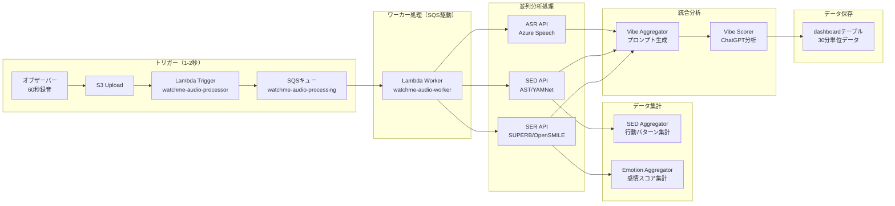

# WatchMe 音声処理アーキテクチャ

## 📊 システム概要

WatchMeプラットフォームは、音声データを多面的に分析し、ユーザーの心理状態を可視化するシステムです。

### 🎯 2つの処理モード

| 処理モード | 実行タイミング | トリガー方式 | 目的 | 頻度 |
|-----------|--------------|------------|------|------|
| **タイムブロック型** | 30分ごと | イベント駆動（Lambda） | 30分単位の個別分析 | 48回/日 |
| **累積分析型** | 30分ごと | イベント駆動（Lambda） | その時点までの統合分析 | 48回/日 |

### 🔬 3つの分析技術

| 技術 | 正式名称 | 役割 | 出力データ |
|------|---------|------|-----------|
| **ASR** | Automatic Speech Recognition | 音声認識・文字起こし | 発話内容テキスト |
| **SED** | Sound Event Detection | 音響イベント検出 | 環境音・行動の分類 |
| **SER** | Speech Emotion Recognition | 音声感情認識 | 8つの基本感情スコア |

### 📈 3つの表示軸

| 表示軸 | データソース | 内容 |
|--------|------------|------|
| **気分（Vibe）** | ASR + SED + SER の総合 | 総合的な心理状態スコアとサマリー |
| **行動（Behavior）** | SED中心 | 音響イベントから推定される行動パターン |
| **感情（Emotion）** | SER中心 | 8つの基本感情の時系列変化 |

---

## 🔄 処理フロー

### 1️⃣ タイムブロック型処理（イベント駆動）

#### ⚡ 2025年9月24日更新：SQSを使った2段階処理に改善



**改善前の問題点**:
- 単一Lambda関数で全処理を実行（3-9分）
- Lambda関数のタイムアウトリスク
- 失敗率約80%（特にSupabase upsert時）

**SQS導入後の改善**:
- **トリガーLambda**: 1-2秒で完了（SQSにメッセージ送信のみ）
- **ワーカーLambda**: 必要な時間だけ実行（最大15分）
- **自動リトライ**: SQSが失敗時に3回まで自動再試行
- **同時実行制御**: ワーカーの同時実行数を制限可能
- **デッドレターキュー**: 3回失敗したメッセージを別途保管
- **失敗率の改善**: Supabase upsertにリトライ処理追加済み

### 2️⃣ 累積分析型処理（イベント駆動）

#### ⚡ 2025年9月25日更新：イベント駆動型に移行

```mermaid
graph LR
    subgraph "トリガー"
        A[タイムブロック処理完了<br/>watchme-audio-worker] --> B[Vibe Scorer成功時]
    end
    
    subgraph "累積分析フェーズ1"
        B --> C[SQSメッセージ送信<br/>dashboard-summary-queue]
        C --> D[Lambda Worker<br/>dashboard-summary-worker]
        D --> E[Dashboard Summary API<br/>プロンプト生成]
    end
    
    subgraph "累積分析フェーズ2"
        E --> F[SQSメッセージ送信<br/>dashboard-analysis-queue]
        F --> G[Lambda Worker<br/>dashboard-analysis-worker]
        G --> H[Dashboard Analysis API<br/>ChatGPT分析]
    end

    subgraph "データ更新・通知"
        H --> I[dashboard_summary<br/>テーブル更新]
        I --> J[プッシュ通知送信<br/>SNS → APNs]
        J --> K[通知先デバイス<br/>iPhoneアプリ]
    end
```



**改善前の問題点**:
- Cronスケジューラーで1時間ごと実行（最大1時間の遅延）
- EC2サーバー上での管理が煩雑
- エラー時の自動復旧なし

**イベント駆動導入後の改善**:
- **実行**: タイムブロック処理完了時（30分ごと、1日48回）
- **トリガー**: Vibe Scorer成功時に自動起動
- **処理内容**: その時点までの全データを統合分析
- **リアルタイム性**: ほぼリアルタイム（処理完了から数秒）
- **信頼性**: SQSによる自動リトライ（最大3回）
- **スケーラビリティ**: Lambda自動スケーリング

---

## 📦 システム構成

### Lambda関数構成（2025年9月25日更新）

| 関数名 | 役割 | 実行時間 | タイムアウト | トリガー |
|--------|------|---------|------------|---------|
| **watchme-audio-processor** | S3イベント受信→SQS送信 | 1-2秒 | 10秒 | S3イベント |
| **watchme-audio-worker** | 音声処理実行→累積分析トリガー | 1-3分 | 15分 | SQSキュー |
| **watchme-dashboard-summary-worker** | プロンプト生成処理 | 10-20秒 | 15分 | SQSキュー |
| **watchme-dashboard-analysis-worker** | ChatGPT分析処理＋プッシュ通知送信 | 10-30秒 | 15分 | SQSキュー |

### SQSキュー構成（2025年9月25日更新）

| キュー名 | 用途 | 可視性タイムアウト | 保持期間 | DLQ |
|---------|------|------------------|---------|-----|
| **watchme-audio-processing** | 音声処理キュー | 15分 | 14日 | あり |
| **watchme-audio-processing-dlq** | 音声処理失敗メッセージ | - | 14日 | - |
| **watchme-dashboard-summary-queue** | プロンプト生成キュー | 15分 | 14日 | あり |
| **watchme-dashboard-summary-dlq** | プロンプト生成失敗メッセージ | - | 14日 | - |
| **watchme-dashboard-analysis-queue** | ChatGPT分析キュー | 15分 | 14日 | あり |
| **watchme-dashboard-analysis-dlq** | ChatGPT分析失敗メッセージ | - | 14日 | - |

### APIサービス構成

**すべてのAPIサービスはAWS EC2インスタンス上でDockerコンテナとして稼働しています。**

| カテゴリ | サービス名 | 技術 | ポート | エンドポイント | 稼働環境 |
|---------|-----------|------|--------|--------------|----------|
| **ASR** | Azure ASR API | Azure Speech Services | 8013 | /vibe-transcriber-v2 | EC2 (Docker) |
| **SED** | AST API | YAMNet (527クラス分類) | 8017 | /behavior-features | EC2 (Docker) |
| **SER** | SUPERB API | OpenSMILE | 8018 | /emotion-features | EC2 (Docker) |
| **集計** | SED Aggregator | 行動パターン分析 | 8010 | /behavior-aggregator | EC2 (Docker) |
| **集計** | Emotion Aggregator | 感情スコア集計 | 8012 | /emotion-aggregator | EC2 (Docker) |
| **統合** | Vibe Aggregator | プロンプト生成 | 8009 | /vibe-aggregator | EC2 (Docker) |
| **統合** | Vibe Scorer | ChatGPT連携 | 8002 | /vibe-scorer | EC2 (Docker) |

> **詳細**: EC2のインフラ構成、Dockerネットワーク、Nginx設定については [server-configs/README.md](./README.md) を参照

### データフロー

```
音声ファイル（60秒）
    ↓
┌─────────────┬─────────────┬─────────────┐
│     ASR     │     SED     │     SER     │
│  (発話内容) │ (環境音検出) │ (感情認識)  │
└─────────────┴─────────────┴─────────────┘
        ↓            ↓              ↓
┌─────────────────────────────────────────┐
│           データ統合・分析               │
├─────────────┬─────────────┬─────────────┤
│  気分(Vibe) │行動(Behavior)│感情(Emotion)│
│  総合スコア │  行動パターン │ 感情の推移  │
└─────────────┴─────────────┴─────────────┘
```

---

## 🗄️ データベース構造

### 基礎データテーブル（タイムブロック単位）

| テーブル名 | データソース | 内容 | 更新頻度 |
|-----------|------------|------|---------|
| `vibe_whisper` | ASR API | 発話内容テキスト | 30分ごと |
| `behavior_yamnet` | SED API | 音響イベント検出結果 | 30分ごと |
| `emotion_opensmile` | SER API | 8感情スコア | 30分ごと |

### 集計データテーブル

| テーブル名 | データソース | 内容 | 更新頻度 |
|-----------|------------|------|---------|
| `behavior_summary` | SED Aggregator | 日次行動パターン | 30分ごと |
| `emotion_opensmile_summary` | Emotion Aggregator | 日次感情推移 | 30分ごと |

### 統合データテーブル

| テーブル名 | 処理タイプ | 内容 | 更新頻度 |
|-----------|----------|------|---------|
| `dashboard` | タイムブロック型 | 30分単位の統合分析 | 30分ごと |
| `dashboard_summary` | 累積分析型 | その時点までの累積分析 | 30分ごと（タイムブロック完了時） |

---

## 🚀 実装状況と今後の計画

### ✅ 実装済み（2025年9月現在）

#### タイムブロック型処理
- [x] Lambda によるイベント駆動処理
- [x] **SQSを使った2段階処理に改善**（2025年9月24日）
- [x] ASR, SED, SER の並列実行
- [x] 各Aggregatorの自動起動
- [x] Vibe Aggregatorまでの自動化
- [x] Vibe Scorerの自動起動
- [x] **dashboardテーブルへのstatus設定**（2025年9月25日）

#### 信頼性改善（2025年9月24日実装）
- [x] **SQSによる自動リトライ機能**（最大3回）
- [x] **デッドレターキュー**による失敗メッセージの保管
- [x] **Supabase upsertのリトライ処理**（最大3回）
- [x] **Lambda関数の分離**（トリガーとワーカー）

#### 累積分析型処理
- [x] イベント駆動型への移行完了（2025年9月25日）
- [x] タイムブロック完了時の自動起動
- [x] SQSによる信頼性の高い処理
- [x] Lambda関数による自動スケーリング

#### プッシュ通知システム（2025年10月15日実装）
- [x] **AWS SNS + APNs統合**
- [x] 累積分析完了時の自動通知送信
- [x] 通知先デバイス（iPhone）へのリアルタイム通知
- [x] フォアグラウンド時のトーストバナー表示
- [x] バックグラウンド時のサイレント通知
- [x] データ自動再取得機能

### 🎯 今後の改善計画

#### Phase 1: Step Functions導入（優先度: 中）
- 複雑なワークフローの可視化
- 部分的な再実行の実現
- より細かい並列処理制御

#### Phase 2: 累積分析のリアルタイム化（優先度: 中）
- Cronからイベント駆動への移行
- タイムブロック完了時の即座更新

#### Phase 3: 監視強化（優先度: 高）
- CloudWatchダッシュボードの構築
- SQSメトリクスの監視
- エラー率のアラート設定

---

## 📊 パフォーマンス指標

### 改善前後の比較（2025年9月24日）

| 指標 | 改善前 | 改善後（SQS導入） |
|------|--------|-----------------|
| **Lambda実行時間** | 3-9分（全処理） | トリガー: 1-2秒<br>ワーカー: 必要な分だけ |
| **失敗率** | 約80% | 大幅改善（リトライ機能） |
| **タイムアウトリスク** | 高い | なし |
| **コスト** | 高い（待機時間も課金） | 低い（実処理時間のみ） |
| **リトライ** | なし | 自動3回 |
| **同時実行制御** | 不可 | 可能 |

### 各APIの処理時間

| 処理 | 平均時間 | タイムアウト設定 | 実測データ（2025年10月調査） |
|------|---------|--------------|---------------------------|
| Lambda Trigger（SQS送信） | 1-2秒 | 10秒 | - |
| ASR API (Azure) | 15-30秒 | 3分（HTTP）/ 15分（Lambda） | **26-28秒**（1分音声） |
| SED API | 10-20秒 | 3分 | - |
| SER API | 10-20秒 | 3分 | - |
| Vibe Aggregator | 5-10秒 | 30秒 | - |
| Vibe Scorer | 10-15秒 | 30秒 | - |
| Lambda Worker（全体） | 1-3分 | **15分** | - |

**重要な発見（2025年10月20日調査）**:
- ✅ **1分の音声ファイル → 平均26-28秒で処理完了**（Azure Speech API）
- ✅ **重複処理は発生していない**（懸念されていた「3回リトライで3倍クォーター消費」は否定）
- ✅ **Lambda関数のタイムアウトは900秒（15分）**で、十分な余裕がある
- ⚠️ **クォーター超過時は1.1秒で即座にエラー**（リトライ機能が動作していない可能性）

### システム負荷

- **タイムブロック型**: 48回/日 × 1-3分 = 約0.8-2.4時間/日
- **累積分析型**: 48回/日 × 30-40秒 = 約24-32分/日
- **合計処理時間**: 約1.2-3時間/日（改善前の40-60%削減）

---

## ⚠️ Azure クォーター超過の運用方針

### 概要

開発環境では**Azure Speech APIの無料プラン**を使用しているため、日次クォーター上限に到達することがあります。

### クォーター超過の発生パターン

**発生時間帯**: UTC 00:00〜07:00頃（JST 09:00〜16:00頃）

**影響範囲**:
- 1日48回の処理のうち、約**14回（09:00〜15:30のタイムブロック）**でクォーター超過が発生
- 該当タイムブロックは`transcriptions_status = 'quota_exceeded'`として記録される

### クォーター超過時の処理フロー

```
1. Azure Speech APIにリクエスト送信
   ↓
2. 1.1秒で即座にエラー応答（クォーター超過）
   ↓
3. Lambda関数内のリトライ機能が動作せず（※）
   ↓
4. azure_success = False
   ↓
5. Vibe Aggregator、Vibe Scorerをスキップ
   ↓
6. 累積分析もトリガーされない
   ↓
7. Lambda関数は正常終了（200 OK）
   ↓
8. 結果: そのタイムブロックのデータが欠損
```

**※ リトライが動作しない理由**:
- Azure APIは**HTTP 200 OK**を返す（429エラーではない）
- レスポンス本文に`errors: 1`が含まれる形式
- Lambda関数内のリトライ条件（`status_code in [429, 503]`）に該当しない

### データ欠損の範囲

| データ種類 | 状態 |
|-----------|------|
| **音声ファイル** | ✅ S3に保存済み |
| **AST（行動分析）** | ✅ 処理完了 |
| **SUPERB（感情分析）** | ✅ 処理完了 |
| **Azure（文字起こし）** | ❌ クォーター超過で失敗 |
| **Vibe Aggregator（統合）** | ❌ スキップ（Azureが失敗したため） |
| **Vibe Scorer（ChatGPT分析）** | ❌ スキップ |
| **Dashboard（統合分析）** | ❌ 作成されない |
| **累積分析** | ❌ トリガーされない |

### 運用方針

#### **基本方針：クォーター超過は即座に諦める**

**理由**:
- クォーター超過は**プラン変更または手動での個別対応**でしか解決できない
- 自動リトライしても復旧しない（無駄なコスト発生）
- **料金が発生する処理は人間による承認プロセスを経るべき**

**処理フロー**:
```
1. Azure APIがクォーター超過エラーを返す
   ↓
2. Lambda関数は即座に処理を終了
   ↓
3. データベースに transcriptions_status = 'quota_exceeded' を記録
   ↓
4. 自動リトライは行わない
   ↓
5. 手動で再処理（後述の手順）
```

#### **開発環境（現在）**
- ✅ **クォーター超過は許容する**（無料プランのため）
- ✅ **欠損データは無視**
- ✅ **手動再処理の手順を用意**（必要に応じて実行）

#### **本番環境**
- ✅ **Azure有料プランに移行**予定
- ⚠️ **万が一のバジェット超過時も同様の方針**（即座に諦める、手動で再処理）
- ✅ **コスト管理アラートを設定**（予算超過の早期検知）

---

### 手動再処理の手順

#### **Step 1: クォーター超過データの確認**

Supabaseで以下のクエリを実行：

```sql
SELECT
  device_id,
  local_date,
  time_block,
  file_path,
  created_at
FROM audio_files
WHERE transcriptions_status = 'quota_exceeded'
ORDER BY created_at DESC;
```

#### **Step 2: Azureクォーターの確認と対応**

1. **Azureポータルにログイン**
2. **Speech Serviceのクォーター使用状況を確認**
3. **以下のいずれかを実行**:
   - プランをアップグレード（有料プランへ移行）
   - 日次リセット待ち（UTC 00:00 = JST 09:00）
   - 追加クォーターを購入

#### **Step 3: 再処理の実行**

**方法A: API経由で再処理（推奨）**

```bash
# 特定のファイルを再処理
curl -X POST https://api.hey-watch.me/vibe-transcriber-v2/fetch-and-transcribe \
  -H "Content-Type: application/json" \
  -d '{
    "file_paths": [
      "files/device_id/2025-10-20/09-00/audio.wav"
    ]
  }'
```

**方法B: Lambda関数を直接トリガー（管理者のみ）**

```bash
# AWS CLIでLambda関数を手動実行
aws lambda invoke \
  --function-name watchme-audio-worker \
  --region ap-southeast-2 \
  --payload '{
    "Records": [{
      "body": "{\"file_path\": \"files/...\", \"device_id\": \"...\", \"date\": \"2025-10-20\", \"time_slot\": \"09-00\"}"
    }]
  }' \
  response.json
```

**方法C: S3から再アップロード**

```bash
# S3ファイルをダウンロード → 再アップロード
# S3イベントがトリガーされて自動処理開始
aws s3 cp s3://watchme-vault/files/device_id/2025-10-20/09-00/audio.wav ./temp.wav
aws s3 cp ./temp.wav s3://watchme-vault/files/device_id/2025-10-20/09-00/audio.wav
```

#### **Step 4: 処理完了の確認**

```sql
-- ステータスが更新されたか確認
SELECT
  device_id,
  local_date,
  time_block,
  transcriptions_status,
  updated_at
FROM audio_files
WHERE file_path = 'files/device_id/2025-10-20/09-00/audio.wav';
```

期待値: `transcriptions_status = 'completed'`

---

### クォーター超過以外のエラー対応

#### **エラー種別とLambda関数の対応**

| エラー種別 | Lambda内リトライ | SQSリトライ | 最終アクション |
|-----------|----------------|-----------|-------------|
| **クォーター超過** | ❌ なし | ❌ なし | DB記録 → 手動再処理 |
| **一時的エラー（429, 503）** | ✅ 3回（指数バックオフ） | ❌ 現時点では不要 | 3回失敗で諦める |
| **タイムアウト** | ✅ 3回（指数バックオフ） | ❌ 現時点では不要 | 3回失敗で諦める |
| **ネットワークエラー** | ✅ 3回 | ❌ 現時点では不要 | 3回失敗で諦める |
| **認証エラー（401, 403）** | ❌ なし | ❌ なし | アラート通知 |
| **存在しないリソース（404）** | ❌ なし | ❌ なし | ログ記録のみ |
| **不正なリクエスト（400）** | ❌ なし | ❌ なし | ログ記録のみ |

**Lambda関数内リトライの設定**:
- **回数**: 最大3回
- **待機時間**: 5秒 → 10秒 → 30秒（指数バックオフ）
- **対象**: 429, 503, Timeout, ConnectionError

**SQSリトライ**:
- **現時点では不要**
- 将来的に必要になった場合に実装を検討

---

## 🎯 データステータスの運用方針

### ステータスの意味と使い方（2025年9月25日更新）

| ステータス | 意味 | 用途 |
|-----------|------|------|
| **pending** | 処理待ち | 新規作成時のデフォルト状態 |
| **completed** | 処理完了 | Vibe Scorerが正常に処理を完了 |
| **failed** | 処理失敗 | エラーが発生して処理が失敗 |

**重要な方針**：
- ステータスは**処理の記録**として使用する
- **処理対象の選別には使わない**（依頼されたデータは全て処理する）
- Dashboard Summary APIは`vibe_score`の存在で処理対象を判断する

## 📝 用語集

### デバイスの概念（重要）

WatchMeシステムでは、**デバイス**という言葉が2つの異なる役割で使われます。この区別を正しく理解することが重要です。

#### 1️⃣ 通知先デバイス（Dashboard Device）

**定義**: アプリをダウンロードしてWatchMeサービスを使用しているデバイス

**役割**:
- ダッシュボードでリアルタイムにデータを閲覧する
- プッシュ通知を受信する
- 分析結果を確認する

**具体例**:
- ユーザーのiPhone
- ユーザーのiPad

**技術的識別子**:
- APNsトークン（プッシュ通知用）
- デバイスID（Supabase上で管理）

**重要**: 1ユーザーにつき通常1台（メインデバイス）

---

#### 2️⃣ 観測対象デバイス（Observer Device）

**定義**: 音声データを収集・録音するデバイス

**役割**:
- 30分ごとに音声を録音する（1日48回）
- 録音データをS3にアップロードする
- データベースに録音メタデータを登録する

**具体例**:
- Apple Watch（ウェアラブル型）
- 据え置き型マイク
- **iPhoneそのもの**（マイク機能を使用）

**重要**: デバイスの形状は様々（ウェアラブル、据え置き、スマートフォンなど）

---

#### 🔄 2つのデバイスの関係

| パターン | 説明 | 具体例 |
|---------|------|--------|
| **別々のデバイス** | 通知先と観測対象が異なる | Apple Watchで録音 → iPhoneで閲覧 |
| **同一デバイス** | 1台のデバイスが両方の役割を果たす | iPhoneで録音 → 同じiPhoneで閲覧 |

**概念の整理**:
- **通知先デバイス**: 「データを見る人」のデバイス
- **観測対象デバイス**: 「データを取る」デバイス
- **同一の場合**: iPhoneが録音もダッシュボード表示も行う
- **別々の場合**: Apple Watchで録音、iPhoneでダッシュボード閲覧

---

### その他の用語

| 用語 | 説明 |
|------|------|
| **タイムブロック** | 30分単位の時間区切り（例: 09-00, 09-30） |
| **オブザーバーデバイス** | （旧用語）観測対象デバイスと同義 |
| **バーストイベント** | 感情の急激な変化点 |
| **Aggregator** | 生データを集計・整形するサービス |
| **Scorer** | ChatGPTを使用した高度な分析サービス |
| **APNsトークン** | 通知先デバイス（iPhone）を一意に識別するトークン |

---

*最終更新: 2025年10月20日*

## 📋 更新履歴

- **2025年10月20日**:
  - **実測データに基づくパフォーマンス調査完了**
  - Azure Speech APIの処理時間を実測：**26-28秒（1分音声）**
  - Lambda関数のタイムアウト設定を確認：**900秒（15分）**
  - **重複処理は発生していないことを確認**（懸念されていた「3回リトライで3倍クォーター消費」を否定）
  - クォーター超過時は1.1秒で即座にエラーになることを確認
  - **Azureクォーター超過の運用方針**セクションを新設
  - 開発環境で無料プラン使用によるクォーター超過が発生することを明記
  - **クォーター超過は即座に諦め、手動再処理する方針を確立**
  - **料金発生処理には人間による承認プロセスを経る設計思想を明記**
  - 手動再処理の詳細手順を3つの方法で記載（API経由、Lambda直接、S3再アップロード）
  - エラー種別ごとのLambda関数の対応方針を明確化
  - **SQSリトライは現時点では不要**と判断
  - DLQ（デッドレターキュー）に溜まった374件のメッセージをパージ（プッシュ通知失敗の古いメッセージ）
  - 本番環境APNSを無効化し、サンドボックスAPNSのみ使用することを確認
- **2025年10月15日**:
  - **プッシュ通知システム実装完了**（AWS SNS + APNs）
  - dashboard-analysis-worker関数にプッシュ通知送信機能を追加
  - 用語定義の標準化：「観測対象デバイス」「通知先デバイス」を明確化
  - 累積分析完了時の通知フローを追加
- **2025年9月25日**:
  - 累積分析処理をイベント駆動型に移行、新規Lambda関数追加
  - Dashboard Summary APIをステータスに関係なく処理するよう修正
  - Vibe Scorer APIがdashboardテーブルに`status: 'completed'`を設定するよう修正
  - ステータスの運用方針を明確化（処理の記録用であり、処理対象の選別には使わない）
- **2025年9月24日**: SQSを使った2段階処理に改善、Lambda関数を分離
- **2025年9月23日**: Azure Speech API (vibe-transcriber-v2)にSupabase upsertリトライ処理追加
- **2025年1月**: 初版作成