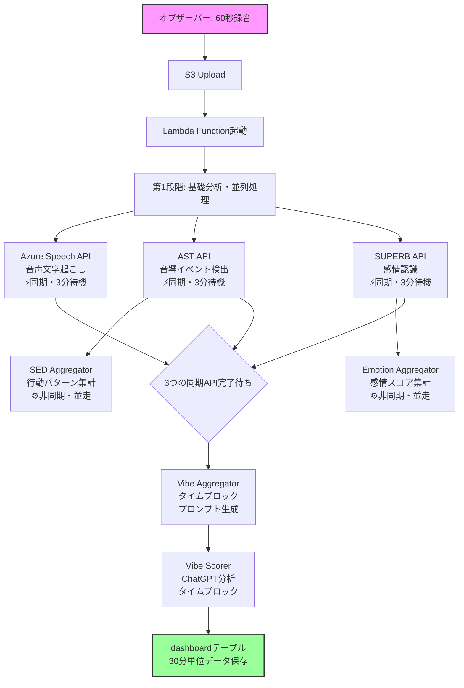
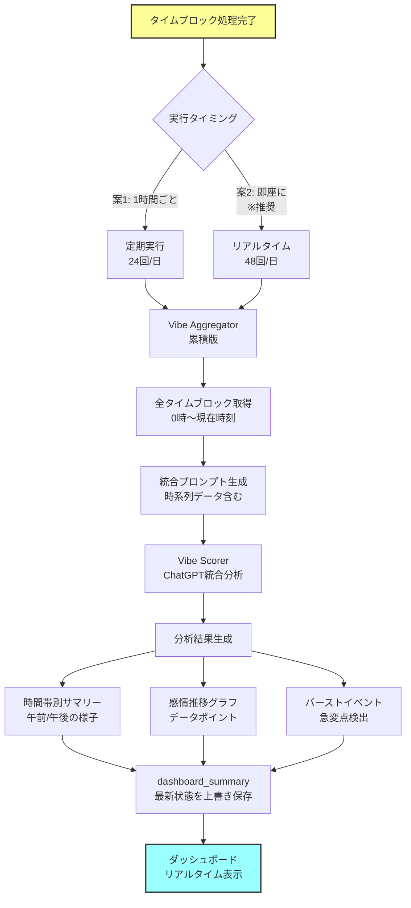

# WatchMe 音声処理アーキテクチャ

## 📊 概要

WatchMeプラットフォームは、音声データから**3つの分析軸**で心理状態を解析します：

1. **気分（Vibe）** - 総合的な心理状態スコア
2. **行動（Behavior）** - 音響イベントから推定される行動パターン
3. **感情（Emotion）** - 8つの基本感情の分析

## 🎯 2つの処理モード

### 1. タイムブロック処理（1日48回）
- **頻度**: 30分ごと（48回/日）
- **トリガー**: オブザーバーデバイスが60秒録音してS3にアップロード
- **目的**: 個別の30分単位の心理状態分析
- **出力**: dashboardテーブルに30分単位のデータ保存

### 2. 累積分析処理（リアルタイム更新）
- **頻度オプション**:
  - **案1**: 1時間ごとの定期実行（24回/日）
  - **案2**: タイムブロック処理完了ごと（48回/日）※推奨
- **目的**: ダッシュボードに常に最新の統合分析を表示
- **処理内容**: その時点（例：12時）までの全タイムブロック（0時〜12時）を統合分析
- **ユーザー体験**: アプリで自分で録音した場合、数分後には結果をグラフに反映
- **出力**: dashboard_summaryテーブルに最新サマリー保存

## 🔄 処理フロー全体図

### 📊 タイムブロック処理フロー（30分ごと・1日48回）

※現在はVibe Aggregator（プロンプト生成）まで自動化、Vibe Scorer（ChatGPT分析）は手動



### 📈 累積分析処理フロー（随時更新）



### 🎯 処理の詳細説明

## 🔄 タイムブロック処理の詳細

#### 第1段階: 基礎分析（3つのAPI並列実行）
- **Azure Speech API**: 文字起こし → **vibe_whisper**テーブル
- **AST API**: 音響イベント検出 → **behavior_yamnet**テーブル  
- **SUPERB API**: 感情認識 → **emotion_opensmile**テーブル

#### 第2段階: データ集計（非同期・並走）
- **SED Aggregator**: ASTの結果から行動パターンを集計 → **behavior_summary**テーブル
- **Emotion Aggregator**: SUPERBの結果から感情スコアを集計 → **emotion_opensmile_summary**テーブル

#### 第3段階: タイムブロック気分分析
**3つの同期API完了を合図として実行：**
- **Vibe Aggregator（タイムブロック版）**: 3つの基礎分析結果からChatGPT用プロンプト生成
- **Vibe Scorer（タイムブロック版）**: ChatGPTで30分単位の分析 → **dashboard**テーブル

## 📈 累積分析処理の詳細

#### トリガー方式の選択
1. **定期実行方式（1時間ごと）**
   - メリット：システム負荷が予測可能
   - デメリット：最大1時間の遅延

2. **リアルタイム方式（タイムブロック完了ごと）** ※推奨
   - メリット：ユーザーが録音後数分で結果確認可能
   - デメリット：処理頻度が高い（1日48回）

#### 処理内容
1. **データ収集**: その日の0時から現在時刻までの全タイムブロック取得
2. **プロンプト生成**: 時系列データを含む統合プロンプト作成
3. **ChatGPT分析**: 
   - 時間帯別の傾向（午前中の様子、午後の変化など）
   - 感情の推移パターン
   - 特筆すべきイベント（バースト）の検出
4. **結果保存**: dashboard_summaryテーブルを最新状態に更新

## 📋 詳細な処理ステップ

### 1️⃣ 第一段階：基礎分析（並列処理）

#### Azure Speech API (Whisper)
- **役割**: 音声を文字に変換
- **エンドポイント**: `/vibe-transcriber-v2/fetch-and-transcribe`
- **出力**: 発話内容のテキスト
- **保存先**: `transcriptions`テーブル

#### AST API (Audio Spectrogram Transformer)
- **役割**: 527種類の音響イベントを検出
- **エンドポイント**: `/behavior-features/fetch-and-process-paths`
- **出力**: 検出された音響イベントのリスト
- **保存先**: `behavior_features`テーブル

#### SUPERB API
- **役割**: 8つの基本感情を分析
- **エンドポイント**: `/emotion-features/process/emotion-features`
- **出力**: 感情スコア（Joy, Fear, Anger, Trust, Disgust, Sadness, Surprise, Anticipation）
- **保存先**: `emotion_features`テーブル

### 2️⃣ 第二段階：データ集計（非同期・第3段階と並走）

#### Speech Aggregator
- **入力**: Whisper APIの結果
- **処理**: 文字起こし結果の整形と要約
- **出力**: 構造化された発話内容

#### SED Aggregator (`api-sed-aggregator`)
- **入力**: AST APIの結果
- **処理**: 音響イベントを行動パターンに分類
- **出力**: 時間帯別の行動サマリー
- **保存先**: `behavior_summary`テーブル

#### Emotion Aggregator (`opensmile-aggregator`)
- **入力**: SUPERB APIの結果
- **処理**: 感情スコアの時系列集計
- **出力**: 時間帯別の感情推移
- **保存先**: `emotion_opensmile_summary`テーブル

### 3️⃣ 第三段階：タイムブロック気分分析（3つの同期API完了で起動）

#### Vibe Aggregator (`api_gen-prompt_mood-chart_v1`)
- **入力**: 
  - 文字起こし結果（vibe_whisperテーブル）
  - 音響イベント（behavior_yamnetテーブル）
  - 感情スコア（emotion_opensmileテーブル）
- **処理**: ChatGPT用のプロンプトを生成（**同期処理**）
- **出力**: 統合されたコンテキスト付きプロンプト
- **エンドポイント**: `/generate-timeblock-prompt`（GET）
- **注意**: SED/Emotion Aggregatorの結果は待たない（これらは日次集計用として並走）

#### Vibe Scorer (`api_gpt_v1`)
- **入力**: Vibe Aggregatorで生成されたプロンプト
- **処理**: ChatGPTによる総合的な心理状態分析
- **出力**: 
  - 気分スコア（-100〜+100）
  - サマリーテキスト
  - バーストイベント（感情の急変点）
- **保存先**: `dashboard`テーブル
- **エンドポイント**: 
  - `/analyze-timeblock`（POST）- タイムブロック分析
  - `/analyze-dashboard-summary`（POST）- 累積分析

## 🔧 実装状況

### ✅ 実装済み（2025-01-22更新）

#### 1. AST → SED Aggregator連携
- Lambda関数内で**イベント駆動型処理**を実装
- AST API処理完了を検知して、自動的にSED Aggregatorを起動
- 実装方法：
  ```python
  # AST API処理（同期的 - 完了を待つ）
  if ast_response.status_code == 200:
      # AST処理完了を確認
      # SED Aggregatorを自動起動（非同期 - タスクIDのみ取得）
      sed_response = requests.post("/behavior-aggregator/analysis/sed", ...)
  ```
- **ステータス**: 実装済み・稼働中

#### 2. SUPERB → Emotion Aggregator連携
- Lambda関数内で**イベント駆動型処理**を実装
- SUPERB API処理完了を検知して、自動的にEmotion Aggregatorを起動
- 実装方法：
  ```python
  # SUPERB API処理（同期的 - 完了を待つ）
  if superb_response.status_code == 200:
      # SUPERB処理完了を確認
      # Emotion Aggregatorを自動起動（非同期 - タスクIDのみ取得）
      emotion_response = requests.post("/emotion-aggregator/analyze/opensmile-aggregator", ...)
  ```
- **ステータス**: 実装済み・稼働中

#### 3. 3つの同期API完了 → Vibe Aggregator連携
- Lambda関数内で**3つのAPI完了を検知**して起動
- Azure Speech、AST、SUPERBがすべて成功した場合にVibe Aggregatorを実行
- 実装方法：
  ```python
  # 3つの基礎APIがすべて成功した場合のみ実行
  if azure_success and ast_success and superb_success:
      # Vibe Aggregator（プロンプト生成）- 同期的に完了を待つ
      vibe_response = requests.get("/vibe-aggregator/generate-timeblock-prompt", timeout=30)
  ```
- **ステータス**: 実装済み・稼働中
- **次のステップ**: Vibe Scorerの自動起動を追加

### 🚧 次の実装タスク

#### 優先度1: Vibe Scorer の自動起動
- 現在: Vibe Aggregator（プロンプト生成）までは自動実行、Vibe Scorer（ChatGPT分析）は手動
- 目標: Vibe Aggregator完了後に自動でVibe Scorerを起動
- **実装方法**：
  - Vibe Aggregatorは**同期的**に動作するため、完了検知が容易
  - Lambda関数内でAggregator完了後、プロンプトを取得してScorerを呼び出し

#### 優先度2: 累積分析の自動化
- 現在: 手動またはバッチ実行
- 目標: タイムブロック完了ごとの自動実行
- 実装方法:
  - Lambda関数にタイムブロック完了後の累積分析トリガーを追加
  - または別のLambda関数として実装し、DynamoDBで状態管理

### ✅ 解決済みの依存関係

#### タイムブロック処理の依存関係（実装済み）

**現在の実装**：
```
Azure Speech API (同期) → vibe_whisper ────────┐
                                               │
AST API (同期) → behavior_yamnet ──────────────┼──→ Vibe Aggregator
         ↓                                     │    （3つのテーブル参照）
    SED Aggregator（非同期・並走）               │
                                               │
SUPERB API (同期) → emotion_opensmile ─────────┘
         ↓
    Emotion Aggregator（非同期・並走）
```

**実装のポイント**：
- 3つの同期APIの完了はLambdaで検知して、Vibe Aggregatorを起動
- SED/Emotion Aggregatorは各APIの成功後に非同期で起動（日次集計用）
- タイムブロック処理と日次集計処理が並走する効率的な設計

### 現在の課題と対策

#### 1. **累積分析のトリガー方式**
- **課題**: ユーザー体験 vs システム負荷のバランス
- **対策案**: 
  - 通常時：1時間ごとの定期実行
  - ユーザー録音時：即座に累積分析を実行（イベントドリブン）

#### 2. **処理時間とタイムアウト**
- **課題**: 長い音声ファイルの処理がLambdaタイムアウト（3分）を超える
- **現在の対策**: タイムアウトしてもEC2側で処理継続
- **将来の対策**: Step FunctionsやSQSでの非同期化

#### 3. **エラーハンドリング**
- **課題**: 一部のAPIが失敗した場合の処理
- **対策案**: 
  - 必須API（Azure Speech）失敗時：処理中断
  - 補助API（AST/SUPERB）失敗時：部分的な分析で継続

### 実装アプローチ

#### 現在の実装（稼働中）
- すべてのAPIタイムアウトを3分（180秒）に設定
- タイムブロック処理は完全自動化
- 累積分析は手動または別トリガーで実行

#### 次期実装（優先度順）

**1. SQSを使用したイベント駆動アーキテクチャ**：
```
S3 → Lambda → SQS Queue → 各API
             ↓
         完了メッセージ → SQS → 次の処理
```

**メリット**：
- タイムアウトを気にする必要なし
- 非同期処理の完了を確実に検知
- リトライが容易
- スケーラブル

**2. Step Functions**を使用したオーケストレーション：

```json
{
  "Comment": "音声処理ワークフロー",
  "StartAt": "並列基礎分析",
  "States": {
    "並列基礎分析": {
      "Type": "Parallel",
      "Branches": [
        {
          "StartAt": "Whisper処理",
          "States": {
            "Whisper処理": {
              "Type": "Task",
              "Resource": "arn:aws:lambda:region:account:function:whisper-processor",
              "End": true
            }
          }
        },
        {
          "StartAt": "AST処理",
          "States": {
            "AST処理": {
              "Type": "Task",
              "Resource": "arn:aws:lambda:region:account:function:ast-processor",
              "End": true
            }
          }
        },
        {
          "StartAt": "SUPERB処理",
          "States": {
            "SUPERB処理": {
              "Type": "Task",
              "Resource": "arn:aws:lambda:region:account:function:superb-processor",
              "End": true
            }
          }
        }
      ],
      "Next": "Vibe分析"
    },
    "Vibe分析": {
      "Type": "Task",
      "Resource": "arn:aws:lambda:region:account:function:vibe-analyzer",
      "End": true
    }
  }
}
```

#### 中期的解決（スケーラブル）

**EventBridge + SQS**を使用したイベント駆動アーキテクチャ：

1. 各APIは処理完了時にEventBridgeにイベントを発行
2. EventBridgeルールでSQSキューにメッセージを送信
3. Lambdaが必要な前処理の完了を確認してから実行

## 📦 関連コンポーネント

### APIサービス（EC2上で稼働）

| サービス名 | ディレクトリ | ポート | 役割 |
|-----------|------------|--------|------|
| Azure Speech API | `/home/ubuntu/vibe-transcriber-v2` | 8013 | 音声文字起こし |
| AST API | `/home/ubuntu/api_ast` | 8017 | 音響イベント検出 |
| SUPERB API | `/home/ubuntu/api_superb_v1` | 8018 | 感情認識 |
| Vibe Aggregator | `/home/ubuntu/api_gen-prompt_mood-chart_v1` | 8009 | プロンプト生成 |
| Vibe Scorer | `/home/ubuntu/api_gpt_v1` | 8002 | ChatGPT連携 |
| SED Aggregator | `/home/ubuntu/api-sed-aggregator` | 8010 | 行動集計 |
| Emotion Aggregator | `/home/ubuntu/opensmile-aggregator` | 8012 | 感情集計 |

### Lambda関数

| 関数名 | 役割 | トリガー |
|--------|------|---------|
| watchme-audio-processor | 音声処理の起動 | S3イベント |

### データベーステーブル（Supabase）

#### 🗄️ タイムブロック用データテーブル（30分単位）
| テーブル名 | 用途 | データソース |
|-----------|------|------------|
| `audio_files` | 音声ファイルメタデータ | S3アップロード時 |
| `vibe_whisper` | 文字起こし結果 | Azure Speech API |
| `behavior_yamnet` | 音響イベント検出結果 | AST API |
| `emotion_opensmile` | 感情分析結果 | SUPERB API |

#### 📊 日次集計用データテーブル（Aggregator処理）
| テーブル名 | 用途 | データソース |
|-----------|------|------------|
| `behavior_summary` | 行動パターンの日次集計 | SED Aggregator |
| `emotion_opensmile_summary` | 感情スコアの日次集計 | Emotion Aggregator |

#### 🎯 統合データテーブル（レベル2）
| テーブル名 | 用途 | 処理段階 |
|-----------|------|---------|
| `dashboard` | タイムブロック単位の統合データ | タイムブロック処理 |
| └ `prompt` | プロンプト | Vibe Aggregator |
| └ `vibe_score` | 気分スコア | Vibe Scorer |
| └ `summary` | 分析結果 | Vibe Scorer |
| `dashboard_summary` | 日次統合データ | 日次処理 |
| └ `prompt` | 統合プロンプト | Vibe Aggregator |
| └ `analysis_result` | 日次分析結果 | Vibe Scorer |
| └ `burst_events` | 感情の急変点 | Vibe Scorer |

## 🚀 今後の実装計画

### 📌 即座に実装すべきタスク

#### 1. SUPERB → Emotion Aggregator連携（最優先）
- Lambda関数に連携処理を追加
- AST/SEDと同じパターンで実装
- Emotion Aggregatorのエンドポイント確認が必要

#### 2. Vibe分析の自動起動
- すべての前処理（Speech、SED、Emotion）の完了を検知
- Vibe Aggregator → Vibe Scorerの連続処理を実装

### フェーズ1：個別連携の完成（1-2日）
- ✅ AST → SED Aggregator（実装済み、デプロイ待ち）
- 🚧 SUPERB → Emotion Aggregator（次の作業）
- ⏳ 全処理完了 → Vibe Aggregator → Vibe Scorer

### フェーズ2：処理状態管理の導入（3-5日）
- DynamoDBで各処理の状態を管理
- 処理完了フラグをチェックしてVibe分析を起動
- エラー時のリトライロジック実装

### フェーズ3：完全なイベント駆動化（1週間）
- Step Functionsで全体のワークフローを管理
- エラーハンドリングとリトライを自動化
- CloudWatchによる監視とアラート設定

## 📋 実装チェックリスト

### Lambda関数の更新
- [x] AST → SED連携コード追加
- [x] SUPERB → Emotion連携コード追加
- [ ] Vibe分析の自動起動ロジック
- [ ] AWS Lambdaへのデプロイ

### APIエンドポイントの確認
- [x] Azure Speech: `/vibe-transcriber-v2/fetch-and-transcribe`
- [x] AST: `/behavior-features/fetch-and-process-paths`
- [x] SUPERB: `/emotion-features/process/emotion-features`
- [x] SED Aggregator: `/behavior-aggregator/analysis/sed`
- [x] Emotion Aggregator: `/emotion-aggregator/analyze/opensmile-aggregator`
- [x] Vibe Aggregator (タイムブロック): `/vibe-aggregator/generate-timeblock-prompt`
- [x] Vibe Aggregator (日次): `/vibe-aggregator/generate-dashboard-summary`
- [x] Vibe Scorer (タイムブロック): `/vibe-scorer/analyze-timeblock`
- [x] Vibe Scorer (日次): `/vibe-scorer/analyze-dashboard-summary`

### テストと検証
- [ ] 音声ファイルアップロードでの動作確認
- [ ] CloudWatchログでの処理フロー確認
- [ ] データベースへの保存確認
- [ ] エラーケースのテスト

## 📊 システム構成と実装状況

### EC2上のAPIサービス
| サービス | ポート | 状態 | Lambda連携 | 次のステップ |
|---------|--------|------|------------|-------------|
| Azure Speech API | 8013 | ✅稼働中 | ✅実装済み | - |
| AST API | 8017 | ✅稼働中 | ✅実装済み | → SED自動起動 |
| SUPERB API | 8018 | ✅稼働中 | ✅実装済み | → Emotion自動起動 |
| SED Aggregator | 8010 | ✅稼働中 | ✅自動起動実装 | デプロイ待ち |
| Emotion Aggregator | 8012 | ✅稼働中 | ✅自動起動実装 | デプロイ待ち |
| Vibe Aggregator | 8009 | ✅稼働中 | ✅自動起動実装 | 同期処理で完了検知可 |
| Vibe Scorer | 8002 | ✅稼働中 | 🔴未連携 | Aggregatorから起動予定 |

### 重要ファイルの場所
| ファイル/ディレクトリ | パス | 状態 |
|---------------------|------|------|
| Lambda関数コード | `/Users/kaya.matsumoto/projects/watchme/watchme-server-configs/lambda-functions/watchme-audio-processor/` | 更新済み |
| function.zip | 上記ディレクトリ内 | ビルド済み・未デプロイ |
| アーキテクチャ文書 | `/Users/kaya.matsumoto/projects/watchme/watchme-server-configs/PROCESSING_ARCHITECTURE.md` | 更新中 |

## 📝 メモ

### 重要な注意点
- Lambda関数のデプロイ時はキャッシュクリアが必要な場合あり
- `function.zip`の内容を必ず確認してからアップロード
- 各APIのタイムアウト設定に注意（特に非同期呼び出し）

### 現在の状況（2025-01-22更新）

#### ✅ タイムブロック処理（部分自動化）
- AST → SED Aggregator連携 ✓
- SUPERB → Emotion Aggregator連携 ✓
- 3つの同期API完了 → Vibe Aggregator連携 ✓
- **Vibe Aggregator → Vibe Scorer連携 ×（未実装）**

#### 🚧 累積分析処理（実装予定）
- **現状**: 手動実行またはバッチ処理
- **目標**: タイムブロック完了ごとの自動実行
- **効果**: ユーザーが録音後数分でダッシュボードに反映

#### 🎯 最終目標
- タイムブロック処理と累積分析の完全自動化
- ユーザー録音から数分でリアルタイムグラフ更新
- 1日の心理状態を継続的に可視化