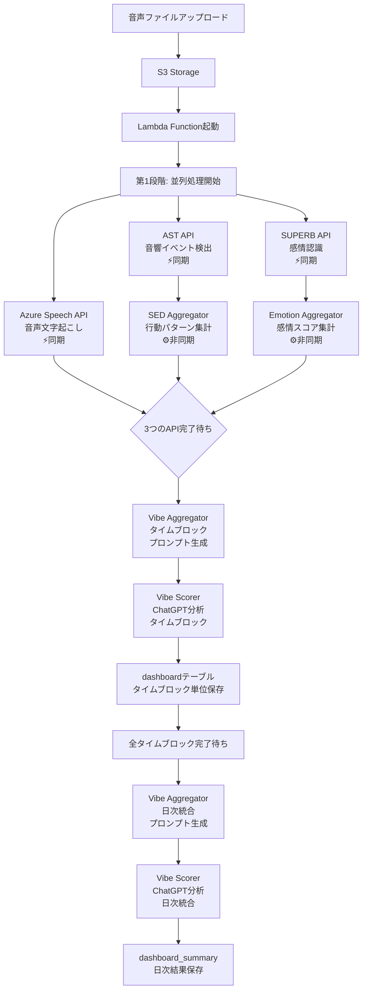

# WatchMe 音声処理アーキテクチャ

## 📊 概要

WatchMeプラットフォームは、音声データから**3つの分析軸**で心理状態を解析します：

1. **気分（Vibe）** - 総合的な心理状態スコア
2. **行動（Behavior）** - 音響イベントから推定される行動パターン
3. **感情（Emotion）** - 8つの基本感情の分析

## 🔄 処理フロー全体図

### 📊 2段階処理システム



### 🎯 処理レベルの説明

#### レベル1: タイムブロック処理（30分単位）
1. **基礎分析**（3つのAPI並列実行）
   - Azure Speech: 文字起こし → **vibe_whisper**テーブル
   - AST: 音響イベント検出 → **behavior_yamnet**テーブル
   - SUPERB: 感情認識 → **emotion_opensmile**テーブル

2. **タイムブロック統合**
   - Vibe Aggregator: 上記3つのテーブルからデータ取得してプロンプト生成
   - Vibe Scorer: ChatGPTでタイムブロック分析 → dashboardテーブル

#### レベル2: 日次処理（1日統合）
1. **日次統合**
   - Vibe Aggregator: 48個のタイムブロックを統合してプロンプト生成
   - Vibe Scorer: ChatGPTで日次分析 → dashboard_summaryテーブル

## 📋 詳細な処理ステップ

### 1️⃣ 第一段階：基礎分析（並列処理）

#### Azure Speech API (Whisper)
- **役割**: 音声を文字に変換
- **エンドポイント**: `/vibe-transcriber-v2/fetch-and-transcribe`
- **出力**: 発話内容のテキスト
- **保存先**: `transcriptions`テーブル

#### AST API (Audio Spectrogram Transformer)
- **役割**: 527種類の音響イベントを検出
- **エンドポイント**: `/behavior-features/fetch-and-process-paths`
- **出力**: 検出された音響イベントのリスト
- **保存先**: `behavior_features`テーブル

#### SUPERB API
- **役割**: 8つの基本感情を分析
- **エンドポイント**: `/emotion-features/process/emotion-features`
- **出力**: 感情スコア（Joy, Fear, Anger, Trust, Disgust, Sadness, Surprise, Anticipation）
- **保存先**: `emotion_features`テーブル

### 2️⃣ 第二段階：データ集計（並列処理）

#### Speech Aggregator
- **入力**: Whisper APIの結果
- **処理**: 文字起こし結果の整形と要約
- **出力**: 構造化された発話内容

#### SED Aggregator (`api-sed-aggregator`)
- **入力**: AST APIの結果
- **処理**: 音響イベントを行動パターンに分類
- **出力**: 時間帯別の行動サマリー
- **保存先**: `behavior_summary`テーブル

#### Emotion Aggregator (`opensmile-aggregator`)
- **入力**: SUPERB APIの結果
- **処理**: 感情スコアの時系列集計
- **出力**: 時間帯別の感情推移
- **保存先**: `emotion_opensmile_summary`テーブル

### 3️⃣ 第三段階：気分分析（すべてに依存）

#### Vibe Aggregator (`api_gen-prompt_mood-chart_v1`)
- **入力**: 
  - 文字起こし結果（Speech Aggregator）
  - 行動パターン（SED Aggregator）
  - 感情スコア（Emotion Aggregator）
- **処理**: ChatGPT用のプロンプトを生成
- **出力**: 統合されたコンテキスト付きプロンプト

#### Vibe Scorer (`api_gpt_v1`)
- **入力**: Vibe Aggregatorで生成されたプロンプト
- **処理**: ChatGPTによる総合的な心理状態分析
- **出力**: 
  - 気分スコア（-100〜+100）
  - サマリーテキスト
  - バーストイベント（感情の急変点）
- **保存先**: `dashboard`、`dashboard_summary`テーブル

## 🔧 実装状況

### ✅ 実装済み（2025-09-22）

#### 1. AST → SED Aggregator連携
- Lambda関数内で**イベント駆動型処理**を実装
- AST API処理完了を検知して、自動的にSED Aggregatorを起動
- 実装方法：
  ```python
  # AST API処理（同期的 - 完了を待つ）
  if ast_response.status_code == 200:
      # AST処理完了を確認
      # SED Aggregatorを自動起動（非同期 - タスクIDのみ取得）
      sed_response = requests.post("/behavior-aggregator/analysis/sed", ...)
  ```
- **ステータス**: Lambdaコード更新済み（AWS未デプロイ）

#### 2. SUPERB → Emotion Aggregator連携
- Lambda関数内で**イベント駆動型処理**を実装
- SUPERB API処理完了を検知して、自動的にEmotion Aggregatorを起動
- 実装方法：
  ```python
  # SUPERB API処理（同期的 - 完了を待つ）
  if superb_response.status_code == 200:
      # SUPERB処理完了を確認
      # Emotion Aggregatorを自動起動（非同期 - タスクIDのみ取得）
      emotion_response = requests.post("/emotion-aggregator/analyze/opensmile-aggregator", ...)
  ```
- **ステータス**: Lambdaコード更新済み（AWS未デプロイ）

### 🚧 次の実装タスク：Vibe分析の自動起動

#### 現在の状況
- 3つの基礎分析（Speech、AST、SUPERB）はすべて実装済み
- 2つのAggregator（SED、Emotion）も自動起動実装済み
- Vibe分析（Aggregator → Scorer）の自動起動が未実装

### 🔴 重要な依存関係の課題

#### タイムブロック処理の依存関係

**実装可能な案（3つの同期API完了で起動）**：
```
Azure Speech API (同期) → vibe_whisper ────────┐
                                               │
AST API (同期) → behavior_yamnet ──────────────┼──→ Vibe Aggregator
                                               │    （3つのテーブル参照）
SUPERB API (同期) → emotion_opensmile ─────────┘
```

**この実装のポイント**：
- 3つの同期APIの完了はLambdaで検知可能
- Vibe Aggregatorは上記3テーブルからデータ取得
- SED/Emotion Aggregatorは別途非同期で実行（日次集計用）

### 現在の課題

1. **依存関係の管理**
   - タイムブロック処理：
     - Azure Speech → vibe_whisperテーブル
     - AST → behavior_yamnetテーブル
     - SUPERB → emotion_opensmileテーブル
     - 3つの同期API完了でVibe Aggregator起動可能
   - 日次処理は別途実行（SED/Emotion Aggregatorの結果を使用）

2. **2段階処理の調整**
   - タイムブロック単位：個別の30分データ処理
   - 日次統合：48個のタイムブロックの統合処理
   - 各段階の完了タイミングの管理が複雑

3. **エラーハンドリング**
   - 一部のAPIが失敗した場合の処理が不明確
   - リトライメカニズムが統一されていない

### 推奨される解決案

#### 暫定処理（実装済み）
- すべてのAPIタイムアウトを3分（180秒）に設定
- 95%のケースは正常に処理完了を検知
- 長い音声ファイルはタイムアウトするが、EC2側では処理継続

#### 本格的解決策（今後実装）

**1. SQSを使用したイベント駆動アーキテクチャ**：
```
S3 → Lambda → SQS Queue → 各API
             ↓
         完了メッセージ → SQS → 次の処理
```

**メリット**：
- タイムアウトを気にする必要なし
- 非同期処理の完了を確実に検知
- リトライが容易
- スケーラブル

**2. Step Functions**を使用したオーケストレーション：

```json
{
  "Comment": "音声処理ワークフロー",
  "StartAt": "並列基礎分析",
  "States": {
    "並列基礎分析": {
      "Type": "Parallel",
      "Branches": [
        {
          "StartAt": "Whisper処理",
          "States": {
            "Whisper処理": {
              "Type": "Task",
              "Resource": "arn:aws:lambda:region:account:function:whisper-processor",
              "End": true
            }
          }
        },
        {
          "StartAt": "AST処理",
          "States": {
            "AST処理": {
              "Type": "Task",
              "Resource": "arn:aws:lambda:region:account:function:ast-processor",
              "End": true
            }
          }
        },
        {
          "StartAt": "SUPERB処理",
          "States": {
            "SUPERB処理": {
              "Type": "Task",
              "Resource": "arn:aws:lambda:region:account:function:superb-processor",
              "End": true
            }
          }
        }
      ],
      "Next": "Vibe分析"
    },
    "Vibe分析": {
      "Type": "Task",
      "Resource": "arn:aws:lambda:region:account:function:vibe-analyzer",
      "End": true
    }
  }
}
```

#### 中期的解決（スケーラブル）

**EventBridge + SQS**を使用したイベント駆動アーキテクチャ：

1. 各APIは処理完了時にEventBridgeにイベントを発行
2. EventBridgeルールでSQSキューにメッセージを送信
3. Lambdaが必要な前処理の完了を確認してから実行

## 📦 関連コンポーネント

### APIサービス（EC2上で稼働）

| サービス名 | ディレクトリ | ポート | 役割 |
|-----------|------------|--------|------|
| Azure Speech API | `/home/ubuntu/vibe-transcriber-v2` | 8013 | 音声文字起こし |
| AST API | `/home/ubuntu/api_ast` | 8017 | 音響イベント検出 |
| SUPERB API | `/home/ubuntu/api_superb_v1` | 8018 | 感情認識 |
| Vibe Aggregator | `/home/ubuntu/api_gen-prompt_mood-chart_v1` | 8009 | プロンプト生成 |
| Vibe Scorer | `/home/ubuntu/api_gpt_v1` | 8002 | ChatGPT連携 |
| SED Aggregator | `/home/ubuntu/api-sed-aggregator` | 8010 | 行動集計 |
| Emotion Aggregator | `/home/ubuntu/opensmile-aggregator` | 8012 | 感情集計 |

### Lambda関数

| 関数名 | 役割 | トリガー |
|--------|------|---------|
| watchme-audio-processor | 音声処理の起動 | S3イベント |

### データベーステーブル（Supabase）

#### 🗄️ タイムブロック用データテーブル（30分単位）
| テーブル名 | 用途 | データソース |
|-----------|------|------------|
| `audio_files` | 音声ファイルメタデータ | S3アップロード時 |
| `vibe_whisper` | 文字起こし結果 | Azure Speech API |
| `behavior_yamnet` | 音響イベント検出結果 | AST API |
| `emotion_opensmile` | 感情分析結果 | SUPERB API |

#### 📊 日次集計用データテーブル（Aggregator処理）
| テーブル名 | 用途 | データソース |
|-----------|------|------------|
| `behavior_summary` | 行動パターンの日次集計 | SED Aggregator |
| `emotion_opensmile_summary` | 感情スコアの日次集計 | Emotion Aggregator |

#### 🎯 統合データテーブル（レベル2）
| テーブル名 | 用途 | 処理段階 |
|-----------|------|---------|
| `dashboard` | タイムブロック単位の統合データ | タイムブロック処理 |
| └ `prompt` | プロンプト | Vibe Aggregator |
| └ `vibe_score` | 気分スコア | Vibe Scorer |
| └ `summary` | 分析結果 | Vibe Scorer |
| `dashboard_summary` | 日次統合データ | 日次処理 |
| └ `prompt` | 統合プロンプト | Vibe Aggregator |
| └ `analysis_result` | 日次分析結果 | Vibe Scorer |
| └ `burst_events` | 感情の急変点 | Vibe Scorer |

## 🚀 今後の実装計画

### 📌 即座に実装すべきタスク

#### 1. SUPERB → Emotion Aggregator連携（最優先）
- Lambda関数に連携処理を追加
- AST/SEDと同じパターンで実装
- Emotion Aggregatorのエンドポイント確認が必要

#### 2. Vibe分析の自動起動
- すべての前処理（Speech、SED、Emotion）の完了を検知
- Vibe Aggregator → Vibe Scorerの連続処理を実装

### フェーズ1：個別連携の完成（1-2日）
- ✅ AST → SED Aggregator（実装済み、デプロイ待ち）
- 🚧 SUPERB → Emotion Aggregator（次の作業）
- ⏳ 全処理完了 → Vibe Aggregator → Vibe Scorer

### フェーズ2：処理状態管理の導入（3-5日）
- DynamoDBで各処理の状態を管理
- 処理完了フラグをチェックしてVibe分析を起動
- エラー時のリトライロジック実装

### フェーズ3：完全なイベント駆動化（1週間）
- Step Functionsで全体のワークフローを管理
- エラーハンドリングとリトライを自動化
- CloudWatchによる監視とアラート設定

## 📋 実装チェックリスト

### Lambda関数の更新
- [x] AST → SED連携コード追加
- [x] SUPERB → Emotion連携コード追加
- [ ] Vibe分析の自動起動ロジック
- [ ] AWS Lambdaへのデプロイ

### APIエンドポイントの確認
- [x] Azure Speech: `/vibe-transcriber-v2/fetch-and-transcribe`
- [x] AST: `/behavior-features/fetch-and-process-paths`
- [x] SUPERB: `/emotion-features/process/emotion-features`
- [x] SED Aggregator: `/behavior-aggregator/analysis/sed`
- [x] Emotion Aggregator: `/emotion-aggregator/analyze/opensmile-aggregator`
- [x] Vibe Aggregator (タイムブロック): `/vibe-aggregator/generate-timeblock-prompt`
- [x] Vibe Aggregator (日次): `/vibe-aggregator/generate-dashboard-summary`
- [x] Vibe Scorer (タイムブロック): `/vibe-scorer/analyze-timeblock`
- [x] Vibe Scorer (日次): `/vibe-scorer/analyze-dashboard-summary`

### テストと検証
- [ ] 音声ファイルアップロードでの動作確認
- [ ] CloudWatchログでの処理フロー確認
- [ ] データベースへの保存確認
- [ ] エラーケースのテスト

## 📊 システム構成と実装状況

### EC2上のAPIサービス
| サービス | ポート | 状態 | Lambda連携 | 次のステップ |
|---------|--------|------|------------|-------------|
| Azure Speech API | 8013 | ✅稼働中 | ✅実装済み | - |
| AST API | 8017 | ✅稼働中 | ✅実装済み | → SED自動起動 |
| SUPERB API | 8018 | ✅稼働中 | ✅実装済み | → Emotion自動起動 |
| SED Aggregator | 8010 | ✅稼働中 | ✅自動起動実装 | デプロイ待ち |
| Emotion Aggregator | 8012 | ✅稼働中 | ✅自動起動実装 | デプロイ待ち |
| Vibe Aggregator | 8009 | ✅稼働中 | 🔴未連携 | 依存関係の実装待ち |
| Vibe Scorer | 8002 | ✅稼働中 | 🔴未連携 | Vibeから起動される |

### 重要ファイルの場所
| ファイル/ディレクトリ | パス | 状態 |
|---------------------|------|------|
| Lambda関数コード | `/Users/kaya.matsumoto/projects/watchme/watchme-server-configs/lambda-functions/watchme-audio-processor/` | 更新済み |
| function.zip | 上記ディレクトリ内 | ビルド済み・未デプロイ |
| アーキテクチャ文書 | `/Users/kaya.matsumoto/projects/watchme/watchme-server-configs/PROCESSING_ARCHITECTURE.md` | 更新中 |

## 📝 メモ

### 重要な注意点
- Lambda関数のデプロイ時はキャッシュクリアが必要な場合あり
- `function.zip`の内容を必ず確認してからアップロード
- 各APIのタイムアウト設定に注意（特に非同期呼び出し）

### 現在の状況（2025-09-22更新）
- **実装済み**: 
  - AST → SED Aggregator連携（AWS未デプロイ）
  - SUPERB → Emotion Aggregator連携（AWS未デプロイ）
- **次の作業**: Vibe分析の自動起動実装
- **デプロイ待ち**: 更新済みfunction.zipのAWSへのアップロード
- **最終目標**: すべての前処理完了後にVibe分析を自動起動