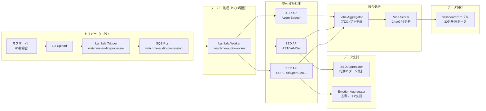

# WatchMe 音声処理アーキテクチャ

## 📊 システム概要

WatchMeプラットフォームは、音声データを多面的に分析し、ユーザーの心理状態を可視化するシステムです。

### 🎯 2つの処理モード

| 処理モード | 実行タイミング | トリガー方式 | 目的 | 頻度 |
|-----------|--------------|------------|------|------|
| **タイムブロック型** | 30分ごと | イベント駆動（Lambda） | 30分単位の個別分析 | 48回/日 |
| **累積分析型** | 30分ごと | イベント駆動（Lambda） | その時点までの統合分析 | 48回/日 |

### 🔬 3つの分析技術

| 技術 | 正式名称 | 役割 | 出力データ |
|------|---------|------|-----------|
| **ASR** | Automatic Speech Recognition | 音声認識・文字起こし | 発話内容テキスト |
| **SED** | Sound Event Detection | 音響イベント検出 | 環境音・行動の分類 |
| **SER** | Speech Emotion Recognition | 音声感情認識 | 8つの基本感情スコア |

### 📈 3つの表示軸

| 表示軸 | データソース | 内容 |
|--------|------------|------|
| **気分（Vibe）** | ASR + SED + SER の総合 | 総合的な心理状態スコアとサマリー |
| **行動（Behavior）** | SED中心 | 音響イベントから推定される行動パターン |
| **感情（Emotion）** | SER中心 | 8つの基本感情の時系列変化 |

---

## 🔄 処理フロー

### 1️⃣ タイムブロック型処理（イベント駆動）

#### ⚡ 2025年9月24日更新：SQSを使った2段階処理に改善



**改善前の問題点**:
- 単一Lambda関数で全処理を実行（3-9分）
- Lambda関数のタイムアウトリスク
- 失敗率約80%（特にSupabase upsert時）

**SQS導入後の改善**:
- **トリガーLambda**: 1-2秒で完了（SQSにメッセージ送信のみ）
- **ワーカーLambda**: 必要な時間だけ実行（最大15分）
- **自動リトライ**: SQSが失敗時に3回まで自動再試行
- **同時実行制御**: ワーカーの同時実行数を制限可能
- **デッドレターキュー**: 3回失敗したメッセージを別途保管
- **失敗率の改善**: Supabase upsertにリトライ処理追加済み

### 2️⃣ 累積分析型処理（イベント駆動）

#### ⚡ 2025年9月25日更新：イベント駆動型に移行

```mermaid
graph LR
    subgraph "トリガー"
        A[タイムブロック処理完了<br/>watchme-audio-worker] --> B[Vibe Scorer成功時]
    end
    
    subgraph "累積分析フェーズ1"
        B --> C[SQSメッセージ送信<br/>dashboard-summary-queue]
        C --> D[Lambda Worker<br/>dashboard-summary-worker]
        D --> E[Dashboard Summary API<br/>プロンプト生成]
    end
    
    subgraph "累積分析フェーズ2"
        E --> F[SQSメッセージ送信<br/>dashboard-analysis-queue]
        F --> G[Lambda Worker<br/>dashboard-analysis-worker]
        G --> H[Dashboard Analysis API<br/>ChatGPT分析]
    end

    subgraph "データ更新・通知"
        H --> I[dashboard_summary<br/>テーブル更新]
        I --> J[プッシュ通知送信<br/>SNS → APNs]
        J --> K[通知先デバイス<br/>iPhoneアプリ]
    end
```



**改善前の問題点**:
- Cronスケジューラーで1時間ごと実行（最大1時間の遅延）
- EC2サーバー上での管理が煩雑
- エラー時の自動復旧なし

**イベント駆動導入後の改善**:
- **実行**: タイムブロック処理完了時（30分ごと、1日48回）
- **トリガー**: Vibe Scorer成功時に自動起動
- **処理内容**: その時点までの全データを統合分析
- **リアルタイム性**: ほぼリアルタイム（処理完了から数秒）
- **信頼性**: SQSによる自動リトライ（最大3回）
- **スケーラビリティ**: Lambda自動スケーリング

---

## 📦 システム構成

### Lambda関数構成（2025年9月25日更新）

| 関数名 | 役割 | 実行時間 | タイムアウト | トリガー |
|--------|------|---------|------------|---------|
| **watchme-audio-processor** | S3イベント受信→SQS送信 | 1-2秒 | 10秒 | S3イベント |
| **watchme-audio-worker** | 音声処理実行→累積分析トリガー | 1-3分 | 15分 | SQSキュー |
| **watchme-dashboard-summary-worker** | プロンプト生成処理 | 10-20秒 | 15分 | SQSキュー |
| **watchme-dashboard-analysis-worker** | ChatGPT分析処理＋プッシュ通知送信 | 10-30秒 | 15分 | SQSキュー |

### SQSキュー構成（2025年9月25日更新）

| キュー名 | 用途 | 可視性タイムアウト | 保持期間 | DLQ |
|---------|------|------------------|---------|-----|
| **watchme-audio-processing** | 音声処理キュー | 15分 | 14日 | あり |
| **watchme-audio-processing-dlq** | 音声処理失敗メッセージ | - | 14日 | - |
| **watchme-dashboard-summary-queue** | プロンプト生成キュー | 15分 | 14日 | あり |
| **watchme-dashboard-summary-dlq** | プロンプト生成失敗メッセージ | - | 14日 | - |
| **watchme-dashboard-analysis-queue** | ChatGPT分析キュー | 15分 | 14日 | あり |
| **watchme-dashboard-analysis-dlq** | ChatGPT分析失敗メッセージ | - | 14日 | - |

### APIサービス構成

| カテゴリ | サービス名 | 技術 | ポート | エンドポイント |
|---------|-----------|------|--------|--------------|
| **ASR** | Azure ASR API | Azure Speech Services | 8013 | /vibe-transcriber-v2 |
| **SED** | AST API | YAMNet (527クラス分類) | 8017 | /behavior-features |
| **SER** | SUPERB API | OpenSMILE | 8018 | /emotion-features |
| **集計** | SED Aggregator | 行動パターン分析 | 8010 | /behavior-aggregator |
| **集計** | Emotion Aggregator | 感情スコア集計 | 8012 | /emotion-aggregator |
| **統合** | Vibe Aggregator | プロンプト生成 | 8009 | /vibe-aggregator |
| **統合** | Vibe Scorer | ChatGPT連携 | 8002 | /vibe-scorer |

### データフロー

```
音声ファイル（60秒）
    ↓
┌─────────────┬─────────────┬─────────────┐
│     ASR     │     SED     │     SER     │
│  (発話内容) │ (環境音検出) │ (感情認識)  │
└─────────────┴─────────────┴─────────────┘
        ↓            ↓              ↓
┌─────────────────────────────────────────┐
│           データ統合・分析               │
├─────────────┬─────────────┬─────────────┤
│  気分(Vibe) │行動(Behavior)│感情(Emotion)│
│  総合スコア │  行動パターン │ 感情の推移  │
└─────────────┴─────────────┴─────────────┘
```

---

## 🗄️ データベース構造

### 基礎データテーブル（タイムブロック単位）

| テーブル名 | データソース | 内容 | 更新頻度 |
|-----------|------------|------|---------|
| `vibe_whisper` | ASR API | 発話内容テキスト | 30分ごと |
| `behavior_yamnet` | SED API | 音響イベント検出結果 | 30分ごと |
| `emotion_opensmile` | SER API | 8感情スコア | 30分ごと |

### 集計データテーブル

| テーブル名 | データソース | 内容 | 更新頻度 |
|-----------|------------|------|---------|
| `behavior_summary` | SED Aggregator | 日次行動パターン | 30分ごと |
| `emotion_opensmile_summary` | Emotion Aggregator | 日次感情推移 | 30分ごと |

### 統合データテーブル

| テーブル名 | 処理タイプ | 内容 | 更新頻度 |
|-----------|----------|------|---------|
| `dashboard` | タイムブロック型 | 30分単位の統合分析 | 30分ごと |
| `dashboard_summary` | 累積分析型 | その時点までの累積分析 | 30分ごと（タイムブロック完了時） |

---

## 🚀 実装状況と今後の計画

### ✅ 実装済み（2025年9月現在）

#### タイムブロック型処理
- [x] Lambda によるイベント駆動処理
- [x] **SQSを使った2段階処理に改善**（2025年9月24日）
- [x] ASR, SED, SER の並列実行
- [x] 各Aggregatorの自動起動
- [x] Vibe Aggregatorまでの自動化
- [x] Vibe Scorerの自動起動
- [x] **dashboardテーブルへのstatus設定**（2025年9月25日）

#### 信頼性改善（2025年9月24日実装）
- [x] **SQSによる自動リトライ機能**（最大3回）
- [x] **デッドレターキュー**による失敗メッセージの保管
- [x] **Supabase upsertのリトライ処理**（最大3回）
- [x] **Lambda関数の分離**（トリガーとワーカー）

#### 累積分析型処理
- [x] イベント駆動型への移行完了（2025年9月25日）
- [x] タイムブロック完了時の自動起動
- [x] SQSによる信頼性の高い処理
- [x] Lambda関数による自動スケーリング

#### プッシュ通知システム（2025年10月15日実装）
- [x] **AWS SNS + APNs統合**
- [x] 累積分析完了時の自動通知送信
- [x] 通知先デバイス（iPhone）へのリアルタイム通知
- [x] フォアグラウンド時のトーストバナー表示
- [x] バックグラウンド時のサイレント通知
- [x] データ自動再取得機能

### 🎯 今後の改善計画

#### Phase 1: Step Functions導入（優先度: 中）
- 複雑なワークフローの可視化
- 部分的な再実行の実現
- より細かい並列処理制御

#### Phase 2: 累積分析のリアルタイム化（優先度: 中）
- Cronからイベント駆動への移行
- タイムブロック完了時の即座更新

#### Phase 3: 監視強化（優先度: 高）
- CloudWatchダッシュボードの構築
- SQSメトリクスの監視
- エラー率のアラート設定

---

## 📊 パフォーマンス指標

### 改善前後の比較（2025年9月24日）

| 指標 | 改善前 | 改善後（SQS導入） |
|------|--------|-----------------|
| **Lambda実行時間** | 3-9分（全処理） | トリガー: 1-2秒<br>ワーカー: 必要な分だけ |
| **失敗率** | 約80% | 大幅改善（リトライ機能） |
| **タイムアウトリスク** | 高い | なし |
| **コスト** | 高い（待機時間も課金） | 低い（実処理時間のみ） |
| **リトライ** | なし | 自動3回 |
| **同時実行制御** | 不可 | 可能 |

### 各APIの処理時間

| 処理 | 平均時間 | タイムアウト設定 |
|------|---------|--------------|
| Lambda Trigger（SQS送信） | 1-2秒 | 10秒 |
| ASR API (Azure) | 15-30秒 | 3分 |
| SED API | 10-20秒 | 3分 |
| SER API | 10-20秒 | 3分 |
| Vibe Aggregator | 5-10秒 | 30秒 |
| Vibe Scorer | 10-15秒 | 30秒 |
| Lambda Worker（全体） | 1-3分 | 15分 |

### システム負荷

- **タイムブロック型**: 48回/日 × 1-3分 = 約0.8-2.4時間/日
- **累積分析型**: 48回/日 × 30-40秒 = 約24-32分/日
- **合計処理時間**: 約1.2-3時間/日（改善前の40-60%削減）

---

## 🎯 データステータスの運用方針

### ステータスの意味と使い方（2025年9月25日更新）

| ステータス | 意味 | 用途 |
|-----------|------|------|
| **pending** | 処理待ち | 新規作成時のデフォルト状態 |
| **completed** | 処理完了 | Vibe Scorerが正常に処理を完了 |
| **failed** | 処理失敗 | エラーが発生して処理が失敗 |

**重要な方針**：
- ステータスは**処理の記録**として使用する
- **処理対象の選別には使わない**（依頼されたデータは全て処理する）
- Dashboard Summary APIは`vibe_score`の存在で処理対象を判断する

## 📝 用語集

| 用語 | 説明 |
|------|------|
| **タイムブロック** | 30分単位の時間区切り（例: 09-00, 09-30） |
| **観測対象デバイス** または **録音デバイス** | 音声データを収集するデバイス（例：Apple Watch） |
| **通知先デバイス** または **iPhoneデバイス** | プッシュ通知を受信するユーザーのiPhone（1ユーザーにつき1台） |
| **オブザーバーデバイス** | （旧用語）観測対象デバイスと同義 |
| **バーストイベント** | 感情の急激な変化点 |
| **Aggregator** | 生データを集計・整形するサービス |
| **Scorer** | ChatGPTを使用した高度な分析サービス |
| **APNsトークン** | 通知先デバイス（iPhone）を一意に識別するトークン |

---

*最終更新: 2025年10月15日*

## 📋 更新履歴

- **2025年10月15日**:
  - **プッシュ通知システム実装完了**（AWS SNS + APNs）
  - dashboard-analysis-worker関数にプッシュ通知送信機能を追加
  - 用語定義の標準化：「観測対象デバイス」「通知先デバイス」を明確化
  - 累積分析完了時の通知フローを追加
- **2025年9月25日**:
  - 累積分析処理をイベント駆動型に移行、新規Lambda関数追加
  - Dashboard Summary APIをステータスに関係なく処理するよう修正
  - Vibe Scorer APIがdashboardテーブルに`status: 'completed'`を設定するよう修正
  - ステータスの運用方針を明確化（処理の記録用であり、処理対象の選別には使わない）
- **2025年9月24日**: SQSを使った2段階処理に改善、Lambda関数を分離
- **2025年9月23日**: Azure Speech API (vibe-transcriber-v2)にSupabase upsertリトライ処理追加
- **2025年1月**: 初版作成