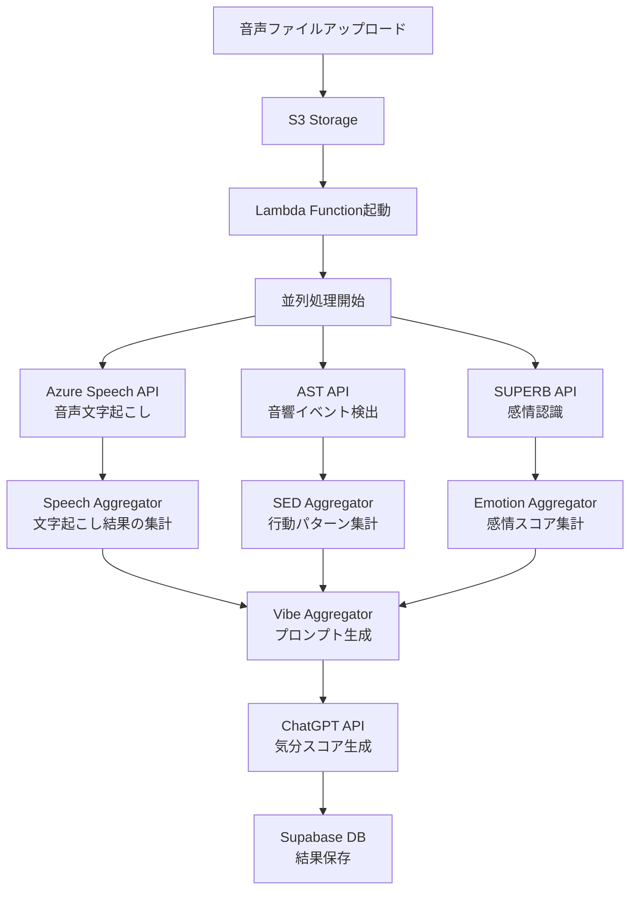

# WatchMe 音声処理アーキテクチャ

## 📊 概要

WatchMeプラットフォームは、音声データから**3つの分析軸**で心理状態を解析します：

1. **気分（Vibe）** - 総合的な心理状態スコア
2. **行動（Behavior）** - 音響イベントから推定される行動パターン
3. **感情（Emotion）** - 8つの基本感情の分析

## 🔄 処理フロー全体図



## 📋 詳細な処理ステップ

### 1️⃣ 第一段階：基礎分析（並列処理）

#### Azure Speech API (Whisper)
- **役割**: 音声を文字に変換
- **エンドポイント**: `/vibe-transcriber-v2/fetch-and-transcribe`
- **出力**: 発話内容のテキスト
- **保存先**: `transcriptions`テーブル

#### AST API (Audio Spectrogram Transformer)
- **役割**: 527種類の音響イベントを検出
- **エンドポイント**: `/behavior-features/fetch-and-process-paths`
- **出力**: 検出された音響イベントのリスト
- **保存先**: `behavior_features`テーブル

#### SUPERB API
- **役割**: 8つの基本感情を分析
- **エンドポイント**: `/emotion-features/process/emotion-features`
- **出力**: 感情スコア（Joy, Fear, Anger, Trust, Disgust, Sadness, Surprise, Anticipation）
- **保存先**: `emotion_features`テーブル

### 2️⃣ 第二段階：データ集計（並列処理）

#### Speech Aggregator
- **入力**: Whisper APIの結果
- **処理**: 文字起こし結果の整形と要約
- **出力**: 構造化された発話内容

#### SED Aggregator (`api-sed-aggregator`)
- **入力**: AST APIの結果
- **処理**: 音響イベントを行動パターンに分類
- **出力**: 時間帯別の行動サマリー
- **保存先**: `behavior_summary`テーブル

#### Emotion Aggregator (`opensmile-aggregator`)
- **入力**: SUPERB APIの結果
- **処理**: 感情スコアの時系列集計
- **出力**: 時間帯別の感情推移
- **保存先**: `emotion_opensmile_summary`テーブル

### 3️⃣ 第三段階：気分分析（すべてに依存）

#### Vibe Aggregator (`api_gen-prompt_mood-chart_v1`)
- **入力**: 
  - 文字起こし結果（Speech Aggregator）
  - 行動パターン（SED Aggregator）
  - 感情スコア（Emotion Aggregator）
- **処理**: ChatGPT用のプロンプトを生成
- **出力**: 統合されたコンテキスト付きプロンプト

#### Vibe Scorer (`api_gpt_v1`)
- **入力**: Vibe Aggregatorで生成されたプロンプト
- **処理**: ChatGPTによる総合的な心理状態分析
- **出力**: 
  - 気分スコア（-100〜+100）
  - サマリーテキスト
  - バーストイベント（感情の急変点）
- **保存先**: `dashboard`、`dashboard_summary`テーブル

## 🔧 実装上の課題と解決案

### 現在の課題

1. **依存関係の管理**
   - Vibe分析は他のすべての処理完了が必要
   - 現在は各APIが独立して動作し、完了通知がない

2. **エラーハンドリング**
   - 一部のAPIが失敗した場合の処理が不明確
   - リトライメカニズムが統一されていない

### 推奨される解決案

#### 短期的解決（シンプル実装）

**Step Functions**を使用したオーケストレーション：

```json
{
  "Comment": "音声処理ワークフロー",
  "StartAt": "並列基礎分析",
  "States": {
    "並列基礎分析": {
      "Type": "Parallel",
      "Branches": [
        {
          "StartAt": "Whisper処理",
          "States": {
            "Whisper処理": {
              "Type": "Task",
              "Resource": "arn:aws:lambda:region:account:function:whisper-processor",
              "End": true
            }
          }
        },
        {
          "StartAt": "AST処理",
          "States": {
            "AST処理": {
              "Type": "Task",
              "Resource": "arn:aws:lambda:region:account:function:ast-processor",
              "End": true
            }
          }
        },
        {
          "StartAt": "SUPERB処理",
          "States": {
            "SUPERB処理": {
              "Type": "Task",
              "Resource": "arn:aws:lambda:region:account:function:superb-processor",
              "End": true
            }
          }
        }
      ],
      "Next": "Vibe分析"
    },
    "Vibe分析": {
      "Type": "Task",
      "Resource": "arn:aws:lambda:region:account:function:vibe-analyzer",
      "End": true
    }
  }
}
```

#### 中期的解決（スケーラブル）

**EventBridge + SQS**を使用したイベント駆動アーキテクチャ：

1. 各APIは処理完了時にEventBridgeにイベントを発行
2. EventBridgeルールでSQSキューにメッセージを送信
3. Lambdaが必要な前処理の完了を確認してから実行

## 📦 関連コンポーネント

### APIサービス（EC2上で稼働）

| サービス名 | ディレクトリ | ポート | 役割 |
|-----------|------------|--------|------|
| Azure Speech API | `/home/ubuntu/vibe-transcriber-v2` | 8013 | 音声文字起こし |
| AST API | `/home/ubuntu/api_ast` | 8017 | 音響イベント検出 |
| SUPERB API | `/home/ubuntu/api_superb_v1` | 8018 | 感情認識 |
| Vibe Aggregator | `/home/ubuntu/api_gen-prompt_mood-chart_v1` | 8009 | プロンプト生成 |
| Vibe Scorer | `/home/ubuntu/api_gpt_v1` | 8002 | ChatGPT連携 |
| SED Aggregator | `/home/ubuntu/api-sed-aggregator` | 8010 | 行動集計 |
| Emotion Aggregator | `/home/ubuntu/opensmile-aggregator` | 8012 | 感情集計 |

### Lambda関数

| 関数名 | 役割 | トリガー |
|--------|------|---------|
| watchme-audio-processor | 音声処理の起動 | S3イベント |

### データベーステーブル（Supabase）

| テーブル名 | 用途 |
|-----------|------|
| `audio_files` | アップロードされた音声ファイルのメタデータ |
| `transcriptions` | 文字起こし結果 |
| `behavior_features` | 音響イベント検出結果 |
| `emotion_features` | 感情分析結果 |
| `behavior_summary` | 行動パターンの日次集計 |
| `emotion_opensmile_summary` | 感情スコアの日次集計 |
| `dashboard` | 時間ブロックごとの気分データ |
| `dashboard_summary` | 日次の気分サマリー |

## 🚀 今後の実装計画

### フェーズ1：行動・感情分析の独立化（実装容易）
- 行動分析と感情分析は独立して完結可能
- それぞれSQSキューを作成し、処理完了をトリガーに

### フェーズ2：気分分析の依存管理
- DynamoDBで処理状態を管理
- 3つの前処理が完了したらVibe分析を起動

### フェーズ3：完全なイベント駆動化
- Step Functionsで全体のワークフローを管理
- エラーハンドリングとリトライを自動化

## 📝 メモ

- 現在はスケジューラー（cron）とLambda（イベント駆動）が混在
- 最終的にはすべてイベント駆動に移行予定
- リアルタイム性と処理の確実性のバランスが重要