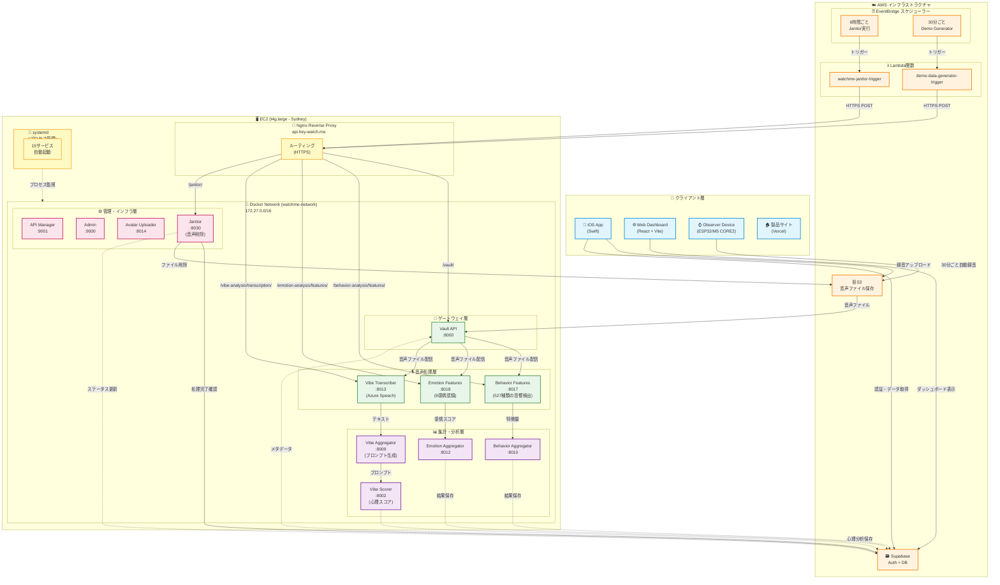

# WatchMe サーバー設定リポジトリ

## 📚 ドキュメントガイド

このリポジトリには複数のドキュメントがあります。**目的に応じて適切なドキュメントを参照してください。**

### 🎯 目的別ドキュメント一覧

| 目的 | ドキュメント | 内容 | こんな時に読む |
|------|-------------|------|--------------|
| **📖 基本理解** | [README.md](./README.md)（このファイル） | サーバー全体の構成・設定 | 最初に読む、全体像を把握したい |
| **🔄 処理の流れ** | [PROCESSING_ARCHITECTURE.md](./PROCESSING_ARCHITECTURE.md) | 音声処理の全体フロー、Lambda→API連携 | データがどう処理されるか知りたい |
| **🔧 技術仕様** | [TECHNICAL_REFERENCE.md](./TECHNICAL_REFERENCE.md) | 全サービス一覧、エンドポイント、ECRリポジトリ | APIのURL・ポート番号を調べたい |
| **📝 作業手順** | [OPERATIONS_GUIDE.md](./OPERATIONS_GUIDE.md) | デプロイ・設定変更・トラブルシューティング | 実際に作業する時の手順を知りたい |
| **🚀 CI/CD** | [CICD_STANDARD_SPECIFICATION.md](./CICD_STANDARD_SPECIFICATION.md) | GitHub Actions、自動デプロイ設定 | 新しいAPIのCI/CDを設定したい |
| **📅 変更履歴** | [CHANGELOG.md](./CHANGELOG.md) | 過去の変更・移行の記録 | いつ何を変更したか確認したい |
| **💰 コスト** | [COST_MANAGEMENT.md](./COST_MANAGEMENT.md) | AWS料金の管理・最適化 | コストを確認・削減したい |
| **🌏 リージョン移行** | [REGION_MIGRATION_GUIDE.md](./REGION_MIGRATION_GUIDE.md) | シドニー→東京リージョン移行手順 | リージョン移行を計画している |
| **🏗️ リストラクチャ** | [API_RESTRUCTURE_LOG.md](./API_RESTRUCTURE_LOG.md) | API階層化の作業ログ | API構造改革の進捗を確認したい |

### 💡 初めての方へのおすすめ読む順序

1. **このREADME.md** - システム全体の構成を理解
2. **[PROCESSING_ARCHITECTURE.md](./PROCESSING_ARCHITECTURE.md)** - データの流れを理解
3. **[TECHNICAL_REFERENCE.md](./TECHNICAL_REFERENCE.md)** - 各サービスの詳細を把握
4. **[OPERATIONS_GUIDE.md](./OPERATIONS_GUIDE.md)** - 実際の作業方法を学ぶ

---

## 📊 システム概要

このリポジトリは、WatchMeプラットフォームのEC2サーバーで稼働する **インフラストラクチャ**、**Nginx**、**systemd** の設定を一元管理します。

### 🎨 システムアーキテクチャ図



### 🎯 3つの管理領域

| 管理領域 | 内容 | 設定場所 |
|---------|------|----------|
| **インフラストラクチャ** | Dockerネットワーク、リソース管理 | docker-compose.infra.yml |
| **リバースプロキシ** | Nginx設定、ルーティング | sites-available/ |
| **プロセス管理** | systemdサービス、自動起動 | systemd/ |

### 🔧 現在の環境

| 項目 | 値 |
|------|-----|
| **リージョン** | ap-southeast-2 (シドニー) |
| **状態** | 稼働中 |
| **移行予定** | ap-northeast-1 (東京) - [移行ガイド](./REGION_MIGRATION_GUIDE.md) 📋 |

### ⚡ クイックアクセス

#### 📖 日常作業用ドキュメント
| 目的 | ドキュメント | 内容 |
|------|-------------|------|
| **デプロイ手順** | [OPERATIONS_GUIDE.md](./OPERATIONS_GUIDE.md#1-アプリケーションのデプロイ手順) | アプリのデプロイ方法 |
| **設定変更** | [OPERATIONS_GUIDE.md](./OPERATIONS_GUIDE.md#2-サーバー構成の変更手順) | サーバー設定の変更 |
| **技術仕様** | [TECHNICAL_REFERENCE.md](./TECHNICAL_REFERENCE.md) | システム全体の詳細仕様 |
| **処理フロー** | [PROCESSING_ARCHITECTURE.md](./PROCESSING_ARCHITECTURE.md) | 音声処理の全体像 |

#### 🗂️ 参照用ドキュメント
| 目的 | ドキュメント | 内容 |
|------|-------------|------|
| **変更履歴** | [CHANGELOG.md](./CHANGELOG.md) | 全変更の記録（過去のAPI移行含む） |
| **CI/CD仕様** | [CICD_STANDARD_SPECIFICATION.md](./CICD_STANDARD_SPECIFICATION.md) | 統一CI/CDプロセス |
| **🚀 東京リージョン移行** | [REGION_MIGRATION_GUIDE.md](./REGION_MIGRATION_GUIDE.md) | シドニー→東京移行の完全手順 |
| **💰 コスト管理** | [COST_MANAGEMENT.md](./COST_MANAGEMENT.md) | AWS料金管理 |
| **🚨 EC2再起動復旧** | [OPERATIONS_GUIDE.md#4-🚨-ec2インスタンス再起動後の復旧手順](./OPERATIONS_GUIDE.md#4-🚨-ec2インスタンス再起動後の復旧手順) | インスタンス再起動時の対処 |

---

## 🖥️ インフラストラクチャ

### EC2インスタンス仕様
- **インスタンスタイプ**: t4g.large (一時的にアップグレード済み、以前はt4g.small)
- **CPU**: 2 vCPU (AWS Graviton2 Processor - Neoverse-N1)
- **メモリ**: 8.0GB RAM (実使用可能: 7.8GB)
- **ストレージ**: 30GB gp3 SSD
- **ネットワーク**: 最大 5 Gigabit
- **リージョン**: ap-southeast-2 (Sydney)
- **更新日**: 2025-09-19 (t4g.smallからt4g.largeへアップグレード)

### 📋 リソース使用状況（t4g.large）

**メモリ状況（大幅改善）**:
- **総メモリ**: 7.8GB (OS込み)
- **以前の使用量**: ~1.4GB (t4g.small時代は78%使用率)
- **Swap**: 2.0GB (必要に応じて調整可能)
- **利用可能**: 6GB以上（余裕あり）
- **注意**: 将来t4g.smallに戻す可能性あり

**Whisper API メモリ使用状況**:
- **アイドル時**: ~580MB (メモリ制限1GB中 57%使用)
- **処理中**: 800MB-1GB（制限値まで使用）
- **⚠️ 重要**: baseモデルでも580MB必要、largeモデルは不可

### 💡 メモリ管理のベストプラクティス

1. **新しいコンテナ追加時の必須チェック**:
   ```bash
   # メモリ使用量確認
   docker stats --no-stream
   free -h
   
   # 必要に応じてメモリ制限設定
   docker run --memory="500m" --cpus="0.5" ...
   ```

2. **メモリ不足時の対応手順**:
   ```bash
   # 不要なコンテナを一時停止
   docker stop <低優先度コンテナ>
   
   # Dockerリソースクリーンアップ
   docker system prune -f
   docker image prune -a -f
   ```

## 🔐 リポジトリの役割と制約

### ✅ できること
- ✅ **Dockerネットワークインフラの一元管理** ← NEW!
- ✅ Nginx/systemd設定ファイルのテンプレートと変更履歴の管理
- ✅ ネットワーク監視・自動修復スクリプトの提供 ← NEW!
- ✅ Pull Requestによるレビュープロセスの実施
- ✅ **インフラリソース管理と制約情報** ← NEW!
- ❌ **本番サーバーへの自動デプロイ機能はありません**

### 🔄 本番環境への反映フロー
1. このリポジトリで設定を変更し、Pull Requestでレビュー
2. マージ後、**手動で**本番サーバーの設定ファイルを更新
3. 本番サーバー上の設定は `/home/ubuntu/watchme-server-configs/` に配置

---

## 📁 リポジトリ構造

```
watchme-server-configs/
├── docker-compose.infra.yml    # ネットワークインフラ定義
├── docker-compose-files/        # 各サービスのdocker-compose設定
│   ├── api-gpt-v1-docker-compose.prod.yml
│   ├── api-sed-aggregator-docker-compose.prod.yml
│   ├── mood-chart-api-docker-compose.prod.yml
│   ├── opensmile-api-docker-compose.prod.yml
│   ├── opensmile-aggregator-docker-compose.prod.yml
│   ├── sed-api-docker-compose.prod.yml
│   ├── vibe-transcriber-v2-docker-compose.prod.yml
│   ├── watchme-admin-docker-compose.prod.yml
│   └── watchme-web-docker-compose.prod.yml
├── systemd/                     # systemdサービスファイル（全13サービス）
│   ├── watchme-infrastructure.service  # インフラ管理サービス
│   ├── api-gpt-v1.service
│   ├── api-sed-aggregator.service
│   ├── mood-chart-api.service
│   ├── opensmile-api.service
│   ├── opensmile-aggregator.service
│   ├── vibe-transcriber-v2.service
│   ├── watchme-admin.service
│   ├── watchme-api-manager.service
│   ├── watchme-avatar-uploader.service
│   ├── watchme-behavior-yamnet.service
│   ├── watchme-vault-api.service
│   ├── watchme-web-app.service
│   └── watchme-docker.service
├── sites-available/             # Nginx設定ファイル
│   └── api.hey-watch.me
├── scripts/                     # 管理・監視スクリプト
│   ├── check-infrastructure.sh # ネットワークヘルスチェック
│   └── network_monitor.py      # Python監視ツール
├── README.md                    # このファイル
├── NETWORK-ARCHITECTURE.md     # ネットワーク設計文書
└── server_overview.md          # サーバー全体構成
```

---

## 🌐 ネットワークインフラ構成

### 🔗 watchme-network構成

全マイクロサービスが相互通信するための共有Dockerネットワークです。

| 設定項目 | 値 | 説明 |
|---------|-----|------|
| **ネットワーク名** | watchme-network | 共有ネットワーク |

| **サブネット** | 172.27.0.0/16 | IPアドレス範囲 |
| **ゲートウェイ** | 172.27.0.1 | デフォルトゲートウェイ |
| **管理サービス** | watchme-infrastructure | systemdサービス |
| **作成日** | 2025-08-06 | - |

### 📡 接続コンテナ一覧（2025年10月23日更新）
```
watchme-api-manager-prod                    (172.27.0.4)  # API管理UI
watchme-scheduler-prod                      (172.27.0.5)  # スケジューラー
emotion-analysis-aggregator                 (172.27.0.6)  # 感情スコア集計
watchme-vault-api                           (172.27.0.7)  # Gateway API
vibe-analysis-aggregator                    (172.27.0.8)  # Vibe Aggregator
vibe-analysis-scorer                        (172.27.0.9)  # スコアリング
watchme-web-prod                            (172.27.0.10) # Webダッシュボード
vibe-analysis-transcriber-v2                (172.27.0.11) # Azure Speech
behavior-analysis-sed-aggregator            (172.27.0.12) # 音声イベント集計
watchme-admin                               (172.27.0.14) # 管理画面
watchme-avatar-uploader                     (172.27.0.15) # アバターアップロード
behavior-analysis-feature-extractor-v2      (172.27.0.17) # 音響イベント検出 ※8017ポート
emotion-analysis-feature-extractor-v3       (172.27.0.18) # 感情認識 ※8018ポート
janitor-api                                 (172.27.0.30) # 音声ファイル自動削除 ※8030ポート
```

### 📋 システム状態

| 項目 | 状態 | 詳細 |
|------|------|------|
| **稼働サービス** | 15サービス | systemd管理下 |
| **自動起動** | 有効 | サーバー再起動時 |
| **ポートバインド** | 127.0.0.1 | セキュリティ向上 |
| **ディスク使用率** | 50% (14GB/29GB) | 余裕あり |

> **ネットワーク移行履歴**: 詳細は [CHANGELOG.md](./CHANGELOG.md#2025年9月19日) を参照

### 🔧 管理コマンド

```bash
# ネットワーク状態の確認
bash /home/ubuntu/watchme-server-configs/scripts/check-infrastructure.sh

# Python監視ツールで詳細確認
python3 /home/ubuntu/watchme-server-configs/scripts/network_monitor.py

# 自動修復モードで実行
python3 /home/ubuntu/watchme-server-configs/scripts/network_monitor.py --fix

# JSON形式で出力
python3 /home/ubuntu/watchme-server-configs/scripts/network_monitor.py --json
```

### 🤖 自動監視設定

```bash
# Cronジョブ設定（5分ごとに自動チェック）
crontab -e
*/5 * * * * /home/ubuntu/watchme-server-configs/scripts/check-infrastructure.sh
```

---

## 1. 運用ルールと作業フロー

このリポジトリの設定を本番サーバーに反映させるための、推奨ワークフローです。
**サーバー上のファイルを直接編集するのではなく、常にこのGitリポジリを起点として作業を行ってください。**

### 1.1. サーバーへの初回セットアップ手順

新しいEC2サーバーを構築した際に、最初に一度だけ実行する手順です。

1.  **リポジトリをクローン**
    ```bash
    # EC2サーバーにSSH接続
    ssh -i /Users/kaya.matsumoto/watchme-key.pem ubuntu@3.24.16.82

    # 適切な場所にリポジトリをクローン
    cd /home/ubuntu
    git clone git@github.com:matsumotokaya/watchme-server-configs.git
    ```

2.  **初期設定スクリプトを実行**
    ```bash
    # クローンしたディレクトリに移動
    cd /home/ubuntu/watchme-server-configs

    # スクリプトに実行権限を付与
    chmod +x setup_server.sh

    # 初期設定スクリプトを実行
    ./setup_server.sh
    ```
    これにより、リポジトリ内のすべてのNginxおよびsystemdの設定が、OSの適切な場所に自動でリンクされ、サービスが有効化されます。

### 1.2. 設定変更時のデプロイ手順

一度セットアップが完了したサーバーで、Nginxやsystemdの設定を変更・追加する際の標準的な手順です。

1.  **ローカルで変更作業**
    - ローカルPCでこのリポジトリを修正し、GitHub上でPull Requestを作成・マージします。

2.  **本番サーバーで変更を反映**
    ```bash
    # EC2サーバーにSSH接続
    ssh -i /Users/kaya.matsumoto/watchme-key.pem ubuntu@3.24.16.82

    # リポジトリのディレクトリに移動
    cd /home/ubuntu/watchme-server-configs

    # 最新の変更を取得
    git pull origin main

    # セットアップスクリプトを再実行して、変更を自動で適用
    ./setup_server.sh
    ```
    `setup_server.sh`は何度実行しても安全です。新しいファイルはリンクを作成し、既存のファイルはリンクを更新し、最後に各種サービスをリロードして変更を完全に適用します。

---

### 1.3. 緊急時の手動復旧手順（非推奨）

万が一、上記の方法が使えない場合にのみ、以下の手動手順で作業を行ってください。作業ミスを防ぐため、可能な限り`setup_server.sh`の使用を推奨します。

```bash
# 1. 現在の設定をバックアップ（必須！）
sudo cp /etc/nginx/sites-available/api.hey-watch.me \
        /etc/nginx/sites-available/api.hey-watch.me.backup.$(date +%Y%m%d_%H%M%S)

# 2. 設定ファイルを編集（このリポジトリの内容を参考に手動で編集）
sudo nano /etc/nginx/sites-available/api.hey-watch.me

# 3. 文法テスト（最重要）
sudo nginx -t

# 4. エラーがなければリロード
sudo systemctl reload nginx
```

---

## 2. 新しいAPIサービスの追加

新規API追加時の必須設定：

1. **Docker Compose**: `networks: watchme-network (external: true)` を設定
2. **Nginx**: `/etc/nginx/sites-available/api.hey-watch.me` にlocation追加
3. **systemd**: `systemd/[サービス名].service` 作成

詳細な手順、設定例、テンプレートは [OPERATIONS_GUIDE.md - アプリケーションのデプロイ手順](./OPERATIONS_GUIDE.md#1-アプリケーションのデプロイ手順) を参照。

---

## 3. トラブルシューティング

問題が発生した場合は、[運用ガイド - トラブルシューティング](./OPERATIONS_GUIDE.md#3-トラブルシューティング)を参照してください。

**主なカテゴリ**：
- 🌐 ネットワーク関連の問題（API間通信エラー、接続エラー）
- 💾 メモリ・ディスク不足
- 🔐 ECR認証エラー
- 🔧 Nginx関連の問題（502/404エラー）
- 🧹 Janitor APIトラブルシューティング
- 🛠️ メンテナンス用コマンド集

---

## 📊 現在稼働中のサービス一覧（2025年10月23日更新）

### クライアントアプリケーション

| サービス名 | プラットフォーム | 用途 | 録音機能 | 技術スタック | 状態 |
|-----------|--------------|------|---------|------------|------|
| **WatchMe App (iOS)** | iOS | ダッシュボード閲覧 + スポット録音分析 | ✅ 手動録音 | Swift | ✅ 本番稼働中 |
| **Observer** | ウェアラブル/据え置き | 定期自動録音デバイス | ✅ 30分ごとに1分間自動録音 | ESP32 (M5 CORE2) / Arduino | 🧪 プロトタイプ運用中 |
| **WatchMe Web** | Web | ダッシュボード閲覧専用 | ❌ なし | React + Vite | ✅ 本番稼働中 |
| **製品サイト** | Web | マーケティング・製品紹介 | - | HTML/CSS/JS (Vercel) | ✅ 公開中 |

### 音声処理API群

| サービス名 | ポート | 用途 | Nginxパス | コンテナ名 | 状態 |
|-----------|--------|------|----------|-----------|------|
| **Behavior Features** | 8017 | 音響イベント検出（527種類） | /behavior-analysis/features/ | behavior-analysis-feature-extractor-v2 | ✅ 稼働中 |
| **Emotion Features** | 8018 | 感情認識（8感情） | /emotion-analysis/features/ | emotion-analysis-feature-extractor-v3 | ✅ 稼働中 |
| **Vibe Transcriber** | 8013 | 音声文字起こし | /vibe-analysis/transcription/ | vibe-analysis-transcriber-v2 | ✅ 稼働中 |
| **Janitor** | 8030 | 音声ファイル自動削除 | /janitor/ | janitor-api | ✅ 稼働中 |

### 集計・分析API群

| サービス名 | ポート | 用途 | Nginxパス | コンテナ名 | 状態 |
|-----------|--------|------|----------|-----------|------|
| **Vibe Aggregator** | 8009 | プロンプト生成 | /vibe-analysis/aggregation/ | vibe-analysis-aggregator | ✅ 稼働中 |
| **Vibe Scorer** | 8002 | 心理スコア生成 | /vibe-analysis/scoring/ | vibe-analysis-scorer | ✅ 稼働中 |
| **Behavior Aggregator** | 8010 | 音声イベント集計 | /behavior-aggregator/ | behavior-analysis-sed-aggregator | ✅ 稼働中 |
| **Emotion Aggregator** | 8012 | 感情スコア集計 | /emotion-analysis/aggregation/ | emotion-analysis-aggregator | ✅ 稼働中 |

### インフラ・管理系

| サービス名 | ポート | 用途 | Nginxパス | コンテナ名 | 状態 |
|-----------|--------|------|----------|-----------|------|
| Vault | 8000 | ファイル管理Gateway | /vault/ | watchme-vault-api | ✅ 稼働中 |
| API Manager | 9001 | API管理UI | /manager/ | watchme-api-manager-prod | ✅ 稼働中 |
| Scheduler | 8015 | スケジューラー | /scheduler/ | watchme-scheduler-prod | ⚠️ 停止中（Lambdaに移行済み） |
| Admin | 9000 | 管理画面 | /admin/ | watchme-admin | ✅ 稼働中 |
| Avatar Uploader | 8014 | アバター管理 | /avatar/ | watchme-avatar-uploader | ✅ 稼働中 |

### 自動実行サービス（EventBridge + Lambda）

| サービス名 | ポート | 用途 | Lambda関数名 | 実行間隔 | 状態 |
|-----------|--------|------|-------------|---------|------|
| Janitor | 8030 | 音声ファイル自動削除 | `watchme-janitor-trigger` | 6時間ごと | ✅ 稼働中 |
| Demo Generator | 8020 | デモデータ生成 | `demo-data-generator-trigger` | 30分ごと | ✅ 稼働中 |

### その他のAPI

| サービス名 | ポート | 用途 | Nginxパス | コンテナ名 | 状態 |
|-----------|--------|------|----------|-----------|------|
| Audio Enhancer | 8016 | 音声品質向上 | (未公開) | audio-enhancer-api | 🚧 現在未使用 |

### メモリ使用状況（概算）

| カテゴリ | サービス | メモリ使用量 |
|----------|----------|--------------|
| 重量級 | Behavior Features | ~2.0GB |
| | Emotion Features | ~1.5GB |
| | Vibe Transcriber | ~1.0GB |
| 中量級 | 各種Aggregator | ~500MB each |
| 軽量級 | Web/Admin UI | ~200MB each |
| **合計** | | **約6.5GB / 7.8GB** |

## 4. よくある質問

### Q: watchme-networkとは何ですか？

**A: 全マイクロサービス間の通信を可能にするDockerの仮想ネットワークです。**
- 172.27.0.0/16のプライベートIPアドレス空間
- コンテナ名でのDNS解決が可能
- 外部からはアクセス不可（セキュア）
- `docker-compose.infra.yml`で一元管理

### Q: API ManagerとSchedulerはどのように管理されている？

**A: 現在は1つのdocker-compose.all.ymlで両方を管理しています。**
- **API Manager (UI)**: ポート9001で稼働
- **Scheduler**: ポート8015で稼働
- **重要**: systemdは`docker-compose.all.yml`を使用（両方起動）
- **注意**: `docker-compose.prod.yml`は使用しない（API Managerのみ起動してしまう）

**今後の改善案**（検討中）:
- 2つのサービスを独立したディレクトリに分離
- それぞれ独自のdocker-compose.prod.ymlを持つ
- systemdサービスも2つに分離

### Q: このリポジトリの設定ファイルをそのまま本番にコピーすればいい？

**A: いいえ、直接コピーはできません。**
- このリポジトリはテンプレートと変更履歴の管理用です
- 本番サーバーには既に動作中の設定があり、それを参考に**手動で編集**する必要があります
- 必ず現在の設定をバックアップしてから編集してください

### Q: なぜ本番サーバーにこのリポジトリをクローンしないの？

**A: セキュリティとシンプルさのため。**
- 本番サーバーに不要なGitリポジトリを置かない
- 設定ファイルは`/etc/`配下に直接存在するのが標準的
- 変更履歴はこのGitHubリポジトリで管理

### Q: 新しいAPIを追加する時の手順は？

**A: 以下の手順で進めます：**
1. このリポジトリで新しいブランチを作成
2. `sites-available/api.hey-watch.me`にlocation設定を追加
3. Pull Requestを作成してレビュー
4. マージ後、本番サーバーで手動で同じ設定を追加
5. `sudo nginx -t`でテスト → `sudo systemctl reload nginx`

### Q: どのポートが使われているか確認したい

**A: 以下のコマンドで確認：**
```bash
# 使用中のポート一覧
sudo lsof -i -P -n | grep LISTEN

# 特定のポートを確認
sudo lsof -i:8014

# Nginxの設定で使用しているポートを確認
grep -E "proxy_pass|listen" /etc/nginx/sites-available/api.hey-watch.me
```

> **トラブルシューティング**: その他の問題は [運用ガイド](./OPERATIONS_GUIDE.md#3-トラブルシューティング) を参照

---

## 5. ベストプラクティス

1. **ネットワーク設定を最優先**
   - 新しいサービスは必ず`watchme-network`に`external: true`で参加
   - デプロイ後は`check-infrastructure.sh`で接続確認
   - 問題があれば`network_monitor.py --fix`で自動修復

2. **常にバックアップを取る**
   - 設定変更前に必ず`backup.$(date +%Y%m%d_%H%M%S)`形式でバックアップ

3. **段階的にテスト**
   - まず`nginx -t`で文法チェック
   - 次に`curl`で内部から動作確認
   - 最後に外部からHTTPS経由で確認

4. **ドキュメント化**
   - 新しいサービスを追加したら、このREADMEも更新
   - CHANGELOG.mdに変更履歴を記録

5. **ポート番号の管理**
   - 8000番台: メインAPI
   - 8001-8099: マイクロサービス
   - 9000番台: 管理ツール
   - 新しいサービスは既存のポートと重複しないよう確認

---

## 🧹 Janitor - 音声データ自動削除サービス

### 概要

処理済み音声ファイルを自動削除し、ユーザーのプライバシーを保護するサービスです。EventBridge + Lambda経由で6時間ごとに自動実行されます。

### 基本情報

| 項目 | 値 |
|------|-----|
| **外部URL** | https://api.hey-watch.me/janitor/ |
| **ポート** | 8030 |
| **コンテナ名** | janitor-api |
| **ディレクトリ** | /home/ubuntu/janitor/ |
| **ECRリポジトリ** | watchme-api-janitor |
| **実行頻度** | 6時間ごと（EventBridge） |

### 自動実行スケジュール

**EventBridge Cron式**: `0 */6 * * ? *` (UTC基準)

**実行時刻（JST）**:
- 09:00 JST（00:00 UTC）
- 15:00 JST（06:00 UTC）
- 21:00 JST（12:00 UTC）
- 03:00 JST（18:00 UTC）

### アーキテクチャ

```
EventBridge (6時間ごと)
  ↓
Lambda: watchme-janitor-trigger
  ↓ (HTTPS POST)
https://api.hey-watch.me/janitor/cleanup
  ↓
Janitor API (FastAPI - Docker/EC2)
  ├─ Supabaseから削除対象を検索
  ├─ S3からファイル削除
  └─ Supabaseレコードのfile_statusを'deleted'に更新
```

### 削除条件

以下の**すべて**を満たすファイルを削除:
1. `transcriptions_status = 'completed'`（文字起こし完了）
2. `behavior_features_status = 'completed'`（行動分析完了）
3. `emotion_features_status = 'completed'`（感情分析完了）
4. `created_at`が**24時間以上経過**（安全マージン）

### エンドポイント

| メソッド | パス | 説明 |
|---------|------|------|
| GET | `/janitor/health` | ヘルスチェック |
| GET | `/janitor/stats` | 削除対象ファイルの統計情報 |
| POST | `/janitor/cleanup` | 削除処理を実行 |

### 運用実績（2025-10-19時点）

**Lambda実行履歴（過去24時間）**:
- 2025-10-19 13:31 JST - 削除0件（対象なし）
- 2025-10-19 15:00 JST - **削除100件成功**（8.3MB）

**データベース状態**:
- `file_status = 'deleted'`: 108件
- すべてのレコードで処理ステータスが完了済み

### 管理コマンド

```bash
# ヘルスチェック
curl https://api.hey-watch.me/janitor/health

# 削除対象の統計確認
curl https://api.hey-watch.me/janitor/stats

# 手動で削除処理を実行
curl -X POST https://api.hey-watch.me/janitor/cleanup

# コンテナログ確認
docker logs janitor-api --tail 100 -f

# サービス再起動
cd /home/ubuntu/janitor
docker-compose -f docker-compose.prod.yml restart
```

> **トラブルシューティング**: 削除処理の問題は [運用ガイド](./OPERATIONS_GUIDE.md#🧹-janitor-api-トラブルシューティング) を参照

### プライバシー保護

> **音声データの自動削除について**
>
> 録音された音声データは、AIによる分析が完了した後、自動的に削除されます。
> - **保存期間**: 分析完了後、最長24時間以内
> - **削除頻度**: 6時間ごとに自動削除処理を実行
> - **削除対象**: 文字起こし、行動分析、感情分析がすべて完了したデータ
>
> このため、音声データそのものが第三者に閲覧されることはありません。
> 分析結果（テキスト、グラフデータ）のみがダッシュボードに表示されます。

### 詳細ドキュメント

- **GitHubリポジトリ**: https://github.com/hey-watchme/api-janitor
- **README**: /Users/kaya.matsumoto/projects/watchme/api/janitor/README.md

---

## 🚀 今後の予定

- [ ] 既存サービスの統一ネットワーク移行完了
- [ ] 監視ダッシュボードの構築
