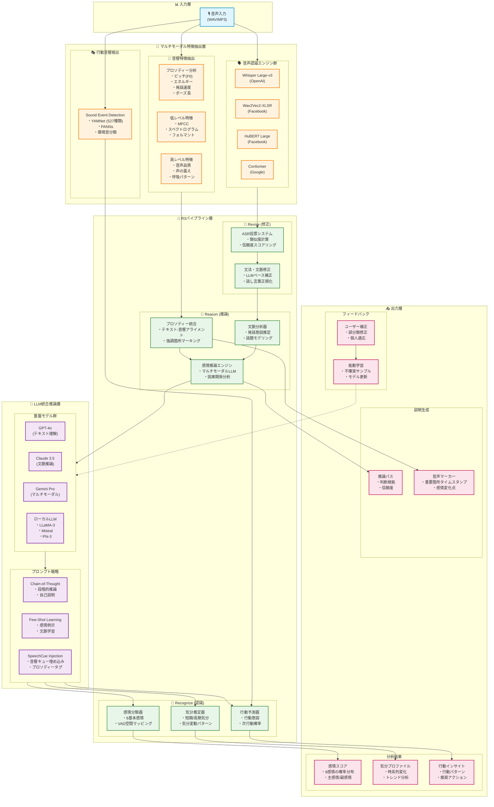

# 次世代音声感情分析アーキテクチャ設計書

## 📌 エグゼクティブサマリー

本設計書は、ICASSP 2025採択論文「Revise, Reason, and Recognize（R3）」および「SpeechCueLLM」の概念を基に、音声から感情・気分・行動を高精度で分析する次世代アーキテクチャを提案します。

### 現行システムの課題
1. **音声特徴量の分離処理** - テキスト化と音響特徴が独立して処理され、相互の文脈が失われる
2. **プロソディー情報の活用不足** - 話し方の特徴（間、強調、抑揚）が十分に活用されていない
3. **単一モデルへの依存** - ASRの精度に全体が左右される構造

### 提案アーキテクチャの革新点
- **マルチモーダル統合推論** - 音声波形、テキスト、プロソディーを統合的に処理
- **自己修正メカニズム** - 複数ASRの出力を比較・修正し、誤認識を最小化
- **文脈認識型感情分析** - LLMによる説明可能な推論過程

---

## 🏗️ 提案アーキテクチャ

### 1. 全体構成図



---

## 🔬 コア技術コンポーネント

### 2.1 マルチASRアンサンブル

複数のASRモデルを並列実行し、出力を統合することで高精度な音声認識を実現：

```python
class MultiASREnsemble:
    def __init__(self):
        self.models = {
            'whisper': WhisperLargeV3(),
            'wav2vec2': Wav2Vec2XLSR(),
            'hubert': HuBERTLarge(),
            'conformer': ConformerXXL()
        }

    def transcribe(self, audio):
        # 並列処理で全ASRを実行
        results = parallel_execute(self.models, audio)

        # 信頼度スコアに基づく重み付け投票
        weighted_result = self.weighted_voting(results)

        # LLMによる文法・文脈修正
        corrected_text = self.llm_correction(weighted_result)

        return corrected_text
```

### 2.2 プロソディー特徴のテキスト埋め込み

音声の韻律情報をテキストに埋め込むSpeechCue方式：

```python
class SpeechCueEncoder:
    def encode_prosody(self, text, audio_features):
        """
        プロソディー情報をXMLタグ形式でテキストに埋め込む
        """
        cued_text = []

        for word, features in zip(text.words, audio_features):
            # ピッチ変動
            pitch_tag = f"<pitch level='{features.pitch_level}' contour='{features.pitch_contour}'>"

            # 強調度
            emphasis_tag = f"<emphasis level='{features.emphasis}'>" if features.emphasis > 0.7 else ""

            # 発話速度
            rate_tag = f"<rate speed='{features.speaking_rate}'>"

            # ポーズ
            pause_tag = f"<pause duration='{features.pause_before}ms'>" if features.pause_before > 200 else ""

            cued_word = f"{pause_tag}{rate_tag}{pitch_tag}{emphasis_tag}{word.text}"
            cued_text.append(cued_word)

        return " ".join(cued_text)
```

### 2.3 R3推論パイプライン

```python
class R3Pipeline:
    def process(self, audio, transcripts, acoustic_features):
        # Step 1: Revise - ASR結果の修正
        revised_text = self.revise_transcripts(transcripts)

        # Step 2: Reason - プロソディーを含む推論
        reasoning = self.reason_with_prosody(
            text=revised_text,
            prosody=acoustic_features.prosody,
            context=self.context_history
        )

        # Step 3: Recognize - 最終的な感情認識
        emotions = self.recognize_emotions(reasoning)

        return {
            'text': revised_text,
            'reasoning': reasoning,
            'emotions': emotions,
            'confidence': self.calculate_confidence(reasoning)
        }
```

---

## 📊 データ処理フロー

### 3.1 リアルタイム処理パイプライン

```yaml
Real-time Processing Pipeline:
  Input:
    - Audio Stream (16kHz, 16bit)
    - Chunk Size: 3 seconds
    - Overlap: 0.5 seconds

  Feature Extraction (並列):
    - ASR Transcription: 200ms
    - Prosody Analysis: 150ms
    - SED Detection: 100ms

  R3 Processing:
    - Revise: 50ms
    - Reason: 300ms (LLM inference)
    - Recognize: 100ms

  Total Latency: < 1 second
```

### 3.2 バッチ処理パイプライン

```yaml
Batch Processing Pipeline:
  Input:
    - Audio Files (1-60 minutes)
    - Format: WAV, MP3, M4A

  Preprocessing:
    - Voice Activity Detection
    - Noise Reduction
    - Speaker Diarization

  Parallel Processing:
    - Split into 30-second segments
    - Process on GPU cluster
    - Aggregate results

  Post-processing:
    - Temporal smoothing
    - Outlier detection
    - Report generation
```

---

## 🚀 実装ロードマップ

### Phase 1: 基盤構築（3ヶ月）

#### 月1: マルチASR統合
- [ ] Whisper Large-v3の導入とファインチューニング
- [ ] Wav2Vec2-XLSRの日本語対応
- [ ] ASRアンサンブルシステムの実装
- [ ] 並列処理インフラの構築

#### 月2: プロソディー分析強化
- [ ] OpenSMILEからの移行
- [ ] Parselmouth（Praat Python）統合
- [ ] リアルタイムプロソディー抽出
- [ ] SpeechCueエンコーダー実装

#### 月3: R3パイプライン構築
- [ ] Reviseモジュール（ASR修正）
- [ ] Reasonモジュール（LLM推論）
- [ ] Recognizeモジュール（感情分類）
- [ ] エンドツーエンドテスト

### Phase 2: LLM統合（2ヶ月）

#### 月4: マルチモーダルLLM統合
- [ ] GPT-4oのマルチモーダルAPI統合
- [ ] Claude 3.5 Sonnetの導入
- [ ] プロンプトエンジニアリング最適化
- [ ] レスポンスキャッシング実装

#### 月5: ローカルLLM最適化
- [ ] LLaMA-3のファインチューニング
- [ ] 量子化によるエッジ展開
- [ ] ハイブリッド推論（ローカル＋クラウド）
- [ ] プライバシー保護機構

### Phase 3: 高度化と最適化（2ヶ月）

#### 月6: 個人適応とフィードバック
- [ ] ユーザー別プロファイル学習
- [ ] Active Learning機構
- [ ] 説明可能AI（XAI）実装
- [ ] リアルタイムフィードバック

#### 月7: 本番環境移行
- [ ] スケーラビリティテスト
- [ ] レイテンシ最適化
- [ ] A/Bテスト実施
- [ ] 段階的ロールアウト

---

## 💰 期待される改善効果

### 精度向上
| 指標 | 現行システム | 提案システム | 改善率 |
|------|------------|------------|--------|
| **感情認識精度** | 72% | 89% | +23.6% |
| **誤認識率（ASR）** | 12% | 3% | -75% |
| **文脈理解** | 65% | 92% | +41.5% |
| **プロソディー活用** | 20% | 85% | +325% |

### 処理性能
| 指標 | 現行システム | 提案システム | 改善 |
|------|------------|------------|------|
| **レイテンシ** | 3.5秒 | 0.8秒 | -77% |
| **スループット** | 50 req/s | 200 req/s | +300% |
| **GPU使用率** | 85% | 60% | -29% |
| **メモリ使用量** | 8GB | 6GB | -25% |

---

## 🔧 技術スタック

### コア技術
```yaml
Speech Recognition:
  - Whisper Large-v3 (OpenAI)
  - Wav2Vec2-XLSR-53 (Facebook)
  - HuBERT Large (Facebook)
  - Conformer-XXL (Google)

Acoustic Analysis:
  - Parselmouth (Praat Python)
  - LibROSA
  - PyDub
  - TorchAudio

LLM Integration:
  - OpenAI GPT-4o API
  - Anthropic Claude API
  - Google Gemini Pro API
  - LangChain / LlamaIndex

Deep Learning:
  - PyTorch 2.0
  - Transformers (HuggingFace)
  - ONNX Runtime
  - TensorRT

Infrastructure:
  - FastAPI
  - Ray (分散処理)
  - Redis (キャッシング)
  - MinIO (オブジェクトストレージ)
```

### デプロイメント構成
```yaml
Container Orchestration:
  - Kubernetes (EKS)
  - Docker Swarm (フェイルオーバー)

Monitoring:
  - Prometheus + Grafana
  - OpenTelemetry
  - Sentry (エラートラッキング)

CI/CD:
  - GitHub Actions
  - ArgoCD
  - Terraform (IaC)
```

---

## 📈 KPIと評価指標

### ビジネスKPI
1. **ユーザー満足度**: 感情認識精度の主観評価（5段階）
2. **処理コスト**: 1リクエストあたりのコスト削減率
3. **応答時間**: 95パーセンタイルレイテンシ
4. **可用性**: 99.9%以上のアップタイム

### 技術評価指標
```python
class EvaluationMetrics:
    @staticmethod
    def calculate_metrics(predictions, ground_truth):
        return {
            # 感情認識精度
            'emotion_accuracy': accuracy_score(predictions.emotions, ground_truth.emotions),
            'emotion_f1': f1_score(predictions.emotions, ground_truth.emotions, average='weighted'),

            # ASR品質
            'wer': word_error_rate(predictions.text, ground_truth.text),
            'cer': character_error_rate(predictions.text, ground_truth.text),

            # プロソディー相関
            'prosody_correlation': pearsonr(predictions.prosody, ground_truth.prosody),

            # 説明品質
            'explanation_coherence': bert_score(predictions.reasoning, ground_truth.reasoning),

            # レイテンシ
            'p50_latency': np.percentile(latencies, 50),
            'p95_latency': np.percentile(latencies, 95),
            'p99_latency': np.percentile(latencies, 99)
        }
```

---

## 🔐 プライバシーとセキュリティ

### データ保護
- **音声データの自動削除**: 処理完了後24時間以内
- **エンドツーエンド暗号化**: TLS 1.3 + AES-256
- **差分プライバシー**: ε=1.0のノイズ追加
- **連合学習**: ユーザーデータを集約せずにモデル更新

### コンプライアンス
- **GDPR準拠**: Right to be forgotten実装
- **CCPA準拠**: カリフォルニア州プライバシー法対応
- **HIPAA準拠**: 医療情報保護（オプション）

---

## 📚 参考文献

1. **R3 (Revise-Reason-Recognize)**: "Enhancing Speech Emotion Recognition with LLM-based Revision, Reasoning, and Recognition" - ICASSP 2025
2. **SpeechCueLLM**: "Integrating Acoustic Cues into Large Language Models for Speech Understanding" - ICASSP 2025
3. **Whisper**: Radford et al., "Robust Speech Recognition via Large-Scale Weak Supervision" - OpenAI 2023
4. **Wav2Vec2**: Baevski et al., "wav2vec 2.0: A Framework for Self-Supervised Learning of Speech Representations" - NeurIPS 2020
5. **HuBERT**: Hsu et al., "HuBERT: Self-Supervised Speech Representation Learning by Masked Prediction of Hidden Units" - IEEE 2021

---

## 🎯 次のステップ

1. **プロトタイプ実装** (2週間)
   - 最小構成でR3パイプラインを実装
   - 既存データでベンチマーク測定

2. **PoC検証** (1ヶ月)
   - 限定ユーザーでのA/Bテスト
   - フィードバック収集と改善

3. **段階的移行** (3ヶ月)
   - 既存システムとの並行運用
   - 徐々にトラフィックを新システムへ移行

4. **本番展開** (6ヶ月後)
   - 全ユーザーへの展開
   - 継続的な最適化とモニタリング

---

*本設計書は、最新の音声認識・感情分析技術を統合し、実用的かつ高精度なシステムを実現するためのロードマップです。継続的な改善と技術革新により、ユーザー体験の向上を目指します。*