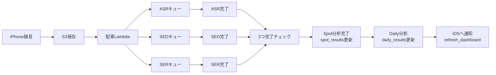

# WatchMe パイプライン概要（非エンジニア向け）

最終更新: 2026-03-07  
Status: Active  
用途: 企画・運用・説明資料向けの簡易版

## 1. 何が起きているか（3行）

1. iPhoneで録音すると、音声がクラウド（S3）に保存される  
2. 裏側で3種類の分析（文字起こし / 音イベント / 感情）が同時に走る  
3. 3つがそろうと Spot分析が完成し、その後 Daily分析と通知に進む

## 2. 概念図（簡易）

## 3. アプリ反映タイミング

1. Spot結果は `spot_results` に保存された時点で取得可能  
2. Daily結果は `daily_results` 更新後に取得可能  
3. 通知は現在、Daily分析ワーカー側で送信する設計  

補足:
- 通知が来る前でも、アプリが再取得すれば Spot が先に見える場合がある  
- 体感としては「通知タイミング = Daily更新タイミング」になりやすい

## 4. なぜキューを使うのか

1. 処理が重い時でも、順番を守って安全にさばける  
2. 一時的な失敗は自動リトライできる  
3. 3分析の足並みをそろえて、Spot分析を安定して開始できる

## 5. 用語ミニ辞典

- ASR: 文字起こし  
- SED: 音イベント検出（例: 会話・生活音など）  
- SER: 感情推定  
- Spot分析: 1回の録音単位の分析  
- Daily分析: その日全体の集約分析
