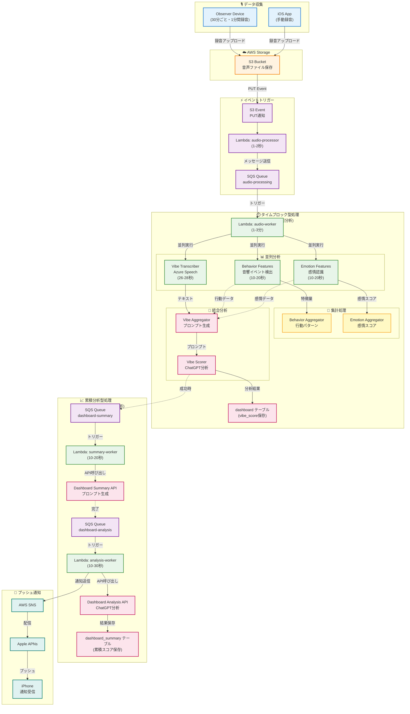
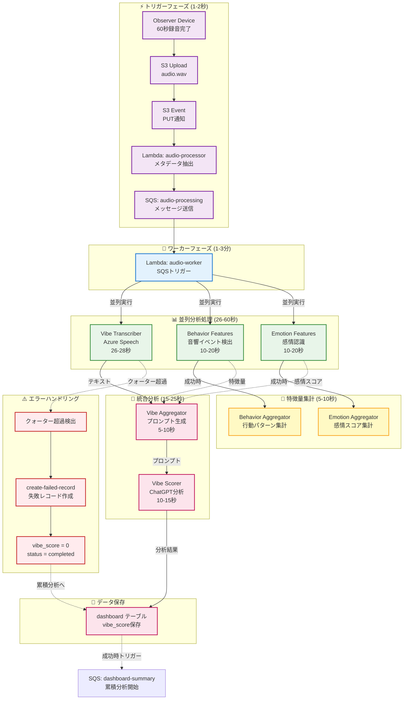
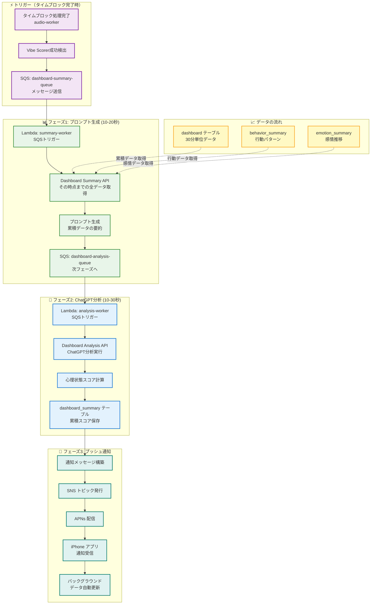
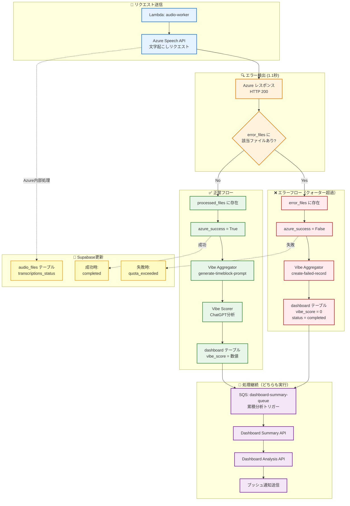
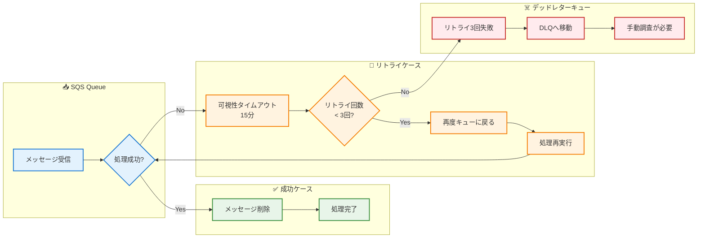

# WatchMe 音声処理アーキテクチャ

## 🎯 サービス概要

WatchMeは、音声データを多面的に分析し、ユーザーの心理状態を可視化するプラットフォームです。

### 録音デバイスとデータ収集

**メイン機能：オブザーバーデバイスによる自動録音**
- **オブザーバーデバイス**：ウェアラブル型または据え置き型の録音デバイス
- **録音頻度**：30分ごとに1分間自動録音（1日48データポイント）
- **用途**：日常的な継続モニタリング

**追加機能：iOSアプリ内スポット録音**
- **録音方式**：ユーザーが手動で録音ボタンを押して開始（フォアグラウンドのみ）
- **録音時間**：任意（制限なし）
- **用途**：特定の会話や状況をピンポイントで分析したい場合

### マルチデバイス対応

- すべての録音デバイス（オブザーバー + iOSアプリ）からのデータを統合
- 分析結果はiOSアプリのダッシュボードに一元表示
- 将来的にAndroidアプリも対応予定

### データフロー

```
録音デバイス（オブザーバー/iOSアプリ）→ S3アップロード → サーバー側で自動分析
→ 結果をプッシュ通知 → iOSダッシュボードで閲覧
```

---

## 📊 システム概要

### 🎯 2つの処理モード

| 処理モード | 実行タイミング | トリガー方式 | 目的 | 頻度 |
|-----------|--------------|------------|------|------|
| **タイムブロック型** | 30分ごと | イベント駆動（Lambda） | 30分単位の個別分析 | 48回/日 |
| **累積分析型** | 30分ごと | イベント駆動（Lambda） | その時点までの統合分析 | 48回/日 |

### 🔬 3つの分析技術

| 技術分野 | サービス名 | 役割 | 出力データ |
|---------|-----------|------|-----------|
| **音声認識** | Vibe Transcriber | 音声認識・文字起こし | 発話内容テキスト |
| **音響分析** | Behavior Features | 音響イベント検出 | 環境音・行動の分類（527種類） |
| **感情分析** | Emotion Features | 音声感情認識 | 8つの基本感情スコア |

### 📈 3つの表示軸

| 表示軸 | データソース | 内容 |
|--------|------------|------|
| **気分（Vibe）** | Vibe Transcriber + Behavior Features + Emotion Features の総合 | 総合的な心理状態スコアとサマリー |
| **行動（Behavior）** | Behavior Features中心 | 音響イベントから推定される行動パターン |
| **感情（Emotion）** | Emotion Features中心 | 8つの基本感情の時系列変化 |

---

## 🔄 処理フロー

### 🎨 システム全体の処理フロー概要



---

### 1️⃣ タイムブロック型処理（イベント駆動）

#### ⚡ 2025年9月24日更新：SQSを使った2段階処理に改善



**アーキテクチャの特徴**:
- **トリガーLambda**: 1-2秒で完了（SQSにメッセージ送信のみ）
- **ワーカーLambda**: 必要な時間だけ実行（最大15分）
- **自動リトライ**: SQSが失敗時に3回まで自動再試行
- **同時実行制御**: ワーカーの同時実行数を制限可能
- **デッドレターキュー**: 3回失敗したメッセージを別途保管
- **信頼性向上**: Supabase upsertにリトライ処理実装済み

### 2️⃣ 累積分析型処理（イベント駆動）

#### ⚡ 2025年9月25日更新：イベント駆動型に移行



**アーキテクチャの特徴**:
- **実行タイミング**: タイムブロック処理完了時（30分ごと、1日48回）
- **トリガー**: Vibe Scorer成功時に自動起動
- **処理内容**: その時点までの全データを統合分析
- **リアルタイム性**: ほぼリアルタイム（処理完了から数秒）
- **信頼性**: SQSによる自動リトライ（最大3回）
- **スケーラビリティ**: Lambda自動スケーリング

---

### 3️⃣ エラーハンドリングフロー

#### ⚠️ クォーター超過時の処理フロー（2025年10月21日更新）



**🎯 重要なポイント**:

1. **エラー検出**: `error_files`リストに該当ファイルが含まれているかで判定
2. **失敗レコード作成**: クォーター超過時も`vibe_score=0`でレコードを作成
3. **処理継続**: 成功/失敗に関わらず累積分析とプッシュ通知を実行
4. **データの3つの状態**:
   - `null` (vibe_score) = 未処理
   - `0` (vibe_score) = 失敗（クォーター超過など）
   - 数値 (vibe_score) = 正常完了

---

### 4️⃣ SQSリトライメカニズム



**⚙️ 設定値**:
- **可視性タイムアウト**: 15分（Lambda最大実行時間と同じ）
- **最大リトライ回数**: 3回
- **メッセージ保持期間**: 14日間
- **DLQ保持期間**: 14日間

---

## 📦 システム構成

### Lambda関数構成（2025年10月22日更新）

| 関数名 | 役割 | 実行時間 | タイムアウト | トリガー | 呼び出し先API |
|--------|------|---------|------------|---------|--------------|
| **watchme-audio-processor** | S3イベント受信→SQS送信 | 1-2秒 | 10秒 | S3イベント | なし |
| **watchme-audio-worker** | 音声処理実行→累積分析トリガー | 1-3分 | 15分 | SQSキュー | 下記7つのAPI |
| **watchme-dashboard-summary-worker** | プロンプト生成処理 | 10-20秒 | 15分 | SQSキュー | Vibe Aggregator（dashboard-summary） |
| **watchme-dashboard-analysis-worker** | ChatGPT分析処理＋プッシュ通知送信 | 10-30秒 | 15分 | SQSキュー | Vibe Scorer（dashboard-analysis） |

#### watchme-audio-worker が呼び出すAPIエンドポイント（詳細）

以下のエンドポイントは`API_BASE_URL`環境変数（デフォルト: `https://api.hey-watch.me`）を基準に構築されます。

| 順序 | API | エンドポイント | メソッド | タイムアウト | 備考 |
|-----|-----|--------------|---------|-----------|------|
| 1 | Vibe Transcriber | `/vibe-analysis/transcriber/fetch-and-transcribe` | POST | 180秒 | リトライ最大3回 |
| 2 | Behavior Features | `/behavior-analysis/features/fetch-and-process-paths` | POST | 180秒 | 音響イベント検出 |
| 2.1 | Behavior Aggregator | `/behavior-aggregator/analysis/sed` | POST | 180秒 | Behavior Features成功時に自動起動 |
| 3 | Emotion Features | `/emotion-analysis/features/process/emotion-features` | POST | 180秒 | 感情認識 |
| 3.1 | Emotion Aggregator | `/emotion-analysis/aggregation/analyze/opensmile-aggregator` | POST | 180秒 | Emotion Features成功時に自動起動 |
| 3.5 | Vibe Aggregator（失敗記録） | `/vibe-analysis/aggregator/create-failed-record` | POST | 30秒 | Vibe Transcriber失敗時のみ |
| 4 | Vibe Aggregator | `/vibe-analysis/aggregator/generate-timeblock-prompt` | GET | 180秒 | 全サービス成功時のみ |
| 5 | Vibe Scorer | `/vibe-analysis/scorer/analyze-timeblock` | POST | 180秒 | Vibe Aggregator成功時のみ |

#### watchme-dashboard-summary-worker が呼び出すAPIエンドポイント

| API | エンドポイント | メソッド | タイムアウト | 備考 |
|-----|--------------|---------|-----------|------|
| Vibe Aggregator（dashboard-summary） | `/vibe-analysis/aggregator/generate-dashboard-summary` | GET | 180秒 | プロンプト生成 |

#### watchme-dashboard-analysis-worker が呼び出すAPIエンドポイント

| API | エンドポイント | メソッド | タイムアウト | 備考 |
|-----|--------------|---------|-----------|------|
| Vibe Scorer（dashboard-analysis） | `/vibe-analysis/scorer/analyze-dashboard-summary` | POST | 180秒 | ChatGPT分析 |

### SQSキュー構成（2025年9月25日更新）

| キュー名 | 用途 | 可視性タイムアウト | 保持期間 | DLQ |
|---------|------|------------------|---------|-----|
| **watchme-audio-processing** | 音声処理キュー | 15分 | 14日 | あり |
| **watchme-audio-processing-dlq** | 音声処理失敗メッセージ | - | 14日 | - |
| **watchme-dashboard-summary-queue** | プロンプト生成キュー | 15分 | 14日 | あり |
| **watchme-dashboard-summary-dlq** | プロンプト生成失敗メッセージ | - | 14日 | - |
| **watchme-dashboard-analysis-queue** | ChatGPT分析キュー | 15分 | 14日 | あり |
| **watchme-dashboard-analysis-dlq** | ChatGPT分析失敗メッセージ | - | 14日 | - |

### APIサービス構成

**すべてのAPIサービスはAWS EC2インスタンス上でDockerコンテナとして稼働しています。**

| カテゴリ | サービス名 | 技術 | ポート | エンドポイント | コンテナ名 | 稼働環境 |
|---------|-----------|------|--------|--------------|-----------|----------|
| **音声認識** | Vibe Transcriber | Azure Speech Services | 8013 | /vibe-analysis/transcriber | `vibe-analysis-transcriber` | EC2 (Docker) |
| **音響分析** | Behavior Features | 音響イベント検出（527種類） | 8017 | /behavior-analysis/features | `behavior-analysis-feature-extractor-v2` | EC2 (Docker) |
| **感情分析** | Emotion Features | 音声感情認識（8感情） | 8018 | /emotion-analysis/features | `emotion-analysis-feature-extractor-v3` | EC2 (Docker) |
| **集計** | Behavior Aggregator | 行動パターン分析 | 8010 | /behavior-aggregator | `behavior-analysis-sed-aggregator` | EC2 (Docker) |
| **集計** | Emotion Aggregator | 感情スコア集計 | 8012 | /emotion-analysis/aggregation | `emotion-analysis-aggregator` | EC2 (Docker) |
| **統合** | Vibe Aggregator | プロンプト生成 | 8009 | /vibe-analysis/aggregator | `api_gen_prompt_mood_chart` | EC2 (Docker) |
| **統合** | Vibe Scorer | ChatGPT連携 | 8002 | /vibe-analysis/scorer | `vibe-analysis-scorer` | EC2 (Docker) |

> **詳細**: EC2のインフラ構成、Dockerネットワーク、Nginx設定については [server-configs/README.md](./README.md) を参照

#### 📝 コンテナ名の重要性

**コンテナ間通信では、コンテナ名を直接参照する場所が多数あります：**

1. **Lambda関数**（`watchme-audio-worker`, `watchme-dashboard-summary-worker`, `watchme-dashboard-analysis-worker`）
   - 環境変数`API_BASE_URL`経由でHTTPSエンドポイントを使用（Nginx経由）
   - コンテナ名の直接参照なし

2. **API Manager（スケジューラー）**（`/api/api-manager/scheduler/run-api-process-docker.py`）
   - **コンテナ名を直接参照**：
     - `http://vibe-analysis-aggregator:8009/...`
     - `http://vibe-analysis-scorer:8002/...`
     - `http://behavior-analysis-feature-extractor-v2:8017/...`
     - `http://emotion-analysis-feature-extractor-v3:8018/...`
     - `http://vibe-analysis-transcriber:8013/...`
     - `http://behavior-analysis-sed-aggregator:8010/...`
     - `http://emotion-analysis-aggregator:8012/...`
   - ⚠️ **コンテナ名を変更する場合は、このファイルも更新が必要**

3. **その他のサービス**（Vault, Janitor, Demo Generator）
   - これらのサービスはリストラクチャ対象のコンテナを参照していないことを確認済み

### データフロー

```
音声ファイル（60秒）
    ↓
┌─────────────┬─────────────┬─────────────┐
│     ASR     │     SED     │     SER     │
│  (発話内容) │ (環境音検出) │ (感情認識)  │
└─────────────┴─────────────┴─────────────┘
        ↓            ↓              ↓
┌─────────────────────────────────────────┐
│           データ統合・分析               │
├─────────────┬─────────────┬─────────────┤
│  気分(Vibe) │行動(Behavior)│感情(Emotion)│
│  総合スコア │  行動パターン │ 感情の推移  │
└─────────────┴─────────────┴─────────────┘
```

---

## 🗄️ データベース構造

### 基礎データテーブル（タイムブロック単位）

| テーブル名 | データソース | 内容 | 更新頻度 |
|-----------|------------|------|---------|
| `vibe_whisper` | ASR API | 発話内容テキスト | 30分ごと |
| `behavior_yamnet` | SED API | 音響イベント検出結果 | 30分ごと |
| `emotion_opensmile` | SER API | 8感情スコア | 30分ごと |

### 集計データテーブル

| テーブル名 | データソース | 内容 | 更新頻度 |
|-----------|------------|------|---------|
| `behavior_summary` | SED Aggregator | 日次行動パターン | 30分ごと |
| `emotion_opensmile_summary` | Emotion Aggregator | 日次感情推移 | 30分ごと |

### 統合データテーブル

| テーブル名 | 処理タイプ | 内容 | 更新頻度 |
|-----------|----------|------|---------|
| `dashboard` | タイムブロック型 | 30分単位の統合分析 | 30分ごと |
| `dashboard_summary` | 累積分析型 | その時点までの累積分析 | 30分ごと（タイムブロック完了時） |

---


## 📊 パフォーマンス指標

### 処理時間

| 処理 | 平均時間 | タイムアウト設定 | 実測データ（2025年10月調査） |
|------|---------|--------------|---------------------------|
| Lambda Trigger（SQS送信） | 1-2秒 | 10秒 | - |
| Vibe Transcriber | 15-30秒 | 3分（HTTP）/ 15分（Lambda） | **26-28秒**（1分音声） |
| Behavior Features | 10-20秒 | 3分 | - |
| Emotion Features | 10-20秒 | 3分 | - |
| Vibe Aggregator | 5-10秒 | 30秒 | - |
| Vibe Scorer | 10-15秒 | 30秒 | - |
| Lambda Worker（全体） | 1-3分 | **15分** | - |

**重要な発見（2025年10月20日調査）**:
- ✅ **1分の音声ファイル → 平均26-28秒で処理完了**（Azure Speech API）
- ✅ **重複処理は発生していない**（懸念されていた「3回リトライで3倍クォーター消費」は否定）
- ✅ **Lambda関数のタイムアウトは900秒（15分）**で、十分な余裕がある
- ⚠️ **クォーター超過時は1.1秒で即座にエラー**（リトライ機能が動作していない可能性）

### システム負荷

- **タイムブロック型**: 48回/日 × 1-3分 = 約0.8-2.4時間/日
- **累積分析型**: 48回/日 × 30-40秒 = 約24-32分/日
- **合計処理時間**: 約1.2-3時間/日（改善前の40-60%削減）

---

## ⚠️ Azure クォーター超過の運用方針

### 概要

開発環境では**Azure Speech APIの無料プラン**を使用しているため、日次クォーター上限に到達することがあります。

### クォーター超過の発生パターン

**発生時間帯**: UTC 00:00〜07:00頃（JST 09:00〜16:00頃）

**影響範囲**:
- 1日48回の処理のうち、約**14回（09:00〜15:30のタイムブロック）**でクォーター超過が発生
- 該当タイムブロックは`transcriptions_status = 'quota_exceeded'`として記録される

### クォーター超過時の処理フロー（2025年10月21日更新）

#### **改善後のフロー**

```
1. Azure Speech APIにリクエスト送信
   ↓
2. 1.1秒で即座にエラー応答（クォーター超過）
   ↓
3. Lambda関数がレスポンス本文を解析
   ↓
4. error_files リストに該当ファイルが含まれている
   ↓
5. azure_success = False と判定
   ↓
6. Vibe Aggregator の /create-failed-record を呼び出し
   ↓
7. dashboardテーブルに失敗レコードを作成
   （vibe_score=0, status='completed', summary="分析失敗..."）
   ↓
8. 累積分析をトリガー（成功時と同じフロー）
   ↓
9. プッシュ通知送信（失敗情報も含めて通知）
```

**✅ 改善のポイント（2025年10月21日実装）**:
- **ファイル単位で成功/失敗を判定**：`processed_files`と`error_files`リストを確認
- **失敗時もフローを止めない**：失敗レコードを作成して累積分析も実行
- **ユーザーへの通知を継続**：失敗情報も含めてプッシュ通知を送信

#### **判定ロジック**

Lambda関数は以下の順序でファイル単位の成功/失敗を判定：

1. **processed_files リストに含まれている** → 成功
2. **error_files リストに含まれている** → 失敗
3. **どちらにもない場合** → `summary.errors`の値で判定

```python
# Lambda関数内の判定ロジック（lambda_function.py Line 95-164）
processed_files = response_data.get('processed_files', [])
error_files = response_data.get('error_files', [])

if file_path in processed_files:
    azure_success = True  # ✅ 成功
elif file_path in error_files:
    azure_success = False  # ❌ 失敗（クォーター超過など）
else:
    # summary.errorsで判定
    errors_count = response_data.get('summary', {}).get('errors', 0)
    azure_success = (errors_count == 0)
```

### データの3つの状態

| 状態 | vibe_score | status | 意味 |
|------|-----------|--------|------|
| **未処理** | `null` | `null` | まだその時間帯に到達していない |
| **失敗** | `0` | `completed` | 処理済みだが分析失敗（クォーター超過など） |
| **正常** | 数値（-100〜100） | `completed` | 正常に分析完了 |

### データ保存の範囲

| データ種類 | 成功時 | 失敗時（クォーター超過など） |
|-----------|--------|--------------------------|
| **音声ファイル（S3）** | ✅ 保存済み | ✅ 保存済み |
| **AST（行動分析）** | ✅ 処理完了 | ✅ 処理完了 |
| **SUPERB（感情分析）** | ✅ 処理完了 | ✅ 処理完了 |
| **Azure（文字起こし）** | ✅ 処理完了 | ❌ クォーター超過で失敗 |
| **Vibe Aggregator（統合）** | ✅ 実行 | ✅ `/create-failed-record`で失敗レコード作成 |
| **Vibe Scorer（ChatGPT分析）** | ✅ 実行 | ❌ スキップ |
| **Dashboard（統合分析）** | ✅ 作成（vibe_score=数値） | ✅ 作成（vibe_score=0） |
| **累積分析** | ✅ トリガー | ✅ トリガー |
| **プッシュ通知** | ✅ 送信 | ✅ 送信（失敗情報も含む） |

### 運用方針

#### **基本方針：クォーター超過は即座に諦める**

**理由**:
- クォーター超過は**プラン変更または手動での個別対応**でしか解決できない
- 自動リトライしても復旧しない（無駄なコスト発生）
- **料金が発生する処理は人間による承認プロセスを経るべき**

**処理フロー（2025年10月21日更新）**:
```
1. Azure APIがクォーター超過エラーを返す（HTTP 200 + error_files）
   ↓
2. Lambda関数がファイル単位で失敗を検出
   ↓
3. Azure Speech API内部でSupabaseに transcriptions_status = 'quota_exceeded' を記録
   ↓
4. Lambda関数が /create-failed-record を呼び出し
   ↓
5. dashboardテーブルに失敗レコード作成（vibe_score=0）
   ↓
6. 累積分析を実行（失敗情報も含めて分析）
   ↓
7. プッシュ通知を送信（ユーザーに状況を通知）
   ↓
8. 必要に応じて手動再処理（後述の手順）
```

#### **開発環境（現在）**
- ✅ **クォーター超過時も処理を継続**（失敗レコードを作成）
- ✅ **累積分析とプッシュ通知は送信**（ユーザー体験を維持）
- ✅ **手動再処理の手順を用意**（必要に応じて実行）

#### **本番環境**
- ✅ **Azure有料プランに移行**予定
- ⚠️ **万が一のバジェット超過時も同様の方針**（即座に諦める、手動で再処理）
- ✅ **コスト管理アラートを設定**（予算超過の早期検知）

---

### 手動再処理の手順

#### **Step 1: クォーター超過データの確認**

Supabaseで以下のクエリを実行：

```sql
SELECT
  device_id,
  local_date,
  time_block,
  file_path,
  created_at
FROM audio_files
WHERE transcriptions_status = 'quota_exceeded'
ORDER BY created_at DESC;
```

#### **Step 2: Azureクォーターの確認と対応**

1. **Azureポータルにログイン**
2. **Speech Serviceのクォーター使用状況を確認**
3. **以下のいずれかを実行**:
   - プランをアップグレード（有料プランへ移行）
   - 日次リセット待ち（UTC 00:00 = JST 09:00）
   - 追加クォーターを購入

#### **Step 3: 再処理の実行**

**方法A: API経由で再処理（推奨）**

```bash
# 特定のファイルを再処理
curl -X POST https://api.hey-watch.me/vibe-analysis/transcriber/fetch-and-transcribe \
  -H "Content-Type: application/json" \
  -d '{
    "file_paths": [
      "files/device_id/2025-10-20/09-00/audio.wav"
    ]
  }'
```

**方法B: Lambda関数を直接トリガー（管理者のみ）**

```bash
# AWS CLIでLambda関数を手動実行
aws lambda invoke \
  --function-name watchme-audio-worker \
  --region ap-southeast-2 \
  --payload '{
    "Records": [{
      "body": "{\"file_path\": \"files/...\", \"device_id\": \"...\", \"date\": \"2025-10-20\", \"time_slot\": \"09-00\"}"
    }]
  }' \
  response.json
```

**方法C: S3から再アップロード**

```bash
# S3ファイルをダウンロード → 再アップロード
# S3イベントがトリガーされて自動処理開始
aws s3 cp s3://watchme-vault/files/device_id/2025-10-20/09-00/audio.wav ./temp.wav
aws s3 cp ./temp.wav s3://watchme-vault/files/device_id/2025-10-20/09-00/audio.wav
```

#### **Step 4: 処理完了の確認**

```sql
-- ステータスが更新されたか確認
SELECT
  device_id,
  local_date,
  time_block,
  transcriptions_status,
  updated_at
FROM audio_files
WHERE file_path = 'files/device_id/2025-10-20/09-00/audio.wav';
```

期待値: `transcriptions_status = 'completed'`

---

### クォーター超過以外のエラー対応

#### **エラー種別とLambda関数の対応**

| エラー種別 | Lambda内リトライ | SQSリトライ | 最終アクション |
|-----------|----------------|-----------|-------------|
| **クォーター超過** | ❌ なし | ❌ なし | DB記録 → 手動再処理 |
| **一時的エラー（429, 503）** | ✅ 3回（指数バックオフ） | ❌ 現時点では不要 | 3回失敗で諦める |
| **タイムアウト** | ✅ 3回（指数バックオフ） | ❌ 現時点では不要 | 3回失敗で諦める |
| **ネットワークエラー** | ✅ 3回 | ❌ 現時点では不要 | 3回失敗で諦める |
| **認証エラー（401, 403）** | ❌ なし | ❌ なし | アラート通知 |
| **存在しないリソース（404）** | ❌ なし | ❌ なし | ログ記録のみ |
| **不正なリクエスト（400）** | ❌ なし | ❌ なし | ログ記録のみ |

**Lambda関数内リトライの設定**:
- **回数**: 最大3回
- **待機時間**: 5秒 → 10秒 → 30秒（指数バックオフ）
- **対象**: 429, 503, Timeout, ConnectionError

**SQSリトライ**:
- **現時点では不要**
- 将来的に必要になった場合に実装を検討

---

## 🎯 データステータスの運用方針

### ステータスの意味と使い方（2025年9月25日更新）

| ステータス | 意味 | 用途 |
|-----------|------|------|
| **pending** | 処理待ち | 新規作成時のデフォルト状態 |
| **completed** | 処理完了 | Vibe Scorerが正常に処理を完了 |
| **failed** | 処理失敗 | エラーが発生して処理が失敗 |

**重要な方針**：
- ステータスは**処理の記録**として使用する
- **処理対象の選別には使わない**（依頼されたデータは全て処理する）
- Dashboard Summary APIは`vibe_score`の存在で処理対象を判断する

## 📝 用語集

### デバイスの概念（重要）

WatchMeシステムでは、**デバイス**という言葉が2つの異なる役割で使われます。この区別を正しく理解することが重要です。

#### 1️⃣ 通知先デバイス（Dashboard Device）

**定義**: アプリをダウンロードしてWatchMeサービスを使用しているデバイス

**役割**:
- ダッシュボードでリアルタイムにデータを閲覧する
- プッシュ通知を受信する
- 分析結果を確認する

**具体例**:
- ユーザーのiPhone
- ユーザーのiPad

**技術的識別子**:
- APNsトークン（プッシュ通知用）
- デバイスID（Supabase上で管理）

**重要**: 1ユーザーにつき通常1台（メインデバイス）

---

#### 2️⃣ 観測対象デバイス（Observer Device）

**定義**: 音声データを収集・録音するデバイス

**役割**:
- 30分ごとに音声を録音する（1日48回）
- 録音データをS3にアップロードする
- データベースに録音メタデータを登録する

**具体例**:
- Apple Watch（ウェアラブル型）
- 据え置き型マイク
- **iPhoneそのもの**（マイク機能を使用）

**重要**: デバイスの形状は様々（ウェアラブル、据え置き、スマートフォンなど）

---

#### 🔄 2つのデバイスの関係

| パターン | 説明 | 具体例 |
|---------|------|--------|
| **別々のデバイス** | 通知先と観測対象が異なる | Apple Watchで録音 → iPhoneで閲覧 |
| **同一デバイス** | 1台のデバイスが両方の役割を果たす | iPhoneで録音 → 同じiPhoneで閲覧 |

**概念の整理**:
- **通知先デバイス**: 「データを見る人」のデバイス
- **観測対象デバイス**: 「データを取る」デバイス
- **同一の場合**: iPhoneが録音もダッシュボード表示も行う
- **別々の場合**: Apple Watchで録音、iPhoneでダッシュボード閲覧

---

### その他の用語

| 用語 | 説明 |
|------|------|
| **タイムブロック** | 30分単位の時間区切り（例: 09-00, 09-30） |
| **オブザーバーデバイス** | （旧用語）観測対象デバイスと同義 |
| **バーストイベント** | 感情の急激な変化点 |
| **Aggregator** | 生データを集計・整形するサービス |
| **Scorer** | ChatGPTを使用した高度な分析サービス |
| **APNsトークン** | 通知先デバイス（iPhone）を一意に識別するトークン |

---

*最終更新: 2025年10月21日*

## 📋 更新履歴

- **2025年10月21日**:
  - **Lambda関数のエラーハンドリング改善完了**
  - Azure Speech APIレスポンスのファイル単位判定を実装
  - `processed_files`/`error_files`リストから該当ファイルの成功/失敗を判定
  - クォーター超過時も失敗レコードを作成して処理を継続
  - 失敗時も累積分析とプッシュ通知を送信（ユーザー体験を維持）
  - **データの3つの状態を明確化**：未処理（null）、失敗（vibe_score=0）、正常（数値）
  - Lambda関数をデプロイ完了（watchme-audio-worker）
- **2025年10月20日**:
  - **実測データに基づくパフォーマンス調査完了**
  - Azure Speech APIの処理時間を実測：**26-28秒（1分音声）**
  - Lambda関数のタイムアウト設定を確認：**900秒（15分）**
  - **重複処理は発生していないことを確認**（懸念されていた「3回リトライで3倍クォーター消費」を否定）
  - クォーター超過時は1.1秒で即座にエラーになることを確認
  - **Azureクォーター超過の運用方針**セクションを新設
  - 開発環境で無料プラン使用によるクォーター超過が発生することを明記
  - **クォーター超過は即座に諦め、手動再処理する方針を確立**
  - **料金発生処理には人間による承認プロセスを経る設計思想を明記**
  - 手動再処理の詳細手順を3つの方法で記載（API経由、Lambda直接、S3再アップロード）
  - エラー種別ごとのLambda関数の対応方針を明確化
  - **SQSリトライは現時点では不要**と判断
  - DLQ（デッドレターキュー）に溜まった374件のメッセージをパージ（プッシュ通知失敗の古いメッセージ）
  - 本番環境APNSを無効化し、サンドボックスAPNSのみ使用することを確認
- **2025年10月15日**:
  - **プッシュ通知システム実装完了**（AWS SNS + APNs）
  - dashboard-analysis-worker関数にプッシュ通知送信機能を追加
  - 用語定義の標準化：「観測対象デバイス」「通知先デバイス」を明確化
  - 累積分析完了時の通知フローを追加
- **2025年9月25日**:
  - 累積分析処理をイベント駆動型に移行、新規Lambda関数追加
  - Dashboard Summary APIをステータスに関係なく処理するよう修正
  - Vibe Scorer APIがdashboardテーブルに`status: 'completed'`を設定するよう修正
  - ステータスの運用方針を明確化（処理の記録用であり、処理対象の選別には使わない）
- **2025年9月24日**: SQSを使った2段階処理に改善、Lambda関数を分離
- **2025年9月23日**: Azure Speech API (vibe-transcriber-v2)にSupabase upsertリトライ処理追加
- **2025年1月**: 初版作成

---

## 🔮 今後の予定

- **Step Functions導入**: 複雑なワークフローの可視化と部分的な再実行の実現
- **監視強化**: CloudWatch監視ダッシュボードの構築、SQSメトリクス・エラーアラート設定