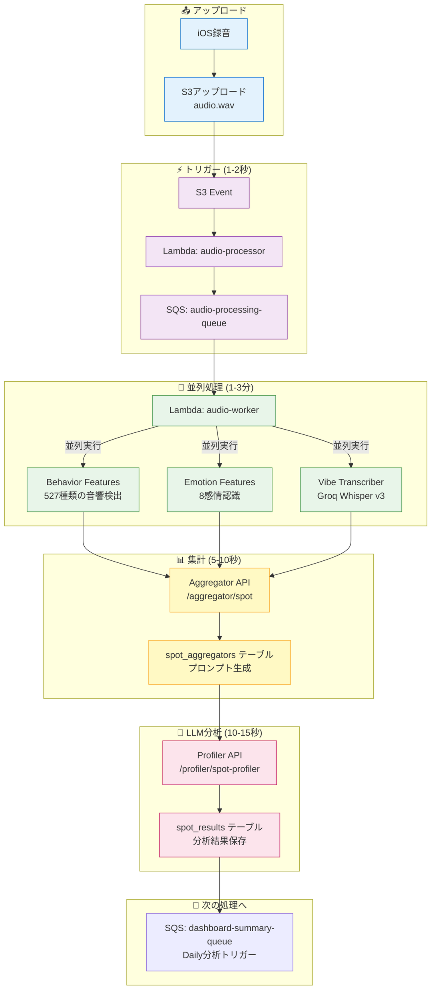
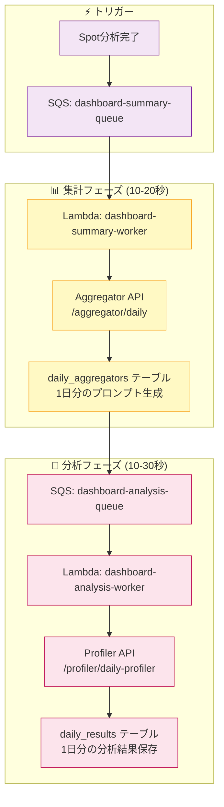
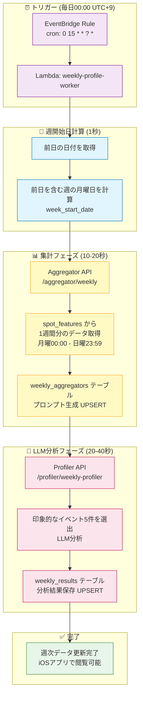

# WatchMe 処理アーキテクチャ

最終更新: 2025-11-16

## 🎯 システム概要

WatchMeは音声録音から心理・感情分析を自動実行するプラットフォームです。

### 録音デバイス

| デバイス | 録音方式 | 用途 |
|---------|---------|------|
| **Observer Device** | 30分ごと自動録音（1分間） | 日常的な継続モニタリング（1日48回） |
| **iOS App** | 手動録音（任意の長さ） | 特定の会話・状況のスポット分析 |

### データフロー

```
録音デバイス → S3アップロード → Lambda自動処理 → 分析結果保存 → iOSアプリ表示
```

---

## 🔄 処理フロー

### 📊 3つの分析レベル

| 分析レベル | 単位 | トリガー | データ保存先 |
|----------|------|---------|------------|
| **Spot分析** | 録音ごと | S3アップロード | spot_results |
| **Daily分析** | 1日の累積 | Spot分析完了時 | daily_results |
| **Weekly分析** | 1週間の累積（月〜日） | 毎日00:00（EventBridge） | weekly_results |

---

## 1️⃣ Spot分析（録音ごと）

### 処理フロー



### 処理詳細

#### ⚡ トリガーフェーズ (1-2秒)

1. S3に音声ファイルアップロード
2. S3イベント → Lambda: audio-processor
3. SQSキューにメッセージ送信

#### 🔧 並列処理フェーズ (1-3分)

Lambda: audio-worker が以下を並列実行:

| API | 処理時間 | 役割 |
|-----|---------|------|
| Behavior Features | 10-20秒 | 527種類の音響イベント検出 |
| Emotion Features | 10-20秒 | 8感情認識 |
| Vibe Transcriber | 26-28秒 | Groq Whisper v3文字起こし |

#### 📊 集計フェーズ (5-10秒)

**Aggregator API** (`/aggregator/spot`):
- 3つの特徴量を統合
- LLM分析用プロンプト生成
- `spot_aggregators` テーブルに保存

#### 🤖 LLM分析フェーズ (10-15秒)

**Profiler API** (`/profiler/spot-profiler`):
- プロンプトを取得
- LLM分析実行（Groq openai/gpt-oss-120b）
- `spot_results` テーブルに保存

**保存データ**:
- `vibe_score`: 心理スコア (-100〜+100)
- `summary`: 状況サマリー（日本語）
- `behavior`: 検出された行動（カンマ区切り）
- `profile_result`: 完全な分析結果（JSONB）

---

## 2️⃣ Daily分析（1日の累積）

### 処理フロー



### 処理詳細

#### 📊 集計フェーズ (10-20秒)

**Lambda: dashboard-summary-worker**
- SQSキューからトリガー
- Aggregator API呼び出し

**Aggregator API** (`/aggregator/daily`):
- その日のspot_resultsを全て取得
- 1日分の統合プロンプト生成
- `daily_aggregators` テーブルに保存

#### 🤖 分析フェーズ (10-30秒)

**Lambda: dashboard-analysis-worker**
- SQSキューからトリガー
- Profiler API呼び出し

**Profiler API** (`/profiler/daily-profiler`):
- daily_aggregatorsからプロンプト取得
- LLM分析実行（1日の総合分析）
- `daily_results` テーブルに保存

**保存データ**:
- `vibe_score`: 1日の平均心理スコア
- `summary`: 1日の総合サマリー（日本語）
- `behavior`: 主要な行動パターン
- `profile_result`: 完全な分析結果（JSONB）
- `vibe_scores`: 録音時刻ベースのスコア配列（JSONB配列）
- `burst_events`: 感情変化イベント（JSONB配列）
- `processed_count`: 処理済みspot数

---

## 3️⃣ Weekly分析（1週間の累積）

### 処理フロー



### 処理詳細

#### ⏰ トリガーフェーズ（毎日00:00）

**EventBridge Rule**:
- **Cron式**: `0 15 * * ? *`（UTC 15:00 = JST 00:00）
- **頻度**: 毎日1回
- **ターゲット**: Lambda `weekly-profile-worker`

**処理タイミング**:
```
例: 2025-11-20 00:00 (JST) に実行
  ↓
yesterday = 2025-11-19 (火曜日)
  ↓
week_start_date = 2025-11-18 (月曜日)
  ↓
week_end_date = 2025-11-24 (日曜日)
  ↓
対象データ: 2025-11-18 〜 2025-11-24
（現時点では 月・火のデータのみ存在）
```

**毎日更新の利点**:
- 週の途中でも常に最新の週次データが閲覧可能
- 日曜日の深夜（月曜00:00）に週が完成
- UPSERTのため、同じ週のデータは上書き更新

#### 📅 週開始日計算フェーズ（1秒）

**Lambda内部処理**:
```python
import datetime

# 前日の日付
yesterday = datetime.date.today() - datetime.timedelta(days=1)

# 前日を含む週の月曜日を計算（ISO 8601準拠）
week_start_date = yesterday - datetime.timedelta(days=yesterday.weekday())

# 週の終了日（日曜日）
week_end_date = week_start_date + datetime.timedelta(days=6)
```

**週の定義**:
- 月曜始まり（ISO 8601準拠）
- 月曜 00:00 〜 日曜 23:59 が1週間

#### 📊 集計フェーズ（10-20秒）

**Aggregator API** (`/aggregator/weekly`):
- `spot_features` から1週間分（月曜〜日曜）のデータを取得
- `vibe_transcriber_result`（発話内容）を時系列で整理
- LLMに「印象的なイベント5件を選出」するプロンプトを生成
- `weekly_aggregators` テーブルに保存（UPSERT）

**データ取得SQL**:
```sql
SELECT
  device_id,
  recorded_at,
  local_date,
  local_time,
  vibe_transcriber_result
FROM spot_features
WHERE device_id = ?
  AND local_date >= '2025-11-18'  -- Monday
  AND local_date <= '2025-11-24'  -- Sunday
ORDER BY recorded_at ASC
```

#### 🤖 LLM分析フェーズ（20-40秒）

**Profiler API** (`/profiler/weekly-profiler`):
- `weekly_aggregators.prompt` からプロンプト取得
- LLM分析実行（Groq openai/gpt-oss-120b）
  - 1週間の録音データから印象的なイベント5件を選出
  - 選出基準: 興味深い会話内容、記憶に残る出来事、週全体の多様性
- `weekly_results` テーブルに保存（UPSERT）

**保存データ**:
- `summary`: 週の総合サマリー（日本語、2-3文）
- `memorable_events`: 印象的なイベント5件（JSONB配列）
  ```json
  [
    {
      "rank": 1,
      "date": "2025-11-16",
      "time": "21:01",
      "day_of_week": "日",
      "event_summary": "幼稚園でインフルエンザが流行し、体調管理の重要性を再認識した瞬間。",
      "transcription_snippet": "インフルエンザで。幼稚園"
    }
  ]
  ```
- `profile_result`: 完全なLLM分析結果（JSONB）
- `processed_count`: 処理した録音数（例: 60件）
- `llm_model`: 使用したLLMモデル

### 処理時間

| 処理 | 平均時間 |
|------|---------|
| EventBridge → Lambda起動 | 1-2秒 |
| 週開始日計算 | 1秒 |
| Aggregator API (Weekly) | 10-20秒 |
| Profiler API (Weekly) | 20-40秒 |
| **Weekly分析合計** | **35-65秒** |

### Weekly分析の特徴

**Spot/Daily分析との違い**:

| 項目 | Spot | Daily | Weekly |
|------|------|-------|--------|
| トリガー | S3アップロード | Spot完了時 | 毎日00:00（EventBridge） |
| データソース | spot_features | spot_results | spot_features |
| 分析内容 | 録音1件の状況 | 1日の傾向 | 1週間の印象的なイベント5件 |
| 更新頻度 | 録音ごと | Spot完了ごと | 毎日1回 |
| データ単位 | 1録音 | 1日 | 1週間（月〜日） |
| UPSERT | なし | あり | あり（週の途中でも毎日更新） |

**UPSERTの動作**:
```
月曜 00:00: 先週分（月〜日）の完成版を生成
火曜 00:00: 今週分（月〜火のデータ）を生成（上書き）
水曜 00:00: 今週分（月〜水のデータ）を生成（上書き）
...
日曜 00:00: 今週分（月〜日のデータ）を生成（上書き）
月曜 00:00: 今週分の完成版（前週の月〜日のデータ）
```

---

## 📊 データベーステーブル

### Spot分析

| テーブル | 内容 | 更新頻度 |
|---------|------|---------|
| `audio_files` | 録音メタデータ | 録音ごと |
| `spot_features` | 音響・感情・文字起こし特徴量 | 録音ごと |
| `spot_aggregators` | Spot分析用プロンプト | 録音ごと |
| `spot_results` | Spot分析結果（LLM出力） | 録音ごと |

### Daily分析

| テーブル | 内容 | 更新頻度 |
|---------|------|---------|
| `daily_aggregators` | Daily分析用プロンプト（1日分のspot_resultsを集約） | Spot完了ごと |
| `daily_results` | Daily分析結果（1日分のLLM出力） | Spot完了ごと |

### Weekly分析

| テーブル | 内容 | 更新頻度 |
|---------|------|---------|
| `weekly_aggregators` | Weekly分析用プロンプト（1週間分のspot_featuresを集約） | 毎日1回（00:00） |
| `weekly_results` | Weekly分析結果（印象的なイベント5件） | 毎日1回（00:00） |

### 主要カラム

**全テーブル共通**:
- `device_id`: デバイスID（**UUID型** - 2025-11-16変更）
- `local_date`: デバイスのタイムゾーンに基づいたローカル日付（**NULL許容** - 一部レガシーデータ対応）
- `created_at`, `updated_at`: タイムスタンプ

**⚠️ データ型の重要な注意事項**:
- `device_id`: PostgreSQLでは`uuid`型だが、API層では文字列として送受信可能（自動変換）
- `local_date`, `recorded_at`: 一部古いデータで`NULL`が存在する可能性あり（iOSアプリ側でオプショナル処理必須）

**spot_results**:
- Primary Key: `(device_id, recorded_at)`
- `recorded_at`: 録音時刻（UTC）
- `vibe_score`, `summary`, `behavior`, `profile_result`

**daily_results**:
- Primary Key: `(device_id, local_date)`
- `vibe_score`, `summary`, `behavior`, `profile_result`
- `vibe_scores`: 録音時刻ベースのスコア配列
- `burst_events`: 感情変化イベント
- `processed_count`: 処理済みspot数

**weekly_results**:
- Primary Key: `(device_id, week_start_date)`
- `summary`: 週の総合サマリー（日本語）
- `memorable_events`: 印象的なイベント5件（JSONB配列）
- `profile_result`: 完全なLLM分析結果（JSONB）
- `processed_count`: 処理済み録音数
- `llm_model`: 使用したLLMモデル

---

## 🔧 Lambda関数

| 関数名 | トリガー | 役割 | タイムアウト |
|--------|---------|------|------------|
| audio-processor | S3イベント | SQS送信 | 10秒 |
| audio-worker | SQS | Feature Extractors並列実行 | 15分 |
| dashboard-summary-worker | SQS | Daily集計実行 | 15分 |
| dashboard-analysis-worker | SQS | Daily LLM分析実行 | 15分 |
| weekly-profile-worker | EventBridge (毎日00:00) | Weekly集計・分析実行 | 15分 |

### API呼び出しチェーン

**audio-worker** → 以下を並列実行:
- `https://api.hey-watch.me/behavior-analysis/features/fetch-and-process-paths`
- `https://api.hey-watch.me/emotion-analysis/features/process/emotion-features`
- `https://api.hey-watch.me/vibe-analysis/transcription/fetch-and-transcribe`

↓ 完了後

- `https://api.hey-watch.me/aggregator/spot`

↓ 完了後

- `https://api.hey-watch.me/profiler/spot-profiler`

**dashboard-summary-worker**:
- `https://api.hey-watch.me/aggregator/daily`

**dashboard-analysis-worker**:
- `https://api.hey-watch.me/profiler/daily-profiler`

**weekly-profile-worker**:
- `https://api.hey-watch.me/aggregator/weekly`
- `https://api.hey-watch.me/profiler/weekly-profiler`

---

## 🌐 EC2 APIサービス

全サービスはEC2上のDockerコンテナとして稼働。

| カテゴリ | サービス | ポート | 役割 |
|---------|---------|--------|------|
| **ゲートウェイ** | Vault API | 8000 | S3音声ファイル配信 |
| **音声処理** | Behavior Features | 8017 | 527種類の音響検出 |
| | Emotion Features | 8018 | 8感情認識 |
| | Vibe Transcriber | 8013 | Groq Whisper v3文字起こし |
| **集計・分析** | Aggregator API | 8011 | Spot/Daily集計 |
| | Profiler API | 8051 | Spot/Daily LLM分析 |
| **管理** | Janitor | 8030 | 音声データ自動削除 |

---

## ⏱️ パフォーマンス

### 処理時間

| 処理 | 平均時間 |
|------|---------|
| S3イベント → SQS | 1-2秒 |
| Behavior Features | 10-20秒 |
| Emotion Features | 10-20秒 |
| Vibe Transcriber | 26-28秒 |
| Aggregator API (Spot) | 5-10秒 |
| Profiler API (Spot) | 10-15秒 |
| Aggregator API (Daily) | 10-20秒 |
| Profiler API (Daily) | 10-30秒 |
| Aggregator API (Weekly) | 10-20秒 |
| Profiler API (Weekly) | 20-40秒 |
| **Spot分析合計** | **1-3分** |
| **Daily分析合計** | **30-40秒** |
| **Weekly分析合計** | **35-65秒** |

### システム負荷（1日あたり）

- **Spot分析**: 48回/日 × 1-3分 = 約0.8-2.4時間/日
- **Daily分析**: 48回/日 × 30-40秒 = 約24-32分/日
- **Weekly分析**: 1回/日 × 35-65秒 = 約35-65秒/日
- **合計**: 約1.3-3.1時間/日

---

## 🔄 SQSリトライメカニズム

```
メッセージ受信
  ↓
処理実行
  ↓
成功? → メッセージ削除 → 完了
  ↓ 失敗
可視性タイムアウト（15分）
  ↓
リトライ回数 < 3回? → 再度キューに戻る
  ↓ 3回失敗
デッドレターキュー（DLQ）へ移動
```

**設定値**:
- 可視性タイムアウト: 15分
- 最大リトライ回数: 3回
- メッセージ保持期間: 14日
- DLQ保持期間: 14日

---

## 🗄️ データの流れ

### Spot分析

```
音声ファイル（60秒）
    ↓
┌─────────────┬─────────────┬─────────────┐
│  Behavior   │   Emotion   │     Vibe    │
│  (音響検出)  │  (感情認識)  │ (文字起こし) │
└─────────────┴─────────────┴─────────────┘
        ↓
    Aggregator API (Spot)
        ↓
    Profiler API (Spot)
        ↓
    spot_results テーブル
```

### Daily分析

```
spot_results (1日分)
    ↓
Aggregator API (Daily)
    ↓
Profiler API (Daily)
    ↓
daily_results テーブル
```

### Weekly分析

```
EventBridge (毎日00:00)
    ↓
Lambda: weekly-profile-worker
    ↓
Aggregator API (Weekly)
    ↓ (spot_features 1週間分を取得)
weekly_aggregators テーブル (UPSERT)
    ↓
Profiler API (Weekly)
    ↓ (印象的なイベント5件を抽出)
weekly_results テーブル (UPSERT)
```

---

## 📝 用語集

| 用語 | 説明 |
|------|------|
| **Spot分析** | 録音ごとの個別分析 |
| **Daily分析** | 1日分の累積分析 |
| **Weekly分析** | 1週間分（月〜日）の累積分析 |
| **タイムブロック** | 30分単位の時間区切り（例: 09-00, 09-30） |
| **local_date** | デバイスのタイムゾーンに基づいたローカル日付 |
| **week_start_date** | 週の開始日（月曜日、ISO 8601準拠） |
| **vibe_score** | 心理スコア (-100〜+100) |
| **burst_events** | 感情の急激な変化点 |
| **memorable_events** | 1週間の印象的なイベント5件（Weekly分析） |
| **Aggregator** | 生データを集計・プロンプト生成するAPI |
| **Profiler** | LLM分析を実行するAPI |
| **UPSERT** | 既存データがあれば上書き、なければ挿入（Daily/Weekly分析で使用） |

---

## 🚀 完了機能

### 2025-11-20
- ✅ **Weekly分析パイプライン** - 1週間分の累積分析（毎日00:00自動実行）
- ✅ **EventBridge自動トリガー** - 毎日00:00にweekly-profile-worker実行
- ✅ **週次印象的イベント抽出** - LLMによる1週間の重要なイベント5件を自動選出

### 2025-11-16
- ✅ **device_id UUID型への統一** - 全テーブルでtext型からuuid型に変更
- ✅ **iOSアプリのクラッシュ修正**:
  - DashboardSummary: profile_result 2階層ネスト対応
  - DashboardTimeBlock: date/recordedAt オプショナル化
  - InteractiveTimelineView: 空配列での範囲エラー修正

### 2025-11-15
- ✅ Spot分析パイプライン
- ✅ Daily分析パイプライン
- ✅ local_date対応（タイムゾーン管理）
- ✅ Aggregator API統一（Spot/Daily）
- ✅ Profiler API統一（Spot/Daily）
- ✅ SQS自動リトライ
- ✅ Lambda関数最適化

---

## 🔮 今後の予定

- Monthly分析パイプライン
- CloudWatch監視ダッシュボード
- Step Functions導入（ワークフロー可視化）
