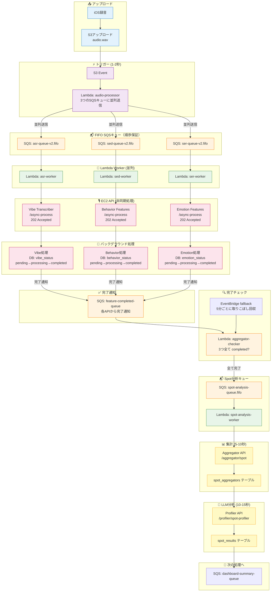
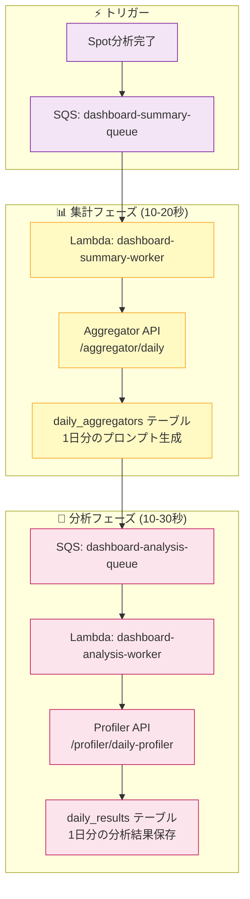
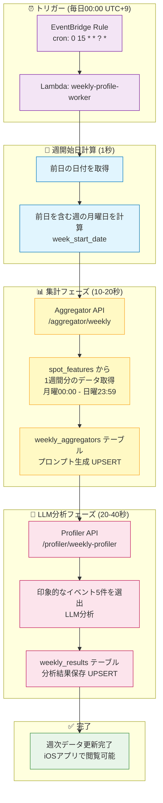

# WatchMe 処理アーキテクチャ

最終更新: 2026-03-07

> Status: Active
> Source of truth: パイプラインの処理順序と役割分担

**⚠️ 重要: 2025-12-12にFIFO Queueへ移行しました（順序保証・重複排除）**

## 🎯 システム概要

WatchMeは音声録音から心理・感情分析を自動実行するプラットフォームです。

### 録音デバイス

| デバイス | 録音方式 | 用途 |
|---------|---------|------|
| **Observer Device** | 30分ごと自動録音（1分間） | 日常的な継続モニタリング（1日48回） |
| **iOS App** | 手動録音（任意の長さ） | 特定の会話・状況のスポット分析 |

### データフロー

```
録音デバイス → S3アップロード → Lambda自動処理 → 分析結果保存 → iOSアプリ表示
```

---

## 🔄 処理フロー

### 📊 3つの分析レベル

| 分析レベル | 単位 | トリガー | データ保存先 |
|----------|------|---------|------------|
| **Spot分析** | 録音ごと | S3アップロード | spot_results |
| **Daily分析** | 1日の累積 | Spot分析完了時 | daily_results |
| **Weekly分析** | 1週間の累積（月〜日） | 毎日00:00（EventBridge） | weekly_results |

---

## 1️⃣ Spot分析（録音ごと）- イベント駆動型アーキテクチャ

**🎯 設計方針:**
- 非同期・イベント駆動
- DBステータス管理（pending → processing → completed）
- SQS完了通知による連携
- タイムアウト依存を最小化（完了判定はイベント/状態遷移で実施）
- `*_ALLOW_IN_PROCESS_FALLBACK=false` を標準とし、受付後の実処理は queue 経由でのみ進める

### 処理フロー


```mermaid
graph TB
    subgraph Upload["📤 アップロード"]
        A[iOS録音]
        B[S3アップロード<br/>audio.wav]
    end

    subgraph Trigger["⚡ トリガー (1-2秒)"]
        C[S3 Event]
        D[Lambda: audio-processor<br/>3つのSQSキューに並列送信]
    end

    subgraph Queue["📬 FIFO SQSキュー（順序保証）"]
        E1[SQS: asr-queue-v2.fifo]
        E2[SQS: sed-queue-v2.fifo]
        E3[SQS: ser-queue-v2.fifo]
    end

    subgraph Worker["🔧 Lambda Worker (並列)"]
        F1[Lambda: asr-worker]
        F2[Lambda: sed-worker]
        F3[Lambda: ser-worker]
    end

    subgraph API["🎙️ EC2 API (非同期処理)"]
        G1[Vibe Transcriber<br/>/async-process<br/>202 Accepted]
        G2[Behavior Features<br/>/async-process<br/>202 Accepted]
        G3[Emotion Features<br/>/async-process<br/>202 Accepted]
    end

    subgraph Background["🔄 バックグラウンド処理"]
        H1[Vibe処理<br/>DB: vibe_status<br/>pending→processing→completed]
        H2[Behavior処理<br/>DB: behavior_status<br/>pending→processing→completed]
        H3[Emotion処理<br/>DB: emotion_status<br/>pending→processing→completed]
    end

    subgraph Completion["✅ 完了通知"]
        I[SQS: feature-completed-queue<br/>各APIから完了通知]
    end

    subgraph Checker["🔍 完了チェック"]
        J[Lambda: aggregator-checker<br/>3つ全て completed?]
        J2[EventBridge fallback<br/>5分ごとに取りこぼし回収]
    end

    subgraph SpotQueue["📬 Spot分析キュー"]
        J3[SQS: spot-analysis-queue.fifo]
        J4[Lambda: spot-analysis-worker]
    end

    subgraph Aggregation["📊 集計 (5-10秒)"]
        K[Aggregator API<br/>/aggregator/spot]
        L[spot_aggregators テーブル]
    end

    subgraph Analysis["🤖 LLM分析 (10-15秒)"]
        M[Profiler API<br/>/profiler/spot-profiler]
        N[spot_results テーブル]
    end

    subgraph NextStep["🔄 次の処理へ"]
        O[SQS: dashboard-summary-queue]
    end

    A --> B --> C --> D
    D -->|並列送信| E1
    D -->|並列送信| E2
    D -->|並列送信| E3

    E1 --> F1 --> G1 --> H1
    E2 --> F2 --> G2 --> H2
    E3 --> F3 --> G3 --> H3

    H1 -->|完了通知| I
    H2 -->|完了通知| I
    H3 -->|完了通知| I

    I --> J
    J2 --> J
    J -->|全て完了| J3 --> J4 --> K --> L --> M --> N --> O

    classDef uploadStyle fill:#e3f2fd,stroke:#1976d2
    classDef triggerStyle fill:#f3e5f5,stroke:#7b1fa2
    classDef queueStyle fill:#fff3e0,stroke:#f57c00
    classDef workerStyle fill:#e8f5e9,stroke:#388e3c
    classDef apiStyle fill:#fce4ec,stroke:#c2185b
    classDef aggStyle fill:#fff9c4,stroke:#f9a825

    class A,B uploadStyle
    class C,D triggerStyle
    class E1,E2,E3 queueStyle
    class F1,F2,F3 workerStyle
    class G1,G2,G3,H1,H2,H3 apiStyle
    class I,J queueStyle
    class J3 queueStyle
    class J4 workerStyle
    class K,L,M,N aggStyle
```

### 処理詳細

#### ⚡ トリガーフェーズ (1-2秒)

1. S3に音声ファイルアップロード
2. S3イベント → Lambda: audio-processor
3. **3つのSQSキューに並列送信**:
   - `watchme-asr-queue-v2.fifo` (ASR用)
   - `watchme-sed-queue-v2.fifo` (SED用)
   - `watchme-ser-queue-v2.fifo` (SER用)

#### 🔧 Lambda Worker フェーズ (即座に完了)

各Lambda Worker が対応するEC2 APIを呼び出し（**202 Acceptedで即座に返る**）:

| Lambda Worker | 呼び出し先API | エンドポイント | HTTPタイムアウト | Lambda実行タイムアウト |
|--------------|-------------|--------------|----------------|----------------------|
| **asr-worker** | Vibe Transcriber | `/async-process` | connect=3秒 / read=10秒 | 60秒 |
| **sed-worker** | Behavior Features | `/async-process` | connect=3秒 / read=10秒 | 60秒 |
| **ser-worker** | Emotion Features | `/async-process` | connect=3秒 / read=10秒 | 60秒 |

**コード確認済みの判定条件（2026-03-07）**:
- Worker Lambda は `HTTP 202` のときだけ「受付成功」として扱う
- `202` 以外（例: `503`）は失敗扱いになり、SQS リトライへ戻る
- これにより「受付成功なのに実処理が始まらない」取りこぼしを減らす運用にしている

#### 🎙️ EC2 API バックグラウンド処理 (1-3分)

各APIは `/async-process` で queue に投入できたときのみ `202 Accepted` を返す。  
queue投入に失敗した場合は `503` を返し、Lambda/SQS の再試行へ戻す。

投入後の処理は API 側 queue consumer が実行:

| API | 処理時間 | 役割 | ステータス管理 |
|-----|---------|------|--------------|
| Vibe Transcriber | 26-28秒 | 音声文字起こし | `vibe_status` |
| Behavior Features | 10-20秒 | 音響イベント検出 | `behavior_status` |
| Emotion Features | 10-20秒 | 音声感情認識 | `emotion_status` |

**処理の流れ:**
1. `/async-process` 受付時に DBステータスを `queued` に更新
2. queue consumer が取り出して `processing` に更新
3. 実際の処理を実行（5分でも10分でもOK）
4. DBに結果を保存 + ステータスを `completed` に更新
5. SQS `feature-completed-queue` に完了通知を送信

#### 🔍 完了チェックフェーズ

**Lambda: aggregator-checker** がトリガーされる:
- トリガー: SQS `feature-completed-queue`
- 処理内容:
  1. `spot_features` テーブルから3つのステータスを確認
  2. 全て `completed` なら → `watchme-spot-analysis-queue.fifo` に録音単位で enqueue
  3. まだ完了していないものがあれば → 何もせず終了（次の完了通知で再チェック）

**EventBridge fallback（補修経路）**:
- 5分ごとに `aggregator-checker` を定期実行
- 対象: `spot_features` で3つ全て `completed` だが、`spot_results` が未作成の録音
- 目的: feature 完了通知が欠落しても、Spot分析を再開できるようにする

**Lambda: spot-analysis-worker**:
- トリガー: FIFO SQS `watchme-spot-analysis-queue.fifo`
- 役割:
  1. Spot分析対象の録音を1件ずつ処理
  2. `spot_aggregators` が未作成なら Aggregator API を実行
  3. Profiler API を実行して `spot_results` を作成
  4. Daily集計用の `dashboard-summary-queue` に送信
- 目的: Spot分析の重い処理を `aggregator-checker` から分離し、SQS リトライ/DLQ を使えるようにする

#### 📊 集計フェーズ (5-10秒)

**Aggregator API** (`/aggregator/spot`):
- 3つの特徴量を統合
- LLM分析用プロンプト生成
- `spot_aggregators` テーブルに保存
- **ステータス管理**: `spot_aggregators.aggregator_status` を `completed` に更新

#### 🤖 LLM分析フェーズ (10-15秒)

**Profiler API** (`/profiler/spot-profiler`):
- プロンプトを取得
- LLM分析実行（OpenAI gpt-5.4-2026-03-05）
- `spot_results` テーブルに保存
- **ステータス管理**: `spot_results.profiler_status` を `completed` に更新

**保存データ**:
- `vibe_score`: 心理スコア (-100〜+100)
- `summary`: 状況サマリー（日本語）
- `behavior`: 検出された行動（カンマ区切り）
- `profile_result`: 完全な分析結果（JSONB）

---

## 2️⃣ Daily分析（1日の累積）

### 処理フロー


```mermaid
graph TB
    subgraph Trigger["⚡ トリガー"]
        A[Spot分析完了]
        B[SQS: dashboard-summary-queue]
    end

    subgraph Summary["📊 集計フェーズ (10-20秒)"]
        C[Lambda: dashboard-summary-worker]
        D[Aggregator API<br/>/aggregator/daily]
        E[daily_aggregators テーブル<br/>1日分のプロンプト生成]
    end

    subgraph Analysis["🤖 分析フェーズ (10-30秒)"]
        F[SQS: dashboard-analysis-queue]
        G[Lambda: dashboard-analysis-worker]
        H[Profiler API<br/>/profiler/daily-profiler]
        I[daily_results テーブル<br/>1日分の分析結果保存]
    end

    A --> B --> C --> D --> E --> F --> G --> H --> I

    classDef triggerStyle fill:#f3e5f5,stroke:#7b1fa2
    classDef summaryStyle fill:#fff9c4,stroke:#f9a825
    classDef analysisStyle fill:#fce4ec,stroke:#c2185b

    class A,B triggerStyle
    class C,D,E summaryStyle
    class F,G,H,I analysisStyle
```

### 処理詳細

#### 📊 集計フェーズ (10-20秒)

**Lambda: dashboard-summary-worker**
- SQSキューからトリガー
- Aggregator API呼び出し

**Aggregator API** (`/aggregator/daily`):
- その日のspot_resultsを全て取得
- 1日分の統合プロンプト生成
- `daily_aggregators` テーブルに保存

#### 🤖 分析フェーズ (10-30秒)

**Lambda: dashboard-analysis-worker**
- SQSキューからトリガー
- Profiler API呼び出し
- **プッシュ通知送信**（分析完了後）

**Profiler API** (`/profiler/daily-profiler`):
- daily_aggregatorsからプロンプト取得
- LLM分析実行（1日の総合分析）
- `daily_results` テーブルに保存

**保存データ**:
- `vibe_score`: 1日の平均心理スコア
- `summary`: 1日の総合サマリー（日本語）
- `behavior`: 主要な行動パターン
- `profile_result`: 完全な分析結果（JSONB）
- `vibe_scores`: 録音時刻ベースのスコア配列（JSONB配列）
- `burst_events`: 感情変化イベント（JSONB配列）
- `processed_count`: 処理済みspot数

#### 📲 プッシュ通知（Daily分析完了時）

> **⚠️ 運用メモ（2026-03-07時点）**
>
> - 以下は **あるべき構成 / 実装上の意図** を含みます
> - 実コード `watchme-dashboard-analysis-worker` は `production` / `sandbox` の両方の SNS Platform Application を持ち、`apns_environment` に応じて切り替える実装です
> - ただし、実運用では「テストでは通知が来ず、本番のみで届く」前提で扱われていたセッション記憶があり、**実際に sandbox 経路が有効かは未確認** です
> - 次回セッションでは、`apns_environment`、参照テーブル、SNS endpoint 作成先、実機テスト時の build / token 種別を突き合わせて、現行仕様を確定してください
> - 現時点では、この節だけを根拠に「テストでも通知が届くはず」と判断しないこと

**送信フロー**:
```
dashboard-analysis-worker
  ↓
1. デバイスIDからユーザーID取得 (user_devices)
2. ユーザーのAPNsトークン取得 (`public.users.apns_token`)
3. デバイスのSubject名取得 (subjects)
4. SNS Platform Endpoint作成/更新
5. APNsプッシュ通知送信
  ↓
iOSアプリに通知表示
```

**コード確認済みの補足（2026-03-07）**:
- `watchme-dashboard-analysis-worker` は Daily Profiler API の成功/失敗に関わらず、通知送信を試行する実装
- そのため運用上は「Daily分析が完全成功した時だけ通知される」とは限らない（通知は refresh トリガーとして扱う）

**通知内容**:
- タイトル: 「{Subject名}さんのデイリー分析完了」
- 本文: 「{日付}の分析が完了しました」
- アクション: タップでダッシュボードを開く

**AWS SNS設定**:
- **Production**: `arn:aws:sns:ap-southeast-2:754724220380:app/APNS/watchme-ios-app-token`
- **Sandbox**: `arn:aws:sns:ap-southeast-2:754724220380:app/APNS_SANDBOX/watchme-ios-app-token-sandbox`

**IAM権限**:
- Lambda Role: `watchme-dashboard-analysis-worker-role-ff2gu1tt`
- 必要な権限: `sns:CreatePlatformEndpoint`, `sns:Publish`, `sns:SetEndpointAttributes`

**メッセージフォーマット**:
```json
{
  "default": "{Subject名}さんのデイリー分析完了",
  "APNS_SANDBOX": "{
    \"aps\": {
      \"alert\": {\"body\": \"{日付}の分析が完了しました\"},
      \"sound\": \"default\",
      \"content-available\": 1
    },
    \"device_id\": \"...\",
    \"date\": \"2026-01-21\",
    \"action\": \"refresh_dashboard\"
  }"
}
```

**重要な注意点**:
1. ✅ **環境に応じてAPNsキーを動的選択** (`APNS` vs `APNS_SANDBOX`)
2. ✅ **`default`キーは必須** (SNS MessageStructure='json'の仕様)
3. ❌ **Weekly分析ではプッシュ通知を送信しない** (Daily分析のみ)
4. ⚠️ **sandbox 通知の実運用可否は別途確認が必要** (この節は実装意図を含む)

---

## 3️⃣ Weekly分析（1週間の累積）

### 処理フロー


```mermaid
graph TB
    subgraph Trigger["⏰ トリガー (毎日00:00 UTC+9)"]
        A[EventBridge Rule<br/>cron: 0 15 * * ? *]
        B[Lambda: weekly-profile-worker]
    end

    subgraph DateCalc["📅 週開始日計算 (1秒)"]
        C[前日の日付を取得]
        D[前日を含む週の月曜日を計算<br/>week_start_date]
    end

    subgraph Aggregation["📊 集計フェーズ (10-20秒)"]
        E[Aggregator API<br/>/aggregator/weekly]
        F[spot_features から<br/>1週間分のデータ取得<br/>月曜00:00 - 日曜23:59]
        G[weekly_aggregators テーブル<br/>プロンプト生成 UPSERT]
    end

    subgraph Analysis["🤖 LLM分析フェーズ (20-40秒)"]
        H[Profiler API<br/>/profiler/weekly-profiler]
        I[印象的なイベント5件を選出<br/>LLM分析]
        J[weekly_results テーブル<br/>分析結果保存 UPSERT]
    end

    subgraph Result["✅ 完了"]
        K[週次データ更新完了<br/>iOSアプリで閲覧可能]
    end

    A --> B --> C --> D --> E
    E --> F --> G --> H --> I --> J --> K

    classDef triggerStyle fill:#f3e5f5,stroke:#7b1fa2
    classDef calcStyle fill:#e1f5fe,stroke:#0277bd
    classDef aggStyle fill:#fff9c4,stroke:#f9a825
    classDef analysisStyle fill:#fce4ec,stroke:#c2185b
    classDef resultStyle fill:#e8f5e9,stroke:#388e3c

    class A,B triggerStyle
    class C,D calcStyle
    class E,F,G aggStyle
    class H,I,J analysisStyle
    class K resultStyle
```

### 処理詳細

#### ⏰ トリガーフェーズ（毎日00:00）

**EventBridge Rule**:
- **Cron式**: `0 15 * * ? *`（UTC 15:00 = JST 00:00）
- **頻度**: 毎日1回
- **ターゲット**: Lambda `weekly-profile-worker`

**処理タイミング**:
```
例: 2025-11-20 00:00 (JST) に実行
  ↓
yesterday = 2025-11-19 (火曜日)
  ↓
week_start_date = 2025-11-18 (月曜日)
  ↓
week_end_date = 2025-11-24 (日曜日)
  ↓
対象データ: 2025-11-18 〜 2025-11-24
（現時点では 月・火のデータのみ存在）
```

**毎日更新の利点**:
- 週の途中でも常に最新の週次データが閲覧可能
- 日曜日の深夜（月曜00:00）に週が完成
- UPSERTのため、同じ週のデータは上書き更新

#### 📅 週開始日計算フェーズ（1秒）

**Lambda内部処理**:
```python
import datetime

# 前日の日付
yesterday = datetime.date.today() - datetime.timedelta(days=1)

# 前日を含む週の月曜日を計算（ISO 8601準拠）
week_start_date = yesterday - datetime.timedelta(days=yesterday.weekday())

# 週の終了日（日曜日）
week_end_date = week_start_date + datetime.timedelta(days=6)
```

**週の定義**:
- 月曜始まり（ISO 8601準拠）
- 月曜 00:00 〜 日曜 23:59 が1週間

#### 📊 集計フェーズ（10-20秒）

**Aggregator API** (`/aggregator/weekly`):
- `spot_features` から1週間分（月曜〜日曜）のデータを取得
- `vibe_transcriber_result`（発話内容）を時系列で整理
- LLMに「印象的なイベント5件を選出」するプロンプトを生成
- `weekly_aggregators` テーブルに保存（UPSERT）

**データ取得SQL**:
```sql
SELECT
  device_id,
  recorded_at,
  local_date,
  local_time,
  vibe_transcriber_result
FROM spot_features
WHERE device_id = ?
  AND local_date >= '2025-11-18'  -- Monday
  AND local_date <= '2025-11-24'  -- Sunday
ORDER BY recorded_at ASC
```

#### 🤖 LLM分析フェーズ（20-40秒）

**Profiler API** (`/profiler/weekly-profiler`):
- `weekly_aggregators.prompt` からプロンプト取得
- LLM分析実行（OpenAI gpt-5.4-2026-03-05）
  - 1週間の録音データから印象的なイベント5件を選出
  - 選出基準: 興味深い会話内容、記憶に残る出来事、週全体の多様性
- `weekly_results` テーブルに保存（UPSERT）

**保存データ**:
- `summary`: 週の総合サマリー（日本語、2-3文）
- `memorable_events`: 印象的なイベント5件（JSONB配列）
  ```json
  [
    {
      "rank": 1,
      "date": "2025-11-16",
      "time": "21:01",
      "day_of_week": "日",
      "event_summary": "幼稚園でインフルエンザが流行し、体調管理の重要性を再認識した瞬間。",
      "transcription_snippet": "インフルエンザで。幼稚園"
    }
  ]
  ```
- `profile_result`: 完全なLLM分析結果（JSONB）
- `processed_count`: 処理した録音数（例: 60件）
- `llm_model`: 使用したLLMモデル

### 処理時間

| 処理 | 平均時間 |
|------|---------|
| EventBridge → Lambda起動 | 1-2秒 |
| 週開始日計算 | 1秒 |
| Aggregator API (Weekly) | 10-20秒 |
| Profiler API (Weekly) | 20-40秒 |
| **Weekly分析合計** | **35-65秒** |

### Weekly分析の特徴

**Spot/Daily分析との違い**:

| 項目 | Spot | Daily | Weekly |
|------|------|-------|--------|
| トリガー | S3アップロード | Spot完了時 | 毎日00:00（EventBridge） |
| データソース | spot_features | spot_results | spot_features |
| 分析内容 | 録音1件の状況 | 1日の傾向 | 1週間の印象的なイベント5件 |
| 更新頻度 | 録音ごと | Spot完了ごと | 毎日1回 |
| データ単位 | 1録音 | 1日 | 1週間（月〜日） |
| UPSERT | なし | あり | あり（週の途中でも毎日更新） |

**UPSERTの動作**:
```
月曜 00:00: 先週分（月〜日）の完成版を生成
火曜 00:00: 今週分（月〜火のデータ）を生成（上書き）
水曜 00:00: 今週分（月〜水のデータ）を生成（上書き）
...
日曜 00:00: 今週分（月〜日のデータ）を生成（上書き）
月曜 00:00: 今週分の完成版（前週の月〜日のデータ）
```

---

## 📊 データベーステーブル

### Spot分析

| テーブル | 内容 | 更新頻度 | ステータス管理 |
|---------|------|---------|--------------|
| `audio_files` | 録音メタデータ | 録音ごと | なし |
| `spot_features` | 音響・感情・文字起こし特徴量 | 録音ごと | `vibe_status`<br>`behavior_status`<br>`emotion_status` |
| `spot_aggregators` | Spot分析用プロンプト | 録音ごと | `aggregator_status` |
| `spot_results` | Spot分析結果（LLM出力） | 録音ごと | `profiler_status` |

### Daily分析

| テーブル | 内容 | 更新頻度 |
|---------|------|---------|
| `daily_aggregators` | Daily分析用プロンプト（1日分のspot_resultsを集約） | Spot完了ごと |
| `daily_results` | Daily分析結果（1日分のLLM出力） | Spot完了ごと |

### Weekly分析

| テーブル | 内容 | 更新頻度 |
|---------|------|---------|
| `weekly_aggregators` | Weekly分析用プロンプト（1週間分のspot_featuresを集約） | 毎日1回（00:00） |
| `weekly_results` | Weekly分析結果（印象的なイベント5件） | 毎日1回（00:00） |

### 主要カラム

**全テーブル共通**:
- `device_id`: デバイスID（**UUID型** - 2025-11-16変更）
- `local_date`: デバイスのタイムゾーンに基づいたローカル日付（**NULL許容** - 一部レガシーデータ対応）
- `created_at`, `updated_at`: タイムスタンプ

**spot_featuresの追加カラム（2025-12-10 イベント駆動型対応）**:
- `vibe_status`: Vibe処理ステータス（`pending` / `processing` / `completed` / `failed`）
- `behavior_status`: Behavior処理ステータス（`pending` / `processing` / `completed` / `failed`）
- `emotion_status`: Emotion処理ステータス（`pending` / `processing` / `completed` / `failed`）

**⚠️ データ型の重要な注意事項**:
- `device_id`: PostgreSQLでは`uuid`型だが、API層では文字列として送受信可能（自動変換）
- `local_date`, `recorded_at`: 一部古いデータで`NULL`が存在する可能性あり（iOSアプリ側でオプショナル処理必須）

**spot_results**:
- Primary Key: `(device_id, recorded_at)`
- `recorded_at`: 録音時刻（UTC）
- `vibe_score`, `summary`, `behavior`, `profile_result`

**daily_results**:
- Primary Key: `(device_id, local_date)`
- `vibe_score`, `summary`, `behavior`, `profile_result`
- `vibe_scores`: 録音時刻ベースのスコア配列
- `burst_events`: 感情変化イベント
- `processed_count`: 処理済みspot数

**weekly_results**:
- Primary Key: `(device_id, week_start_date)`
- `summary`: 週の総合サマリー（日本語）
- `memorable_events`: 印象的なイベント5件（JSONB配列）
- `profile_result`: 完全なLLM分析結果（JSONB）
- `processed_count`: 処理済み録音数
- `llm_model`: 使用したLLMモデル

---

## 🔧 Lambda関数

### Spot分析用（イベント駆動型）

| 関数名 | トリガー | 役割 | タイムアウト | 状態 |
|--------|---------|------|------------|------|
| **audio-processor** | S3イベント | 3つのSQSキューに並列送信 | 30秒 | ✅ 稼働中 |
| **asr-worker** | SQS: asr-queue-v2.fifo | Vibe Transcriber API呼び出し（202受付） | 60秒 | ✅ 稼働中 |
| **sed-worker** | SQS: sed-queue-v2.fifo | Behavior Features API呼び出し（202受付） | 60秒 | ✅ 稼働中 |
| **ser-worker** | SQS: ser-queue-v2.fifo | Emotion Features API呼び出し（202受付） | 60秒 | ✅ 稼働中 |
| **aggregator-checker** | SQS: feature-completed-queue / EventBridge | 3つ完了後にSpot分析キューへ送信、取りこぼし回収 | 5分（300秒） | ✅ 稼働中 |
| **spot-analysis-worker** | SQS: spot-analysis-queue.fifo | Aggregator/Profiler実行、Daily集計キュー送信 | 5分 | ✅ 新規 |

### Daily/Weekly分析用

| 関数名 | トリガー | 役割 | タイムアウト |
|--------|---------|------|------------|
| dashboard-summary-worker | SQS: dashboard-summary-queue | Daily集計実行 | 15分（900秒） |
| dashboard-analysis-worker | SQS: dashboard-analysis-queue | Daily LLM分析実行 | 15分（900秒） |
| weekly-profile-worker | EventBridge (毎日00:00) | Weekly集計・分析実行 | 15分（900秒） |

### SQSキュー一覧

| キュー名 | タイプ | 用途 | トリガー元 | 処理先 |
|---------|--------|------|----------|--------|
| **watchme-asr-queue-v2.fifo** | **FIFO** | ASR処理キュー（順序保証） | audio-processor | asr-worker |
| **watchme-sed-queue-v2.fifo** | **FIFO** | SED処理キュー（順序保証） | audio-processor | sed-worker |
| **watchme-ser-queue-v2.fifo** | **FIFO** | SER処理キュー（順序保証） | audio-processor | ser-worker |
| **watchme-asr-job-queue-v1.fifo** | **FIFO** | ASR API実行ジョブキュー（受付後実処理） | Vibe `/async-process` | Vibe API queue worker |
| **watchme-sed-job-queue-v1.fifo** | **FIFO** | SED API実行ジョブキュー（受付後実処理） | Behavior `/async-process` | Behavior API queue worker |
| **watchme-ser-job-queue-v1.fifo** | **FIFO** | SER API実行ジョブキュー（受付後実処理） | Emotion `/async-process` | Emotion API queue worker |
| **watchme-feature-completed-queue** | Standard | 完了通知キュー | 各EC2 API | aggregator-checker |
| **watchme-spot-analysis-queue.fifo** | **FIFO** | Spot分析実行キュー | aggregator-checker | spot-analysis-worker |
| watchme-dashboard-summary-queue | Standard | Daily集計キュー | spot-analysis-worker | dashboard-summary-worker |
| watchme-dashboard-analysis-queue | Standard | Daily分析キュー | dashboard-summary-worker | dashboard-analysis-worker |

**FIFO Queue設定:**
- **順序保証**: デバイス単位で録音の時系列順を保証
- **重複排除**: 同じ録音を5分以内に2回処理しない
- **Message Group ID**: `{device_id}-{api_type}` 形式（例: `abc123-sed`）
- **Deduplication ID**: `SHA256({device_id}-{recorded_at}-{api_type})` の先頭80文字
- **Dead Letter Queue**: 3回リトライ後にDLQへ移動

### API呼び出しチェーン（イベント駆動型）

**audio-processor**:
- `watchme-asr-queue-v2.fifo` にメッセージ送信（FIFO）
- `watchme-sed-queue-v2.fifo` にメッセージ送信（FIFO）
- `watchme-ser-queue-v2.fifo` にメッセージ送信（FIFO）

**asr-worker / sed-worker / ser-worker**:
- `https://api.hey-watch.me/vibe-analysis/transcriber/async-process` (202 Accepted)
- `https://api.hey-watch.me/behavior-analysis/features/async-process` (202 Accepted)
- `https://api.hey-watch.me/emotion-analysis/feature-extractor/async-process` (202 Accepted)

**feature API `/async-process`（queueモード有効時）**:
- 受け付け後に `watchme-asr-job-queue-v1.fifo` / `watchme-sed-job-queue-v1.fifo` / `watchme-ser-job-queue-v1.fifo` へ enqueue
- API内 queue worker が実処理を実行し、完了時に `watchme-feature-completed-queue` へ通知

**EC2 API (バックグラウンド処理完了後)**:
- `watchme-feature-completed-queue` に完了通知送信

**aggregator-checker** (3つ全て completed の場合):
- `watchme-spot-analysis-queue.fifo` にメッセージ送信

**spot-analysis-worker**:
- `https://api.hey-watch.me/aggregator/spot`
- `https://api.hey-watch.me/profiler/spot-profiler`
- `watchme-dashboard-summary-queue` にメッセージ送信

**dashboard-summary-worker**:
- `https://api.hey-watch.me/aggregator/daily`
- `watchme-dashboard-analysis-queue` にメッセージ送信

**dashboard-analysis-worker**:
- `https://api.hey-watch.me/profiler/daily-profiler`

**weekly-profile-worker**:
- `https://api.hey-watch.me/aggregator/weekly`
- `https://api.hey-watch.me/profiler/weekly-profiler`

---

## ⏱️ タイムアウト設定インベントリ（2026-03-07 実測）

> 出典: AWS本番設定（Lambda/SQS/EventBridge）と実装コードの両方を照合

### 1. 実行タイムアウト（Lambda）

| レイヤー | コンポーネント | 値 |
|---------|---------------|----|
| Spot | watchme-audio-processor | 30秒 |
| Spot | watchme-asr-worker | 60秒 |
| Spot | watchme-sed-worker | 60秒 |
| Spot | watchme-ser-worker | 60秒 |
| Spot | watchme-aggregator-checker | 300秒 |
| Spot | watchme-spot-analysis-worker | 300秒 |
| Daily | watchme-dashboard-summary-worker | 900秒 |
| Daily | watchme-dashboard-analysis-worker | 900秒 |
| Weekly | watchme-weekly-profile-worker | 900秒 |

### 2. HTTPクライアント待機（requests / SDK）

| ステージ | 呼び出し元 | 呼び出し先 | 設定値 |
|---------|-----------|-----------|--------|
| Spot初段 | asr/sed/ser-worker | `/async-process` | connect=3秒 / read=10秒 |
| Spot初段 | audio-processor | Supabase REST (`audio_files`) | 10秒 |
| Spot中段 | aggregator-checker | Supabase REST（状態照会・更新） | 10秒（候補探索のみ20秒） |
| Spot中段 | spot-analysis-worker | Aggregator API / Profiler API | 180秒 |
| Spot中段 | spot-analysis-worker | Supabase REST（状態照会・更新） | 10秒 |
| Daily | dashboard-summary-worker | Aggregator Daily API | 180秒 |
| Daily | dashboard-analysis-worker | Profiler Daily API | 180秒 |
| Daily | dashboard-analysis-worker | Supabase REST（通知対象検索） | 10秒 |
| Weekly | weekly-profile-worker | Supabase REST（最新 local_date） | 10秒 |
| Weekly | weekly-profile-worker | Aggregator Weekly / Profiler Weekly API | 180秒 |
| API内部 | vibe-transcriber | `done.wait(...)` | 通常300秒 / 高精度600秒 |

### 3. Reverse Proxy（Nginx）

| 経路 | 設定値 |
|------|--------|
| `/vibe-analysis/transcriber/` | read/connect/send = 180秒 |
| `/behavior-analysis/features/` | read/connect/send = 180秒 |
| `/emotion-analysis/feature-extractor/` | read/connect/send = 180秒 |
| `/aggregator/` | read/connect/send = 180秒 |
| `/profiler/` | read/connect/send = 180秒 |

### 4. SQS 可視性タイムアウト / リトライ

| キュー | Visibility Timeout | maxReceiveCount |
|-------|---------------------|-----------------|
| watchme-asr-queue-v2.fifo | 300秒 | 3 |
| watchme-sed-queue-v2.fifo | 300秒 | 3 |
| watchme-ser-queue-v2.fifo | 300秒 | 3 |
| watchme-asr-job-queue-v1.fifo | 600秒 | 3 |
| watchme-sed-job-queue-v1.fifo | 600秒 | 3 |
| watchme-ser-job-queue-v1.fifo | 600秒 | 3 |
| watchme-feature-completed-queue | 330秒 | なし（DLQ設定なし） |
| watchme-spot-analysis-queue.fifo | 330秒 | 3 |
| watchme-dashboard-summary-queue | 900秒 | 3 |
| watchme-dashboard-analysis-queue | 900秒 | 3 |

### 5. タイマー駆動（EventBridge）

| ルール | 役割 | スケジュール |
|--------|------|--------------|
| watchme-aggregator-reconciliation-every-5-minutes | Spot取りこぼし回収 | `rate(5 minutes)` |
| watchme-weekly-profile-daily-trigger | 週次更新実行 | `cron(0 15 * * ? *)`（JST 00:00） |

### 6. イベント駆動から外れている箇所（要修正）

1. **asr/sed/ser-worker が `/async-process` のHTTPレスポンスを待つ設計**  
   read timeout=10秒に収まらないとSQS再試行ループになる。
2. **spot-analysis-worker が Aggregator/Profiler を同期呼び出し（180秒待ち）**  
   処理完了をHTTP応答に依存しており、ジョブ完了イベント連携になっていない。
3. **dashboard-summary/analysis/weekly worker も同期呼び出し（180秒待ち）**  
   Daily/Weeklyがタイムアウト値依存の直列パイプラインになっている。
4. **`/async-process` の実処理が同一プロセス内のスレッド実行キュー依存**  
   202応答は即時化済み。さらに 2026-03-07 に SQS feature-job queue モード（`*-job-queue-v1.fifo`）をコード実装し、キュー作成済み。残りは各APIデプロイ完了と env 有効化反映。

### 7. 改修方針（イベント駆動へ戻す）

1. `/async-process` を「受付専用」にし、即時でジョブID発行＋専用キュー投入のみ実施。
2. Feature系APIの実処理をキューワーカーへ分離し、完了時に `feature-completed-queue` へ通知。
3. Spot/Daily/Weekly も同様に `accepted -> queue -> worker -> completion event` に統一。
4. すべてのHTTP timeoutは「故障検知ガードレール」として残し、処理完了の判定には使わない。

---

## 🌐 EC2 APIサービス

全サービスはEC2上のDockerコンテナとして稼働。

| カテゴリ | サービス | ポート | 役割 |
|---------|---------|--------|------|
| **ゲートウェイ** | Vault API | 8000 | S3音声ファイル配信 |
| **音声処理** | Behavior Features | 8017 | 音響イベント検出 |
| | Emotion Features | 8018 | 音声感情認識 |
| | Vibe Transcriber | 8013 | 音声文字起こし |
| **集計・分析** | Aggregator API | 8011 | Spot/Daily集計 |
| | Profiler API | 8051 | Spot/Daily LLM分析 |
| **管理** | Janitor | 8030 | 音声データ自動削除 |

**Nginx ルーティング（バージョンなし）**:
- `/vibe-analysis/transcriber/` → localhost:8013
- `/behavior-analysis/features/` → localhost:8017
- `/emotion-analysis/feature-extractor/` → localhost:8018

> **注**: 各 feature API の実装モデル（Kushinada / Hume 等）はリポジトリ単位で管理される。
> Nginx ルーティングはモデルに依存しない。デプロイ先の ECR リポジトリ名とポートは共通。

---

## ⏱️ パフォーマンス

### 処理時間

| 処理 | 平均時間 |
|------|---------|
| S3イベント → SQS | 1-2秒 |
| Behavior Features | 10-20秒 |
| Emotion Features | 10-20秒 |
| Vibe Transcriber | 26-28秒 |
| Aggregator API (Spot) | 5-10秒 |
| Profiler API (Spot) | 10-15秒 |
| Aggregator API (Daily) | 10-20秒 |
| Profiler API (Daily) | 10-30秒 |
| Aggregator API (Weekly) | 10-20秒 |
| Profiler API (Weekly) | 20-40秒 |
| **Spot分析合計** | **1-3分** |
| **Daily分析合計** | **30-40秒** |
| **Weekly分析合計** | **35-65秒** |

### システム負荷（1日あたり）

- **Spot分析**: 48回/日 × 1-3分 = 約0.8-2.4時間/日
- **Daily分析**: 48回/日 × 30-40秒 = 約24-32分/日
- **Weekly分析**: 1回/日 × 35-65秒 = 約35-65秒/日
- **合計**: 約1.3-3.1時間/日

---

## 🎯 FIFO Queueの仕組み（2025-12-12移行）

### 概要

FIFO Queue（First-In-First-Out Queue）は、**順序保証**と**重複排除**を提供するSQSキューです。
Standard Queueと異なり、同じMessage Group内のメッセージは順番通りに処理されます。

### 主要機能

#### 1. **順序保証（Ordering）**

**Message Group ID** により、同じグループ内のメッセージは送信順に処理されます。

```
デバイスAの録音:
  録音1 (09:00) → 録音2 (09:30) → 録音3 (10:00)
  ↓
Message Group ID: "deviceA-sed"
  ↓
Lambda Workerは必ず 09:00 → 09:30 → 10:00 の順で処理
```

**WatchMeでの実装:**
- Message Group ID: `{device_id}-{api_type}`
- 例: `9f7d6e27-98c3-4c19-bdfb-f7fda58b9a93-sed`

**利点:**
- デバイスAの録音を処理中でも、デバイスBの録音は並列処理可能
- 同一デバイスの録音は時系列順を保証

#### 2. **重複排除（Deduplication）**

**Deduplication ID** により、5分以内の重複送信を自動的に排除します。

```
同じ録音を誤って2回送信:
  送信1 (12:00:00) → MessageId: abc123
  送信2 (12:00:05) → 同じDeduplication ID → 排除される
```

**WatchMeでの実装:**
- Deduplication ID: `SHA256({device_id}-{recorded_at}-{api_type})` の先頭80文字
- 例: `e3b0c44298fc1c149afbf4c8996fb92427ae41e4649b934ca495991b7852b855...` (80文字)

**利点:**
- S3イベントの重複トリガーでも安全
- 手動再実行時の誤った重複処理を防止

#### 3. **並列処理の制御**

FIFO Queueでは、**Message Group単位**で並列処理が制御されます。

**Standard Queue（旧）:**
```
Lambda並列数: 2 (SED/SER)
  ↓
デバイスAとデバイスBの録音が混在
  ↓
順序保証なし、処理順がランダム
```

**FIFO Queue（新）:**
```
Lambda並列数: 2 (SED/SER)
  ↓
Message Group毎に1つずつ処理
  - Group "deviceA-sed": 録音1処理中
  - Group "deviceB-sed": 録音1処理中（並列OK）
  ↓
デバイスAの録音2は、録音1完了後に処理開始
```

**スケーラビリティ:**
- デバイス数が増えれば、自動的に並列度が向上
- 1デバイス: 最大3並列（ASR/SED/SER）
- 10デバイス: 最大30並列（各デバイス × 3API）

### Dead Letter Queue（DLQ）

FIFO Queueでも、Standard Queueと同様にDLQを設定できます。

**設定:**
- 最大リトライ回数: 3回
- DLQ: `watchme-{api_type}-dlq-v2.fifo`
- メッセージ保持期間: 14日

**動作:**
```
処理失敗（1回目） → 5分後リトライ
処理失敗（2回目） → 5分後リトライ
処理失敗（3回目） → DLQへ移動
```

### FIFO Queue vs Standard Queue

| 項目 | Standard Queue（旧） | FIFO Queue（新） |
|------|---------------------|-----------------|
| **順序保証** | なし | Message Group単位であり |
| **重複排除** | なし | 5分以内の重複を自動排除 |
| **スループット** | 無制限 | 300メッセージ/秒（Message Group単位） |
| **並列制御** | Lambda並列数のみ | Message Group単位 |
| **スケーラビリティ** | 低（並列数固定） | 高（デバイス数に応じて） |
| **料金** | 安い | 若干高い |

### WatchMeでの移行理由

**問題（Standard Queue時代）:**
1. 同一デバイスの録音が順不同で処理される可能性
2. S3イベント重複時に同じ録音を2回処理するリスク
3. スケーラビリティの限界（Lambda並列数で制約）

**解決（FIFO Queue移行後）:**
1. ✅ デバイス単位で時系列順を保証
2. ✅ 重複処理を自動排除
3. ✅ デバイス数に応じて自動的に並列度向上

---

## 🔄 SQSリトライメカニズム

### 仕組み概要

SQSは **Visibility Timeout** により、失敗メッセージを自動的に再配信します。  
FIFO/Standard どちらでも再試行の考え方は同じです。

### 処理フロー（現行）

```
1. Lambda Workerがメッセージ受信
  ↓
2. メッセージがInFlight化（Visibility Timeout中は他Workerから見えない）
  ↓
3. 処理成功: メッセージ削除
   処理失敗: メッセージ未削除
  ↓
4. Visibility Timeout経過で再配信
  ↓
5. maxReceiveCount超過でDLQへ移動（DLQ設定があるキューのみ）
```

### 現行設定値（2026-03-07）

| キュー | Visibility Timeout | maxReceiveCount | 補足 |
|-------|---------------------|-----------------|------|
| watchme-asr-queue-v2.fifo | 300秒 | 3 | feature起動キュー |
| watchme-sed-queue-v2.fifo | 300秒 | 3 | feature起動キュー |
| watchme-ser-queue-v2.fifo | 300秒 | 3 | feature起動キュー |
| watchme-asr-job-queue-v1.fifo | 600秒 | 3 | ASR API実行ジョブ |
| watchme-sed-job-queue-v1.fifo | 600秒 | 3 | SED API実行ジョブ |
| watchme-ser-job-queue-v1.fifo | 600秒 | 3 | SER API実行ジョブ |
| watchme-feature-completed-queue | 330秒 | なし | 完了通知キュー（DLQなし） |
| watchme-spot-analysis-queue.fifo | 330秒 | 3 | Spot分析本処理 |
| watchme-dashboard-summary-queue | 900秒 | 3 | Daily集計 |
| watchme-dashboard-analysis-queue | 900秒 | 3 | Daily分析 |

### 監視コマンド（v2キュー名に更新）

```bash
# SQSキューの状態確認（例: SED v2）
aws sqs get-queue-attributes \
  --queue-url https://sqs.ap-southeast-2.amazonaws.com/754724220380/watchme-sed-queue-v2.fifo \
  --attribute-names All \
  --region ap-southeast-2 \
  | jq -r '.Attributes | "Available: \(.ApproximateNumberOfMessages), InFlight: \(.ApproximateNumberOfMessagesNotVisible)"'

# Lambda Workerのログ確認
aws logs tail /aws/lambda/watchme-sed-worker --since 10m --format short

# DLQの確認（例: SED v2 DLQ）
aws sqs get-queue-attributes \
  --queue-url https://sqs.ap-southeast-2.amazonaws.com/754724220380/watchme-sed-dlq-v2.fifo \
  --attribute-names ApproximateNumberOfMessages \
  --region ap-southeast-2
```

### トラブルシューティング（現行）

| 症状 | 主な原因 | 対処 |
|------|---------|------|
| InFlightが増え続ける | API受付がread timeoutを超過（例: 10秒） | API側の即時受付保証を確認、WorkerのHTTP待機依存を解消 |
| DLQにメッセージが溜まる | maxReceiveCount到達まで連続失敗 | DLQ内容確認、根本原因修正後にredrive |
| Availableが増え続ける | Event Source Mapping無効/失敗 | Lambdaトリガー状態を確認 |
| 処理遅延が拡大 | Visibility Timeoutと処理特性が不一致 | キュー単位でVisibility/設計を再調整 |

---

## 🗄️ データの流れ

### Spot分析

```
音声ファイル（60秒）
    ↓
┌─────────────┬─────────────┬─────────────┐
│  Behavior   │   Emotion   │     Vibe    │
│  (音響検出)  │  (感情認識)  │ (文字起こし) │
└─────────────┴─────────────┴─────────────┘
        ↓
    Aggregator API (Spot)
        ↓
    Profiler API (Spot)
        ↓
    spot_results テーブル
```

### Daily分析

```
spot_results (1日分)
    ↓
Aggregator API (Daily)
    ↓
Profiler API (Daily)
    ↓
daily_results テーブル
```

### Weekly分析

```
EventBridge (毎日00:00)
    ↓
Lambda: weekly-profile-worker
    ↓
Aggregator API (Weekly)
    ↓ (spot_features 1週間分を取得)
weekly_aggregators テーブル (UPSERT)
    ↓
Profiler API (Weekly)
    ↓ (印象的なイベント5件を抽出)
weekly_results テーブル (UPSERT)
```

---

## 📝 用語集

| 用語 | 説明 |
|------|------|
| **Spot分析** | 録音ごとの個別分析 |
| **Daily分析** | 1日分の累積分析 |
| **Weekly分析** | 1週間分（月〜日）の累積分析 |
| **タイムブロック** | 30分単位の時間区切り（例: 09-00, 09-30） |
| **local_date** | デバイスのタイムゾーンに基づいたローカル日付 |
| **week_start_date** | 週の開始日（月曜日、ISO 8601準拠） |
| **vibe_score** | 心理スコア (-100〜+100) |
| **burst_events** | 感情の急激な変化点 |
| **memorable_events** | 1週間の印象的なイベント5件（Weekly分析） |
| **Aggregator** | 生データを集計・プロンプト生成するAPI |
| **Profiler** | LLM分析を実行するAPI |
| **UPSERT** | 既存データがあれば上書き、なければ挿入（Daily/Weekly分析で使用） |

---

## 🚀 完了機能

### 2026-03-07 🎯 **`/async-process` の即時ACK化（feature API v2）**
- ✅ **対象API**:
  - `api-behavior-analysis-feature-extractor-v2` (`40eaf79`)
  - `api-emotion-analysis-feature-extractor-v2` (`ea9e24a`)
  - `api-vibe-analysis-transcriber-v2` (`7cc1fb0`)
- ✅ **修正内容**:
  - FastAPI `BackgroundTasks` 依存をやめ、`ThreadPoolExecutor` でワーカー実行を分離
  - `/async-process` は `202 Accepted` を先に返し、実処理はスレッドで継続
  - Vibe API はアプリ終了時の executor shutdown フックを追加
- ✅ **目的**:
  - Lambda Worker の `read timeout=10秒` に引っかかる前に受付応答を返し、不要な SQS 再試行を減らす
- ⚠️ **未完了事項**:
  - 実処理はまだ API プロセス内スレッドであり、専用キューワーカー分離（完全イベント駆動）には未到達

### 2025-12-29 🎯 **Cloudflare Proxy問題の修正 + Lambda Worker直接接続**
- ✅ **根本原因特定** - Cloudflareがデフォルトで「Proxied」を有効化していた
- ✅ **DLQパージ** - SED/SER合計1,350件の失敗メッセージを削除
- ✅ **Cloudflare DNS修正** - `api.hey-watch.me` をDNS Only（⚪グレー雲）に変更
- ✅ **Lambda Worker環境変数更新** - `API_BASE_URL=http://3.24.16.82` に変更（バックアップ対策）
- ✅ **パフォーマンス改善** - API応答時間を51秒→2.3秒に短縮（**22倍高速化**）
- ✅ **Daily分析不安定問題の完全解決** - SQSタイムアウトが原因だったため、修正後は時間帯に関係なく常に動作

**問題の経緯:**
- Cloudflare Proxyが有効だと、Lambda Worker → API のレスポンスが51秒かかっていた
- Lambda Workerの30秒タイムアウトで処理失敗 → 3回リトライ → DLQに蓄積
- 定期的にDLQをパージしても、根本原因が未解決だったため再発していた
- 2025-12-29に発覚・修正完了

### 2025-12-12 🎯 **ステータス管理の最適化 + FIFO Queue移行完了**
- ✅ **ステータスカラム再設計** - 責任分離の原則に基づく整理
  - `audio_files`: ステータスカラム削除（不要なレガシーカラム）
  - `spot_features`: 特徴量抽出API（Vibe/Behavior/Emotion）のステータス管理
  - `spot_aggregators`: Aggregator処理のステータス管理（`aggregator_status`追加）
  - `spot_results`: Profiler処理のステータス管理（`profiler_status`追加）
- ✅ **aggregator-checker修正** - 正しいテーブルへのステータス更新
- ✅ **FIFO Queue作成** - 3つのFIFOキュー（asr-v2/sed-v2/ser-v2）+ DLQ
- ✅ **順序保証** - デバイス単位で録音の時系列順を保証（Message Group ID）
- ✅ **重複排除** - 5分以内の重複送信を自動排除（Deduplication ID）
- ✅ **audio-processor修正** - FIFO Queue対応（MessageGroupId/DeduplicationId追加）
- ✅ **Lambda Worker接続更新** - Standard Queue無効化、FIFO Queue有効化
- ✅ **スケーラビリティ向上** - デバイス数に応じて自動的に並列度向上

### 2025-12-11 🎯 **イベント駆動型アーキテクチャへ移行完了**
- ✅ **SQSキュー作成** - 4つの新規キュー（asr/sed/ser/feature-completed）
- ✅ **Lambda関数作成** - 4つの新規Lambda（asr-worker/sed-worker/ser-worker/aggregator-checker）
- ✅ **EC2 API非同期化** - 3つのAPIに `/async-process` エンドポイント追加
- ✅ **DBステータス管理** - spot_featuresに3つのステータスカラム追加
- ✅ **audio-processor修正** - 3つのSQSキューへ並列送信
- ✅ **旧audio-worker削除** - 同期処理からイベント駆動型へ完全移行
- ✅ **タイムアウト問題解決** - Cloudflare 100秒制限を完全回避
- ✅ **動作確認完了** - 全APIが2秒以内で202 Acceptedを返却

### 2025-11-20
- ✅ **Weekly分析パイプライン** - 1週間分の累積分析（毎日00:00自動実行）
- ✅ **EventBridge自動トリガー** - 毎日00:00にweekly-profile-worker実行
- ✅ **週次印象的イベント抽出** - LLMによる1週間の重要なイベント5件を自動選出

### 2025-11-16
- ✅ **device_id UUID型への統一** - 全テーブルでtext型からuuid型に変更
- ✅ **iOSアプリのクラッシュ修正**:
  - DashboardSummary: profile_result 2階層ネスト対応
  - DashboardTimeBlock: date/recordedAt オプショナル化
  - InteractiveTimelineView: 空配列での範囲エラー修正

### 2025-11-15
- ✅ Spot分析パイプライン
- ✅ Daily分析パイプライン
- ✅ local_date対応（タイムゾーン管理）
- ✅ Aggregator API統一（Spot/Daily）
- ✅ Profiler API統一（Spot/Daily）
- ✅ SQS自動リトライ
- ✅ Lambda関数最適化

---

## 🔮 今後の予定

- Monthly分析パイプライン
- CloudWatch監視ダッシュボード
- Step Functions導入（ワークフロー可視化）
- 旧audio-worker Lambda関数の完全削除
