```mermaid
graph TB
    subgraph Upload["📤 アップロード"]
        A[iOS録音]
        B[S3アップロード<br/>audio.wav]
    end

    subgraph Trigger["⚡ トリガー (1-2秒)"]
        C[S3 Event]
        D[Lambda: audio-processor]
        E[SQS: audio-processing-queue]
    end

    subgraph Worker["🔧 並列処理 (1-3分)"]
        F[Lambda: audio-worker]
        G1[Behavior Features<br/>527種類の音響検出]
        G2[Emotion Features<br/>8感情認識]
        G3[Vibe Transcriber<br/>Groq Whisper v3]
    end

    subgraph Aggregation["📊 集計 (5-10秒)"]
        H[Aggregator API<br/>/aggregator/spot]
        I[spot_aggregators テーブル<br/>プロンプト生成]
    end

    subgraph Analysis["🤖 LLM分析 (10-15秒)"]
        J[Profiler API<br/>/profiler/spot-profiler]
        K[spot_results テーブル<br/>分析結果保存]
    end

    subgraph NextStep["🔄 次の処理へ"]
        L[SQS: dashboard-summary-queue<br/>Daily分析トリガー]
    end

    A --> B --> C --> D --> E --> F
    F -->|並列実行| G1
    F -->|並列実行| G2
    F -->|並列実行| G3
    G1 --> H
    G2 --> H
    G3 --> H
    H --> I --> J --> K --> L

    classDef uploadStyle fill:#e3f2fd,stroke:#1976d2
    classDef triggerStyle fill:#f3e5f5,stroke:#7b1fa2
    classDef workerStyle fill:#e8f5e9,stroke:#388e3c
    classDef aggStyle fill:#fff9c4,stroke:#f9a825
    classDef analysisStyle fill:#fce4ec,stroke:#c2185b

    class A,B uploadStyle
    class C,D,E triggerStyle
    class F,G1,G2,G3 workerStyle
    class H,I aggStyle
    class J,K analysisStyle
```

```mermaid
graph TB
    subgraph Trigger["⚡ トリガー"]
        A[Spot分析完了]
        B[SQS: dashboard-summary-queue]
    end

    subgraph Summary["📊 集計フェーズ (10-20秒)"]
        C[Lambda: dashboard-summary-worker]
        D[Aggregator API<br/>/aggregator/daily]
        E[daily_aggregators テーブル<br/>1日分のプロンプト生成]
    end

    subgraph Analysis["🤖 分析フェーズ (10-30秒)"]
        F[SQS: dashboard-analysis-queue]
        G[Lambda: dashboard-analysis-worker]
        H[Profiler API<br/>/profiler/daily-profiler]
        I[daily_results テーブル<br/>1日分の分析結果保存]
    end

    A --> B --> C --> D --> E --> F --> G --> H --> I

    classDef triggerStyle fill:#f3e5f5,stroke:#7b1fa2
    classDef summaryStyle fill:#fff9c4,stroke:#f9a825
    classDef analysisStyle fill:#fce4ec,stroke:#c2185b

    class A,B triggerStyle
    class C,D,E summaryStyle
    class F,G,H,I analysisStyle
```

# WatchMe 処理アーキテクチャ

最終更新: 2025-11-15

## 🎯 システム概要

WatchMeは音声録音から心理・感情分析を自動実行するプラットフォームです。

### 録音デバイス

| デバイス | 録音方式 | 用途 |
|---------|---------|------|
| **Observer Device** | 30分ごと自動録音（1分間） | 日常的な継続モニタリング（1日48回） |
| **iOS App** | 手動録音（任意の長さ） | 特定の会話・状況のスポット分析 |

### データフロー

```
録音デバイス → S3アップロード → Lambda自動処理 → 分析結果保存 → iOSアプリ表示
```

---

## 🔄 処理フロー

### 📊 2つの分析レベル

| 分析レベル | 単位 | トリガー | データ保存先 |
|----------|------|---------|------------|
| **Spot分析** | 録音ごと | S3アップロード | spot_results |
| **Daily分析** | 1日の累積 | Spot分析完了時 | daily_results |

---

## 1️⃣ Spot分析（録音ごと）

### 処理フロー



### 処理詳細

#### ⚡ トリガーフェーズ (1-2秒)

1. S3に音声ファイルアップロード
2. S3イベント → Lambda: audio-processor
3. SQSキューにメッセージ送信

#### 🔧 並列処理フェーズ (1-3分)

Lambda: audio-worker が以下を並列実行:

| API | 処理時間 | 役割 |
|-----|---------|------|
| Behavior Features | 10-20秒 | 527種類の音響イベント検出 |
| Emotion Features | 10-20秒 | 8感情認識 |
| Vibe Transcriber | 26-28秒 | Groq Whisper v3文字起こし |

#### 📊 集計フェーズ (5-10秒)

**Aggregator API** (`/aggregator/spot`):
- 3つの特徴量を統合
- LLM分析用プロンプト生成
- `spot_aggregators` テーブルに保存

#### 🤖 LLM分析フェーズ (10-15秒)

**Profiler API** (`/profiler/spot-profiler`):
- プロンプトを取得
- LLM分析実行（Groq openai/gpt-oss-120b）
- `spot_results` テーブルに保存

**保存データ**:
- `vibe_score`: 心理スコア (-100〜+100)
- `summary`: 状況サマリー（日本語）
- `behavior`: 検出された行動（カンマ区切り）
- `profile_result`: 完全な分析結果（JSONB）

---

## 2️⃣ Daily分析（1日の累積）

### 処理フロー



### 処理詳細

#### 📊 集計フェーズ (10-20秒)

**Lambda: dashboard-summary-worker**
- SQSキューからトリガー
- Aggregator API呼び出し

**Aggregator API** (`/aggregator/daily`):
- その日のspot_resultsを全て取得
- 1日分の統合プロンプト生成
- `daily_aggregators` テーブルに保存

#### 🤖 分析フェーズ (10-30秒)

**Lambda: dashboard-analysis-worker**
- SQSキューからトリガー
- Profiler API呼び出し

**Profiler API** (`/profiler/daily-profiler`):
- daily_aggregatorsからプロンプト取得
- LLM分析実行（1日の総合分析）
- `daily_results` テーブルに保存

**保存データ**:
- `vibe_score`: 1日の平均心理スコア
- `summary`: 1日の総合サマリー（日本語）
- `behavior`: 主要な行動パターン
- `profile_result`: 完全な分析結果（JSONB）
- `vibe_scores`: 48個の30分ブロックごとのスコア（JSONB配列）
- `burst_events`: 感情変化イベント（JSONB配列）
- `processed_count`: 処理済みspot数
- `last_time_block`: 最終処理時刻ブロック

---

## 📊 データベーステーブル

### Spot分析

| テーブル | 内容 | 更新頻度 |
|---------|------|---------|
| `audio_files` | 録音メタデータ | 録音ごと |
| `spot_features` | 音響・感情・文字起こし特徴量 | 録音ごと |
| `spot_aggregators` | Spot分析用プロンプト | 録音ごと |
| `spot_results` | Spot分析結果（LLM出力） | 録音ごと |

### Daily分析

| テーブル | 内容 | 更新頻度 |
|---------|------|---------|
| `daily_aggregators` | Daily分析用プロンプト（1日分のspot_resultsを集約） | Spot完了ごと |
| `daily_results` | Daily分析結果（1日分のLLM出力） | Spot完了ごと |

### 主要カラム

**全テーブル共通**:
- `device_id`: デバイスID
- `local_date`: デバイスのタイムゾーンに基づいたローカル日付
- `created_at`, `updated_at`: タイムスタンプ

**spot_results**:
- Primary Key: `(device_id, recorded_at)`
- `recorded_at`: 録音時刻（UTC）
- `vibe_score`, `summary`, `behavior`, `profile_result`

**daily_results**:
- Primary Key: `(device_id, local_date)`
- `vibe_score`, `summary`, `behavior`, `profile_result`
- `vibe_scores`: 48個の30分ブロックスコア
- `burst_events`: 感情変化イベント
- `processed_count`: 処理済みspot数
- `last_time_block`: 最終処理時刻

---

## 🔧 Lambda関数

| 関数名 | トリガー | 役割 | タイムアウト |
|--------|---------|------|------------|
| audio-processor | S3イベント | SQS送信 | 10秒 |
| audio-worker | SQS | Feature Extractors並列実行 | 15分 |
| dashboard-summary-worker | SQS | Daily集計実行 | 15分 |
| dashboard-analysis-worker | SQS | Daily LLM分析実行 | 15分 |

### API呼び出しチェーン

**audio-worker** → 以下を並列実行:
- `https://api.hey-watch.me/behavior-analysis/features/fetch-and-process-paths`
- `https://api.hey-watch.me/emotion-analysis/features/process/emotion-features`
- `https://api.hey-watch.me/vibe-analysis/transcription/fetch-and-transcribe`

↓ 完了後

- `https://api.hey-watch.me/aggregator/spot`

↓ 完了後

- `https://api.hey-watch.me/profiler/spot-profiler`

**dashboard-summary-worker**:
- `https://api.hey-watch.me/aggregator/daily`

**dashboard-analysis-worker**:
- `https://api.hey-watch.me/profiler/daily-profiler`

---

## 🌐 EC2 APIサービス

全サービスはEC2上のDockerコンテナとして稼働。

| カテゴリ | サービス | ポート | 役割 |
|---------|---------|--------|------|
| **ゲートウェイ** | Vault API | 8000 | S3音声ファイル配信 |
| **音声処理** | Behavior Features | 8017 | 527種類の音響検出 |
| | Emotion Features | 8018 | 8感情認識 |
| | Vibe Transcriber | 8013 | Groq Whisper v3文字起こし |
| **集計・分析** | Aggregator API | 8011 | Spot/Daily集計 |
| | Profiler API | 8051 | Spot/Daily LLM分析 |
| **管理** | Janitor | 8030 | 音声データ自動削除 |

---

## ⏱️ パフォーマンス

### 処理時間

| 処理 | 平均時間 |
|------|---------|
| S3イベント → SQS | 1-2秒 |
| Behavior Features | 10-20秒 |
| Emotion Features | 10-20秒 |
| Vibe Transcriber | 26-28秒 |
| Aggregator API (Spot) | 5-10秒 |
| Profiler API (Spot) | 10-15秒 |
| Aggregator API (Daily) | 10-20秒 |
| Profiler API (Daily) | 10-30秒 |
| **Spot分析合計** | **1-3分** |
| **Daily分析合計** | **30-40秒** |

### システム負荷（1日あたり）

- **Spot分析**: 48回/日 × 1-3分 = 約0.8-2.4時間/日
- **Daily分析**: 48回/日 × 30-40秒 = 約24-32分/日
- **合計**: 約1.2-3時間/日

---

## 🔄 SQSリトライメカニズム

```
メッセージ受信
  ↓
処理実行
  ↓
成功? → メッセージ削除 → 完了
  ↓ 失敗
可視性タイムアウト（15分）
  ↓
リトライ回数 < 3回? → 再度キューに戻る
  ↓ 3回失敗
デッドレターキュー（DLQ）へ移動
```

**設定値**:
- 可視性タイムアウト: 15分
- 最大リトライ回数: 3回
- メッセージ保持期間: 14日
- DLQ保持期間: 14日

---

## 🗄️ データの流れ

### Spot分析

```
音声ファイル（60秒）
    ↓
┌─────────────┬─────────────┬─────────────┐
│  Behavior   │   Emotion   │     Vibe    │
│  (音響検出)  │  (感情認識)  │ (文字起こし) │
└─────────────┴─────────────┴─────────────┘
        ↓
    Aggregator API (Spot)
        ↓
    Profiler API (Spot)
        ↓
    spot_results テーブル
```

### Daily分析

```
spot_results (1日分)
    ↓
Aggregator API (Daily)
    ↓
Profiler API (Daily)
    ↓
daily_results テーブル
```

---

## 📝 用語集

| 用語 | 説明 |
|------|------|
| **Spot分析** | 録音ごとの個別分析 |
| **Daily分析** | 1日分の累積分析 |
| **タイムブロック** | 30分単位の時間区切り（例: 09-00, 09-30） |
| **local_date** | デバイスのタイムゾーンに基づいたローカル日付 |
| **vibe_score** | 心理スコア (-100〜+100) |
| **burst_events** | 感情の急激な変化点 |
| **Aggregator** | 生データを集計・プロンプト生成するAPI |
| **Profiler** | LLM分析を実行するAPI |

---

## 🚀 完了機能 (2025-11-15)

- ✅ Spot分析パイプライン
- ✅ Daily分析パイプライン
- ✅ local_date対応（タイムゾーン管理）
- ✅ Aggregator API統一（Spot/Daily）
- ✅ Profiler API統一（Spot/Daily）
- ✅ SQS自動リトライ
- ✅ Lambda関数最適化

---

## 🔮 今後の予定

- Weekly分析パイプライン
- Monthly分析パイプライン
- CloudWatch監視ダッシュボード
- Step Functions導入（ワークフロー可視化）
