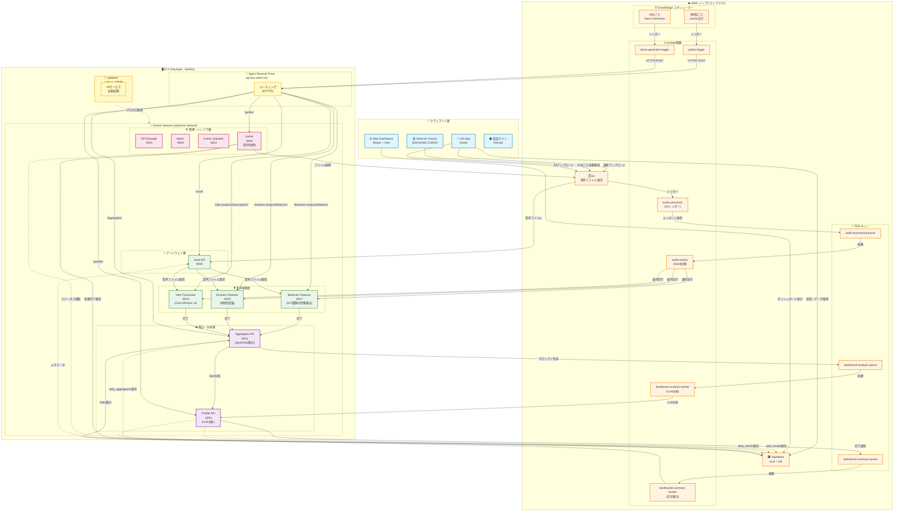

# WatchMe サーバー設定リポジトリ

## 📚 ドキュメントガイド

このリポジトリには複数のドキュメントがあります。**目的に応じて適切なドキュメントを参照してください。**

### 🎯 目的別ドキュメント一覧

| 目的 | ドキュメント | 内容 | こんな時に読む |
|------|-------------|------|--------------|
| **📖 基本理解** | [README.md](./README.md)（このファイル） | サーバー全体の構成・設定 | 最初に読む、全体像を把握したい |
| **🔄 処理の流れ** | [PROCESSING_ARCHITECTURE.md](./PROCESSING_ARCHITECTURE.md) | 音声処理の全体フロー、Lambda→API連携 | データがどう処理されるか知りたい |
| **🔧 技術仕様** | [TECHNICAL_REFERENCE.md](./TECHNICAL_REFERENCE.md) | 全サービス一覧、エンドポイント、ECRリポジトリ | APIのURL・ポート番号を調べたい |
| **📝 作業手順** | [OPERATIONS_GUIDE.md](./OPERATIONS_GUIDE.md) | デプロイ・設定変更・トラブルシューティング | 実際に作業する時の手順を知りたい |
| **🚀 CI/CD** | [CICD_STANDARD_SPECIFICATION.md](./CICD_STANDARD_SPECIFICATION.md) | GitHub Actions、自動デプロイ設定 | 新しいAPIのCI/CDを設定したい |
| **📅 変更履歴** | [CHANGELOG.md](./CHANGELOG.md) | 過去の変更・移行の記録 | いつ何を変更したか確認したい |
| **💰 コスト** | [COST_MANAGEMENT.md](./COST_MANAGEMENT.md) | AWS料金の管理・最適化 | コストを確認・削減したい |
| **🌏 リージョン移行** | [REGION_MIGRATION_GUIDE.md](./REGION_MIGRATION_GUIDE.md) | シドニー→東京リージョン移行手順 | リージョン移行を計画している |
| **🏗️ リストラクチャ** | [API_RESTRUCTURE_LOG.md](./API_RESTRUCTURE_LOG.md) | API階層化の作業ログ | API構造改革の進捗を確認したい |

### 💡 初めての方へのおすすめ読む順序

1. **このREADME.md** - システム全体の構成を理解
2. **[PROCESSING_ARCHITECTURE.md](./PROCESSING_ARCHITECTURE.md)** - データの流れを理解
3. **[TECHNICAL_REFERENCE.md](./TECHNICAL_REFERENCE.md)** - 各サービスの詳細を把握
4. **[OPERATIONS_GUIDE.md](./OPERATIONS_GUIDE.md)** - 実際の作業方法を学ぶ

---

## 📊 システム概要

このリポジトリは、WatchMeプラットフォームのEC2サーバーで稼働する **インフラストラクチャ**、**Nginx**、**systemd** の設定を一元管理します。

### 🎨 システムアーキテクチャ図



### 🎯 3つの管理領域

| 管理領域 | 内容 | 設定場所 |
|---------|------|----------|
| **インフラストラクチャ** | Dockerネットワーク、リソース管理 | docker-compose.infra.yml |
| **リバースプロキシ** | Nginx設定、ルーティング | sites-available/ |
| **プロセス管理** | systemdサービス、自動起動 | systemd/ |

### 🌏 AWSリージョン構成

全てのAWSリソース（EC2、ECR、Lambda、S3、EventBridge）は **ap-southeast-2 (Sydney)** に統一されています。

> **詳細情報**: リージョン別リソース一覧、設定の統一、移行計画は [TECHNICAL_REFERENCE.md - AWSリージョン構成](./TECHNICAL_REFERENCE.md#awsリージョン構成-更新-2025-10-26) を参照

> **移行計画**: 東京リージョン (ap-northeast-1) への移行手順は [REGION_MIGRATION_GUIDE.md](./REGION_MIGRATION_GUIDE.md) を参照

### ⚡ クイックアクセス

#### 📖 日常作業用ドキュメント
| 目的 | ドキュメント | 内容 |
|------|-------------|------|
| **デプロイ手順** | [OPERATIONS_GUIDE.md](./OPERATIONS_GUIDE.md#1-アプリケーションのデプロイ手順) | アプリのデプロイ方法 |
| **設定変更** | [OPERATIONS_GUIDE.md](./OPERATIONS_GUIDE.md#2-サーバー構成の変更手順) | サーバー設定の変更 |
| **技術仕様** | [TECHNICAL_REFERENCE.md](./TECHNICAL_REFERENCE.md) | システム全体の詳細仕様 |
| **処理フロー** | [PROCESSING_ARCHITECTURE.md](./PROCESSING_ARCHITECTURE.md) | 音声処理の全体像 |

#### 🗂️ 参照用ドキュメント
| 目的 | ドキュメント | 内容 |
|------|-------------|------|
| **変更履歴** | [CHANGELOG.md](./CHANGELOG.md) | 全変更の記録（過去のAPI移行含む） |
| **CI/CD仕様** | [CICD_STANDARD_SPECIFICATION.md](./CICD_STANDARD_SPECIFICATION.md) | 統一CI/CDプロセス |
| **🚀 東京リージョン移行** | [REGION_MIGRATION_GUIDE.md](./REGION_MIGRATION_GUIDE.md) | シドニー→東京移行の完全手順 |
| **💰 コスト管理** | [COST_MANAGEMENT.md](./COST_MANAGEMENT.md) | AWS料金管理 |
| **🚨 EC2再起動復旧** | [OPERATIONS_GUIDE.md#4-🚨-ec2インスタンス再起動後の復旧手順](./OPERATIONS_GUIDE.md#4-🚨-ec2インスタンス再起動後の復旧手順) | インスタンス再起動時の対処 |

---

## 🖥️ インフラストラクチャ

### EC2インスタンス概要

- **インスタンスタイプ**: t4g.large (AWS Graviton2, 2 vCPU, 8.0GB RAM)
- **リージョン**: ap-southeast-2 (Sydney)
- **IPアドレス**: 3.24.16.82

> **詳細情報**: リソース使用状況、メモリ・ディスク管理、Kushinada移行によるリソース影響などの詳細は [TECHNICAL_REFERENCE.md - システムアーキテクチャ](./TECHNICAL_REFERENCE.md#🏗️-システムアーキテクチャ) を参照

## 🔐 リポジトリの役割と制約

### ✅ できること
- ✅ **Dockerネットワークインフラの一元管理** ← NEW!
- ✅ Nginx/systemd設定ファイルのテンプレートと変更履歴の管理
- ✅ ネットワーク監視・自動修復スクリプトの提供 ← NEW!
- ✅ Pull Requestによるレビュープロセスの実施
- ✅ **インフラリソース管理と制約情報** ← NEW!
- ❌ **本番サーバーへの自動デプロイ機能はありません**

### 🔄 本番環境への反映フロー
1. このリポジトリで設定を変更し、Pull Requestでレビュー
2. マージ後、**手動で**本番サーバーの設定ファイルを更新
3. 本番サーバー上の設定は `/home/ubuntu/watchme-server-configs/` に配置

---

## 📁 リポジトリ構造

```
watchme-server-configs/
├── docker-compose.infra.yml    # ネットワークインフラ定義
├── docker-compose-files/        # 各サービスのdocker-compose設定
│   ├── api-gpt-v1-docker-compose.prod.yml
│   ├── api-sed-aggregator-docker-compose.prod.yml
│   ├── mood-chart-api-docker-compose.prod.yml
│   ├── opensmile-api-docker-compose.prod.yml
│   ├── opensmile-aggregator-docker-compose.prod.yml
│   ├── sed-api-docker-compose.prod.yml
│   ├── vibe-transcriber-v2-docker-compose.prod.yml
│   ├── watchme-admin-docker-compose.prod.yml
│   └── watchme-web-docker-compose.prod.yml
├── systemd/                     # systemdサービスファイル（全13サービス）
│   ├── watchme-infrastructure.service  # インフラ管理サービス
│   ├── api-gpt-v1.service
│   ├── api-sed-aggregator.service
│   ├── mood-chart-api.service
│   ├── opensmile-api.service
│   ├── opensmile-aggregator.service
│   ├── vibe-transcriber-v2.service
│   ├── watchme-admin.service
│   ├── watchme-api-manager.service
│   ├── watchme-avatar-uploader.service
│   ├── watchme-behavior-yamnet.service
│   ├── watchme-vault-api.service
│   ├── watchme-web-app.service
│   └── watchme-docker.service
├── sites-available/             # Nginx設定ファイル
│   └── api.hey-watch.me
├── scripts/                     # 管理・監視スクリプト
│   ├── check-infrastructure.sh # ネットワークヘルスチェック
│   └── network_monitor.py      # Python監視ツール
├── README.md                    # このファイル
├── NETWORK-ARCHITECTURE.md     # ネットワーク設計文書
└── server_overview.md          # サーバー全体構成
```

---

## 🌐 ネットワークインフラ構成

### watchme-network 概要

全マイクロサービスが相互通信するための共有Dockerネットワークです。

| 設定項目 | 値 |
|---------|-----|
| **ネットワーク名** | watchme-network |
| **サブネット** | 172.27.0.0/16 |
| **ゲートウェイ** | 172.27.0.1 |
| **管理サービス** | watchme-infrastructure (systemd) |
| **稼働コンテナ数** | 15サービス |

> **詳細情報**: IPアドレス割り当て一覧、管理コマンド、監視設定などの詳細は [TECHNICAL_REFERENCE.md - ネットワーク設計](./TECHNICAL_REFERENCE.md#🌐-ネットワーク設計) を参照

---

## 1. 運用ルールと作業フロー

このリポジトリの設定を本番サーバーに反映させるための、推奨ワークフローです。
**サーバー上のファイルを直接編集するのではなく、常にこのGitリポジリを起点として作業を行ってください。**

### 1.1. サーバーへの初回セットアップ手順

新しいEC2サーバーを構築した際に、最初に一度だけ実行する手順です。

1.  **リポジトリをクローン**
    ```bash
    # EC2サーバーにSSH接続
    ssh -i /Users/kaya.matsumoto/watchme-key.pem ubuntu@3.24.16.82

    # 適切な場所にリポジトリをクローン
    cd /home/ubuntu
    git clone git@github.com:matsumotokaya/watchme-server-configs.git
    ```

2.  **初期設定スクリプトを実行**
    ```bash
    # クローンしたディレクトリに移動
    cd /home/ubuntu/watchme-server-configs

    # スクリプトに実行権限を付与
    chmod +x setup_server.sh

    # 初期設定スクリプトを実行
    ./setup_server.sh
    ```
    これにより、リポジトリ内のすべてのNginxおよびsystemdの設定が、OSの適切な場所に自動でリンクされ、サービスが有効化されます。

### 1.2. 設定変更時のデプロイ手順

一度セットアップが完了したサーバーで、Nginxやsystemdの設定を変更・追加する際の標準的な手順です。

1.  **ローカルで変更作業**
    - ローカルPCでこのリポジトリを修正し、GitHub上でPull Requestを作成・マージします。

2.  **本番サーバーで変更を反映**
    ```bash
    # EC2サーバーにSSH接続
    ssh -i /Users/kaya.matsumoto/watchme-key.pem ubuntu@3.24.16.82

    # リポジトリのディレクトリに移動
    cd /home/ubuntu/watchme-server-configs

    # 最新の変更を取得
    git pull origin main

    # セットアップスクリプトを再実行して、変更を自動で適用
    ./setup_server.sh
    ```
    `setup_server.sh`は何度実行しても安全です。新しいファイルはリンクを作成し、既存のファイルはリンクを更新し、最後に各種サービスをリロードして変更を完全に適用します。

---

### 1.3. 緊急時の手動復旧手順（非推奨）

万が一、上記の方法が使えない場合にのみ、以下の手動手順で作業を行ってください。作業ミスを防ぐため、可能な限り`setup_server.sh`の使用を推奨します。

```bash
# 1. 現在の設定をバックアップ（必須！）
sudo cp /etc/nginx/sites-available/api.hey-watch.me \
        /etc/nginx/sites-available/api.hey-watch.me.backup.$(date +%Y%m%d_%H%M%S)

# 2. 設定ファイルを編集（このリポジトリの内容を参考に手動で編集）
sudo nano /etc/nginx/sites-available/api.hey-watch.me

# 3. 文法テスト（最重要）
sudo nginx -t

# 4. エラーがなければリロード
sudo systemctl reload nginx
```

---

## 2. 新しいAPIサービスの追加

新規API追加時の必須設定：

1. **Docker Compose**: `networks: watchme-network (external: true)` を設定
2. **Nginx**: `/etc/nginx/sites-available/api.hey-watch.me` にlocation追加
3. **systemd**: `systemd/[サービス名].service` 作成

詳細な手順、設定例、テンプレートは [OPERATIONS_GUIDE.md - アプリケーションのデプロイ手順](./OPERATIONS_GUIDE.md#1-アプリケーションのデプロイ手順) を参照。

---

## 3. トラブルシューティング

問題が発生した場合は、[運用ガイド - トラブルシューティング](./OPERATIONS_GUIDE.md#3-トラブルシューティング)を参照してください。

**主なカテゴリ**：
- 🌐 ネットワーク関連の問題（API間通信エラー、接続エラー）
- 💾 メモリ・ディスク不足
- 🔐 ECR認証エラー
- 🔧 Nginx関連の問題（502/404エラー）
- 🧹 Janitor APIトラブルシューティング
- 🛠️ メンテナンス用コマンド集

---

## 📊 稼働中のサービス一覧

WatchMeプラットフォームでは以下のサービスが稼働しています：

### EC2 Docker コンテナ（15サービス）

| カテゴリ | サービス名 | ポート | 役割 |
|---------|----------|--------|------|
| **🚪 ゲートウェイ** | Vault API | 8000 | S3音声ファイル配信、SKIP機能 |
| **🎙️ 音声処理** | Behavior Features | 8017 | 527種類の音響イベント検出 |
| | Emotion Features | 8018 | 8感情認識 |
| | Vibe Transcriber | 8013 | Groq Whisper v3文字起こし |
| **📊 集計・分析** | **Aggregator API** | **8011** | **Spot/Daily集計、プロンプト生成** |
| | **Profiler API** | **8051** | **LLM分析（Spot/Daily）** |
| **⚙️ 管理** | API Manager | 9001 | API管理UI |
| | Admin | 9000 | 管理ツール |
| | Avatar Uploader | 8014 | アバター画像管理 |
| | Janitor | 8030 | 音声データ自動削除 |

### AWS Lambda関数（6サービス）

| 関数名 | トリガー | 役割 |
|--------|---------|------|
| **audio-processor** | S3 Upload | 録音ファイルをSQSに送信 |
| **audio-worker** | SQS (audio-processing-queue) | Feature Extractors並列実行 |
| **dashboard-summary-worker** | SQS (dashboard-summary-queue) | Daily Aggregator実行 |
| **dashboard-analysis-worker** | SQS (dashboard-analysis-queue) | Daily Profiler実行 |
| janitor-trigger | EventBridge (6時間ごと) | Janitor API実行 |
| demo-generator-trigger | EventBridge (30分ごと) | デモデータ生成 |

### 🔄 新しいデータフロー（2025-11-15更新）

```
S3 Upload
  ↓
Lambda: audio-processor → SQS
  ↓
Lambda: audio-worker
  ↓ (並列実行)
  ├─ Behavior Features (音響検出)
  ├─ Emotion Features (感情認識)
  └─ Vibe Transcriber (文字起こし)
  ↓ 3つ完了後
Aggregator API (/aggregator/spot)
  → spot_aggregators テーブルに保存
  ↓
Profiler API (/profiler/spot-profiler)
  → spot_results テーブルに保存
  ↓
SQS: dashboard-summary-queue
  ↓
Lambda: dashboard-summary-worker
  ↓
Aggregator API (/aggregator/daily)
  → daily_aggregators テーブルに保存
  ↓
SQS: dashboard-analysis-queue
  ↓
Lambda: dashboard-analysis-worker
  ↓
Profiler API (/profiler/daily-profiler)
  → daily_results テーブルに保存
```

### 🆕 local_date対応（2025-11-15）

全テーブルに `local_date` カラムを追加し、デバイスのタイムゾーンに基づいたローカル日付を保存：

- `audio_files` - Vault APIで計算・保存
- `spot_features` - Feature Extractorsでコピー
- `spot_aggregators` - Aggregator APIでコピー
- `spot_results` - Profiler APIでコピー
- `daily_aggregators` - local_dateでグルーピング
- `daily_results` - 日次分析結果

> **詳細情報**: 全サービスのエンドポイント、ポート番号、ECRリポジトリ、systemdサービス名などの技術仕様は [TECHNICAL_REFERENCE.md - サービス一覧](./TECHNICAL_REFERENCE.md#📡-サービス一覧) を参照

---

## 🗄️ データベース管理

### Supabase CLI

| 操作 | ツール | 詳細 |
|------|--------|------|
| ✅ **スキーマ変更** | Supabase CLI (`supabase db push`) | [OPERATIONS_GUIDE.md - データベースマイグレーション](./OPERATIONS_GUIDE.md#3-データベースマイグレーション) |
| ❌ **データ確認** | Supabaseダッシュボード | SQL Editor |

**重要**：Supabase CLIはマイグレーション管理専用。データ確認はブラウザで実行。

---

## 4. よくある質問

### Q: watchme-networkとは何ですか？

**A: 全マイクロサービス間の通信を可能にするDockerの仮想ネットワークです。**
- 172.27.0.0/16のプライベートIPアドレス空間
- コンテナ名でのDNS解決が可能
- 外部からはアクセス不可（セキュア）
- `docker-compose.infra.yml`で一元管理

### Q: API ManagerとSchedulerはどのように管理されている？

**A: 現在は1つのdocker-compose.all.ymlで両方を管理しています。**
- **API Manager (UI)**: ポート9001で稼働
- **Scheduler**: ポート8015で稼働
- **重要**: systemdは`docker-compose.all.yml`を使用（両方起動）
- **注意**: `docker-compose.prod.yml`は使用しない（API Managerのみ起動してしまう）

**今後の改善案**（検討中）:
- 2つのサービスを独立したディレクトリに分離
- それぞれ独自のdocker-compose.prod.ymlを持つ
- systemdサービスも2つに分離

### Q: このリポジトリの設定ファイルをそのまま本番にコピーすればいい？

**A: いいえ、直接コピーはできません。**
- このリポジトリはテンプレートと変更履歴の管理用です
- 本番サーバーには既に動作中の設定があり、それを参考に**手動で編集**する必要があります
- 必ず現在の設定をバックアップしてから編集してください

### Q: なぜ本番サーバーにこのリポジトリをクローンしないの？

**A: セキュリティとシンプルさのため。**
- 本番サーバーに不要なGitリポジトリを置かない
- 設定ファイルは`/etc/`配下に直接存在するのが標準的
- 変更履歴はこのGitHubリポジトリで管理

### Q: 新しいAPIを追加する時の手順は？

**A: 以下の手順で進めます：**
1. このリポジトリで新しいブランチを作成
2. `sites-available/api.hey-watch.me`にlocation設定を追加
3. Pull Requestを作成してレビュー
4. マージ後、本番サーバーで手動で同じ設定を追加
5. `sudo nginx -t`でテスト → `sudo systemctl reload nginx`

### Q: どのポートが使われているか確認したい

**A: 以下のコマンドで確認：**
```bash
# 使用中のポート一覧
sudo lsof -i -P -n | grep LISTEN

# 特定のポートを確認
sudo lsof -i:8014

# Nginxの設定で使用しているポートを確認
grep -E "proxy_pass|listen" /etc/nginx/sites-available/api.hey-watch.me
```

> **トラブルシューティング**: その他の問題は [運用ガイド](./OPERATIONS_GUIDE.md#3-トラブルシューティング) を参照

---

## 5. ベストプラクティス

1. **ネットワーク設定を最優先**
   - 新しいサービスは必ず`watchme-network`に`external: true`で参加
   - デプロイ後は`check-infrastructure.sh`で接続確認
   - 問題があれば`network_monitor.py --fix`で自動修復

2. **常にバックアップを取る**
   - 設定変更前に必ず`backup.$(date +%Y%m%d_%H%M%S)`形式でバックアップ

3. **段階的にテスト**
   - まず`nginx -t`で文法チェック
   - 次に`curl`で内部から動作確認
   - 最後に外部からHTTPS経由で確認

4. **ドキュメント化**
   - 新しいサービスを追加したら、このREADMEも更新
   - CHANGELOG.mdに変更履歴を記録

5. **ポート番号の管理**
   - 8000番台: メインAPI
   - 8001-8099: マイクロサービス
   - 9000番台: 管理ツール
   - 新しいサービスは既存のポートと重複しないよう確認

---

## 🧹 Janitor - 音声データ自動削除サービス

処理済み音声ファイルを自動削除し、ユーザーのプライバシーを保護するサービスです。EventBridge + Lambda経由で6時間ごとに自動実行されます。

### クイック情報

| 項目 | 値 |
|------|-----|
| **外部URL** | https://api.hey-watch.me/janitor/ |
| **ポート** | 8030 |
| **実行頻度** | 6時間ごと（EventBridge + Lambda） |
| **状態** | ✅ 本番稼働中 |

### 詳細ドキュメント

詳しい仕様、運用手順、トラブルシューティングは以下を参照:
- **完全版README**: [/Users/kaya.matsumoto/projects/watchme/api/janitor/README.md](file:///Users/kaya.matsumoto/projects/watchme/api/janitor/README.md)
- **GitHubリポジトリ**: https://github.com/hey-watchme/api-janitor
- **運用ガイド**: [OPERATIONS_GUIDE.md](./OPERATIONS_GUIDE.md#🧹-janitor-api-トラブルシューティング)

---

## 🚀 今後の予定

- [x] **API階層化の完了**（2025-11-15）
  - Aggregator API: Spot/Daily集計を統一
  - Profiler API: LLM分析を統一
  - local_date対応でタイムゾーン問題を解決
- [x] **Lambda関数パイプラインの最新化**（2025-11-15）
  - audio-worker: Feature Extractors並列実行
  - dashboard-summary-worker: Daily Aggregator実行
  - dashboard-analysis-worker: Daily Profiler実行
- [ ] 既存サービスの統一ネットワーク移行完了
- [ ] 監視ダッシュボードの構築
- [ ] 東京リージョンへの移行（ap-southeast-2 → ap-northeast-1）

## 📅 最終更新

- **2025-11-15**: API階層化完了、local_date対応、Lambda関数最新化
- **2025-10-26**: AWSリージョン構成統一（Sydney）
- **2025-10-01**: Janitor API本番稼働開始
